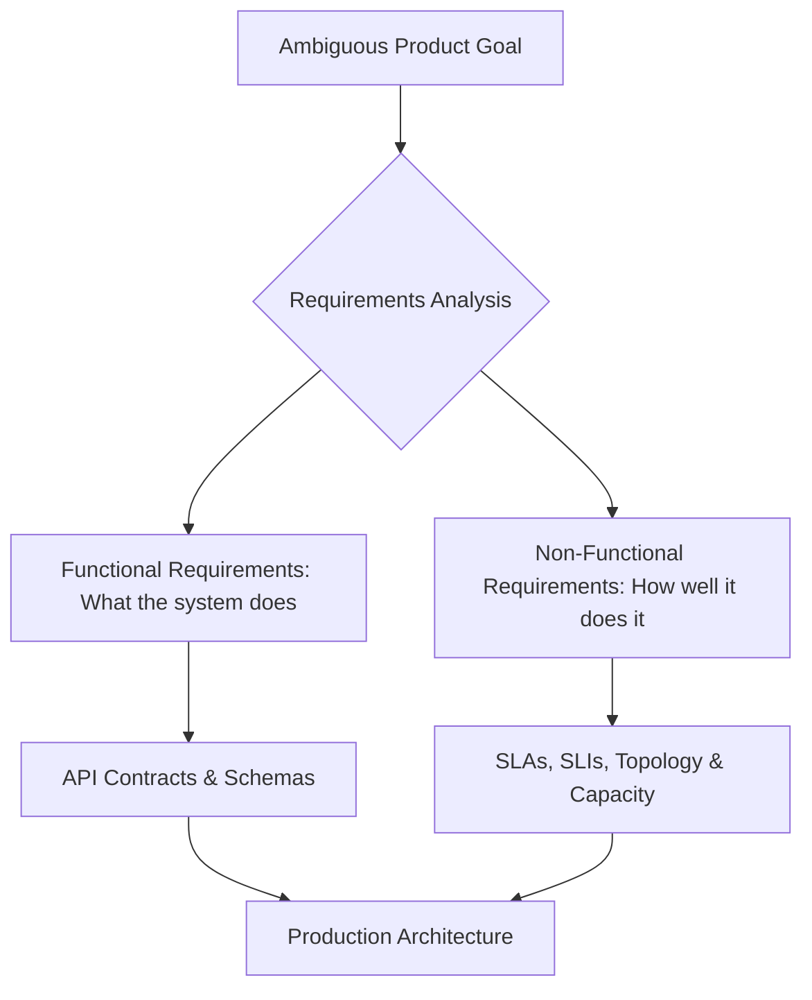

# What System Design Is: Functional vs Non-Functional Requirements

## Overview
**System design** is the systematic process of defining the architecture, components, modules, interfaces, and data for a software system to satisfy specified business and technical constraints. In production engineering, it bridges the gap between high-level product vision and low-level code execution.

At its core, system design requires translating ambiguous user problems into well-defined, scalable, and resilient technical contracts categorized into **Functional Requirements (FR)** and **Non-Functional Requirements (NFR)**.

## Why It Matters
Without disciplined requirements scoping, systems suffer from two fatal failure modes:
1. **Under-engineering**: Building an architecture incapable of handling peak production traffic spikes, leading to cascading outages, data corruption, and SLA violations.
2. **Over-engineering**: Introducing distributed complexity (e.g., event sourcing, microservices, multi-region Raft clusters) for applications that could comfortably run on a single PostgreSQL instance, draining engineering velocity and inflating infrastructure costs.

## Core Concepts
- **Functional Requirements (FR)**: The concrete capabilities and user-facing workflows the system must support (e.g., *"Users can upload a video"*, *"Users can send money to a peer"*).
- **Non-Functional Requirements (NFR)**: The quality attributes, operational limits, and constraints under which the system must operate:
  - **Availability**: Percentage of time the system remains operational and accessible (e.g., 99.99%).
  - **Latency**: Bound on response duration, typically measured at percentiles (e.g., P99 < 100ms).
  - **Throughput**: Number of operations processed per unit time (e.g., 50,000 QPS).
  - **Consistency**: The degree of state uniformity across replicas (e.g., linearizable vs eventual).
  - **Durability**: Probability that stored records survive hardware loss (e.g., 99.999999999% in S3).

## How It Works: Scoping Requirements Step-by-Step
When architecting any system, follow a repeatable extraction framework:
1. **Define Core Verbs**: Identify the 2 to 4 mission-critical operations. Eliminate nice-to-have features into "Out of Scope".
2. **Quantify Workload Scale**:
   - Daily Active Users (DAU) & Monthly Active Users (MAU).
   - Read-to-Write Ratio (e.g., 100:1 for social feeds, 1:1 for telemetry).
   - Average and peak Queries Per Second (QPS).
3. **Establish Service Level Objectives (SLOs)**:
   - What is the acceptable P95 and P99 latency?
   - What data loss window is permissible (Recovery Point Objective - RPO)?
4. **Identify Regulatory & Geographic Constraints**:
   - Data residency (GDPR, HIPAA, PCI-DSS).

## Trade-offs
| Requirement Dimension | High Guarantee Benefit | Engineering Cost / Trade-off |
| :--- | :--- | :--- |
| **Strict Consistency (ACID/Linearizable)** | Zero stale reads, simplified app logic | Increased write latency, coordination bottlenecks, lower availability during partitions |
| **Ultra-High Availability (99.999%)** | Minimal downtime (< 5.26 mins/year) | Redundant multi-region infrastructure, automated failovers, high cloud cost |
| **Sub-10ms P99 Latency** | Superior user engagement and conversion | Multi-layer caching, in-memory data tiers, complexity of cache invalidation |

## When to Use / When NOT to Use
### When to Focus on Strict NFRs
- Financial ledgers, healthcare records, payment processors, and auth systems where data loss or inconsistency causes catastrophic business impact.

### When to Defer Complex NFRs
- Early-stage prototypes, internal tooling, and MVPs validating product-market fit where shipping speed outweighs five-nines availability.

## Real-World Examples
- **Stripe**: Treats consistency and durability as non-negotiable functional constraints. Every ledger entry requires double-entry accounting and synchronous replication across availability zones.
- **Twitter/X**: Sacrifices strict consistency for global availability. A 2-second delay in tweet delivery to follower feeds is an acceptable trade-off for handling 300,000 timeline reads per second.

## Common Pitfalls
- **Confusing Average Latency with P99**: Designing for average latency masks severe tail latency; a 50ms average can hide a P99 of 4,000ms affecting 1 out of every 100 requests.
- **Vague Requirements**: Writing *"The system must be fast and reliable"* instead of *"P99 latency < 150ms at 25,000 QPS with 99.99% monthly availability"*.

## Key Takeaways
- Functional requirements define **what** a system executes; non-functional requirements define **how well** it performs.
- Always quantify requirements with concrete numbers (QPS, storage, P99 latency) before choosing databases or frameworks.
- Clarify out-of-scope features early to avoid architectural bloat.

## Common Interview Questions
1. How do you prioritize conflicting requirements between low latency and strong consistency?
2. What questions would you ask a product manager when asked to "design a messaging service"?
3. How do you distinguish between system availability, reliability, and durability?

## Further Reading
- [Google Site Reliability Engineering: Chapter 3 (Service Level Objectives)](https://sre.google/sre-book/service-level-objectives/)
- [Designing Data-Intensive Applications: Chapter 1 (Reliable, Scalable, and Maintainable Systems)](https://dataintensive.net/)
