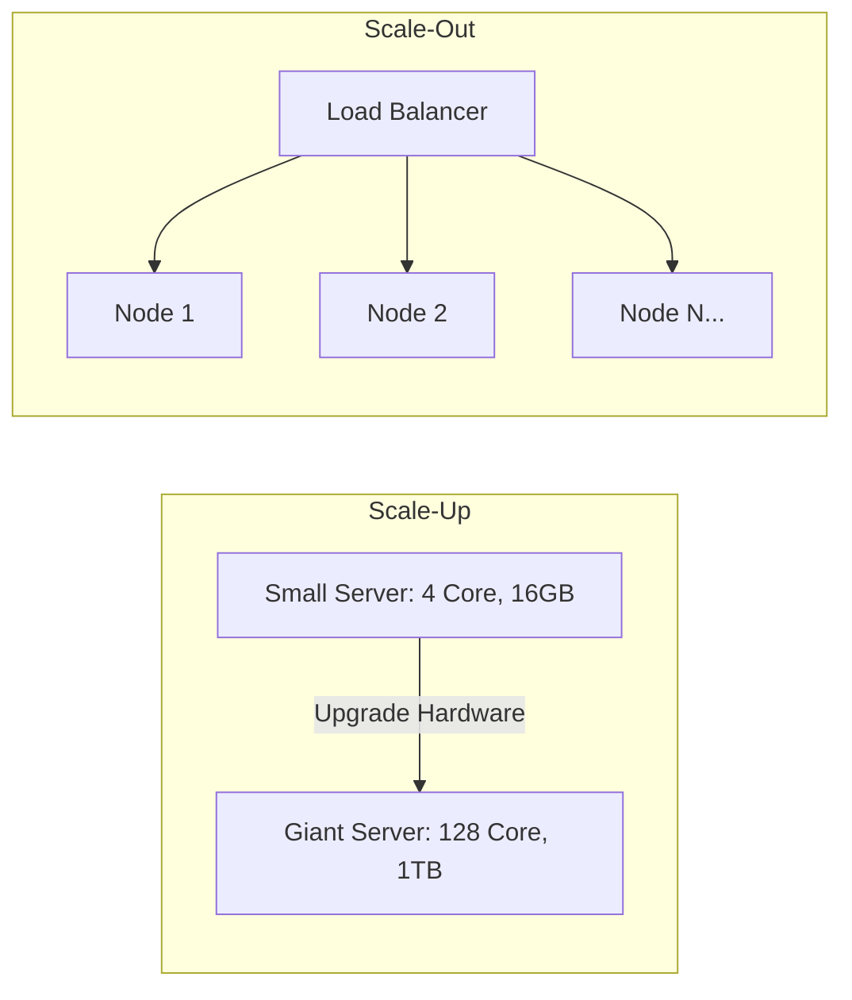

# Scalability: Vertical vs Horizontal Scaling

## Overview
**Scalability** is the measure of a system's ability to handle growing amounts of work by adding resources to the system. There are two primary paradigms for scaling:
- **Vertical Scaling (Scale-Up)**: Adding more processing power, memory, or storage to an existing single machine (e.g., upgrading from a 16-core to a 128-core bare-metal instance).
- **Horizontal Scaling (Scale-Out)**: Adding more discrete machines/nodes into a networked pool to distribute the workload (e.g., expanding from 5 to 50 stateless application instances behind a load balancer).

## Why It Matters
Workloads grow over time due to business adoption or sudden flash sales. Knowing when to scale vertically versus horizontally determines whether your infrastructure costs scale linearly or exponentially, and whether your system has a single point of failure (SPOF).

## Core Concepts
- **Amdahl's Law**: The theoretical speedup of a task is limited by the serial (non-parallelizable) portion of the program:
  $$S_{latency}(s) = \frac{1}{(1 - p) + \frac{p}{s}}$$
  Where $p$ is the fraction of parallelizable code, and $s$ is the speedup factor.
- **Shared-Nothing Architecture**: Distributed architecture where each independent node possesses its own private CPU, RAM, and disk. Nodes communicate solely through high-speed network protocols.
- **Stateless Distribution**: Application nodes maintain zero client session state across requests, allowing any incoming request to land on any server node arbitrarily.

## How It Works
1. **Vertical Mechanics**: Operating systems leverage symmetric multiprocessing (SMP) and Non-Uniform Memory Access (NUMA). Processes scale by spawning concurrent OS threads accessing a shared memory bus.
2. **Horizontal Mechanics**: Traffic hits an ingress Layer 4 / Layer 7 load balancer. The load balancer runs scheduling algorithms (e.g., Round Robin, Least Connections, Consistent Hashing) to distribute requests across the cluster.

## Trade-offs
| Dimension | Vertical Scaling (Scale-Up) | Horizontal Scaling (Scale-Out) |
| :--- | :--- | :--- |
| **Complexity** | Extremely low (zero distributed systems bugs) | High (requires service discovery, load balancing, consensus) |
| **Hardware Limits** | Hard ceiling (maximum CPU sockets and PCIe channels) | Theoretically unbounded (add thousands of nodes) |
| **Cost Scaling** | Exponential at the high end (specialized high-core servers) | Linear using commodity VMs or cloud instances |
| **Fault Tolerance** | Single Point of Failure (node crash = total outage) | High resilience (failure of 1 of 50 nodes is negligible) |
| **Network Overhead**| Zero network latency (inter-thread memory communication)| Network transport serialization and packet latency (0.5ms+)|

## When to Use / When NOT to Use
### When to Scale Vertically
- Early-stage startups prioritizing development speed.
- Relational databases (PostgreSQL/MySQL) up to moderate scale (~10,000 QPS) where ACID transactions are critical and read replicas suffice.

### When to Scale Horizontally
- Stateless application layers, API gateways, and web servers.
- Massive data stores requiring petabyte-scale storage and write throughput beyond a single disk controller (Cassandra, Bigtable, Kafka).

## Real-World Examples
- **Stack Overflow**: Famous for scaling predominantly vertically for years on a handful of powerful multi-socket Microsoft SQL Server machines, handling millions of pageviews with exceptional operational simplicity.
- **Netflix**: Scaled horizontally across tens of thousands of AWS EC2 instances, leveraging microservices and Chaos Monkey to withstand arbitrary instance terminations.

## Common Pitfalls
- **Premature Horizontal Decomposition**: Splitting an application into 30 microservices before identifying core domain boundaries, creating network serialization overhead and distributed transaction hell.
- **Ignoring NUMA Effects on Scale-Up**: Assuming a 128-core machine yields 8x the speed of a 16-core machine without accounting for inter-socket memory latency.

## Key Takeaways
- Start vertically whenever possible to minimize operational complexity; scale horizontally when physical limits, fault-tolerance needs, or economics demand it.
- Horizontal scaling requires making the application tier strictly **stateless**.
- Amdahl's Law dictates that serialization bottlenecks cap horizontal scaling efficiency.

## Common Interview Questions
1. At what point does vertical scaling become economically non-viable compared to horizontal scaling?
2. How do you design an application so that it can scale horizontally without session affinity?
3. What is the difference between Amdahl's Law and Gustafson's Law in scalable systems?

## Further Reading
- [Amdahl's Law: Validity of the Single Processor Approach to Achieving Large Scale Computing Capabilities (1967)](https://dl.acm.org/doi/10.1145/1465482.1465560)
- [Martin Fowler: MonolithFirst Pattern](https://martinfowler.com/bliki/MonolithFirst.html)
