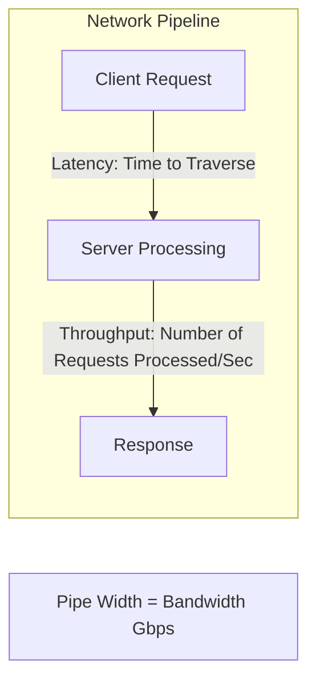

# Latency, Throughput, and Bandwidth

## Overview
Performance in distributed systems is defined by three interrelated dimensions:
- **Latency**: The time taken for a data packet or request to travel from its origin to its destination and return (measured in milliseconds or microseconds).
- **Throughput**: The volume of work completed by the system per unit of time (measured in Requests Per Second - RPS, Queries Per Second - QPS, or Transactions Per Second - TPS).
- **Bandwidth**: The maximum theoretical data transfer capacity of a communications channel (measured in bits per second, e.g., 10 Gbps).

## Why It Matters
A system can possess massive bandwidth yet deliver terrible user experience due to high latency. Conversely, a low-latency system can buckle under load if its throughput capacity is exhausted. Understanding their exact mathematical relationships prevents performance bottlenecks.

## Core Concepts
- **Little's Law**: In a stable queueing system, the long-term average number of concurrent items $L$ is equal to the long-term average arrival rate $\lambda$ multiplied by the average time $W$ that an item spends in the system:
  $$L = \lambda \times W$$
  *Example*: If your API receives $\lambda = 10,000$ RPS and the average processing time is $W = 0.2$ seconds (200ms), your servers must concurrently sustain:
  $$L = 10,000 \times 0.2 = 2,000\text{ in-flight requests}$$
- **Tail Latency Amplification**: In distributed microservice graphs where a single user request fans out to $N$ downstream services in parallel, the user-perceived response time is governed by the *slowest* downstream service:
  $$P(\text{User hits }> 99\text{th percentile}) = 1 - (0.99)^N$$
  For $N = 100$ parallel backend calls, **63.4% of users experience latency worse than the 99th percentile**!

## How It Works
1. **Network Latency Components**:
   - *Propagation Delay*: Distance divided by speed of light in fiber ($pprox 200,000\text{ km/s}$).
   - *Transmission Delay*: Packet size divided by channel bandwidth.
   - *Processing Delay*: Time taken by routers/firewalls to inspect headers.
   - *Queuing Delay*: Time spent waiting in network buffer queues before transmission.
2. **Measuring Latency Accurately**: Avoid arithmetic averages ($Mean$). Always measure percentiles: **P50 (Median)**, **P95**, **P99**, and **P99.9**.

## Trade-offs
| Optimization Strategy | Latency Impact | Throughput Impact |
| :--- | :--- | :--- |
| **Request Batching** (e.g., Kafka producer batching) | Increases latency (awaits buffer fill) | Dramatically increases throughput (amortizes network headers) |
| **Payload Compression** (gzip/Zstandard) | Adds CPU serialization latency | Decreases bandwidth consumption, boosts network throughput |
| **Connection Pooling** | Eliminates TCP/TLS handshake latency | Caps maximum concurrent throughput to pool size |

## When to Use / When NOT to Use
### When to Optimize for Ultra-Low Latency
- High-frequency financial trading, real-time gaming, autonomous vehicle telemetry.

### When to Prioritize Throughput over Latency
- Big data batch analytics (MapReduce/Spark), log processing pipelines, video transcoding queues.

## Real-World Examples
- **Google Search**: Proved that adding an artificial 400ms delay to search results caused a 0.44% drop in search traffic.
- **Amazon**: Discovered that every 100ms of additional latency reduced sales revenue by 1%.

## Common Pitfalls
- **Coordinated Omission**: Benchmarking tools that wait for a request to complete before sending the next one inadvertently omit the latency of queued requests, reporting deceptively optimistic percentiles.
- **Ignoring Network Hop Latency**: Assuming RPC calls between microservices inside AWS are negligible; inter-AZ round trips routinely introduce 1-2ms of baseline latency per hop.

## Key Takeaways
- Use **Little's Law** ($L = \lambda W$) to accurately size thread pools and memory capacity.
- Never measure performance using averages—always monitor P95, P99, and P99.9 percentiles.
- In fan-out architectures, tail latency dominates overall user experience.

## Common Interview Questions
1. A service has an average response time of 50ms and receives 2,000 QPS. How many concurrent connections must it maintain?
2. Why is tail latency amplification particularly dangerous in microservice architectures?
3. How does increasing TCP window size affect throughput on high-latency links (BDP)?

## Further Reading
- [The Tail at Scale (Jeffrey Dean and Luiz André Barroso, Google, 2013)](https://research.google/pubs/pub40801/)
- [Gil Tene: Understanding Latency and Coordinated Omission](https://www.youtube.com/watch?v=lJ8ydIuPFeU)
