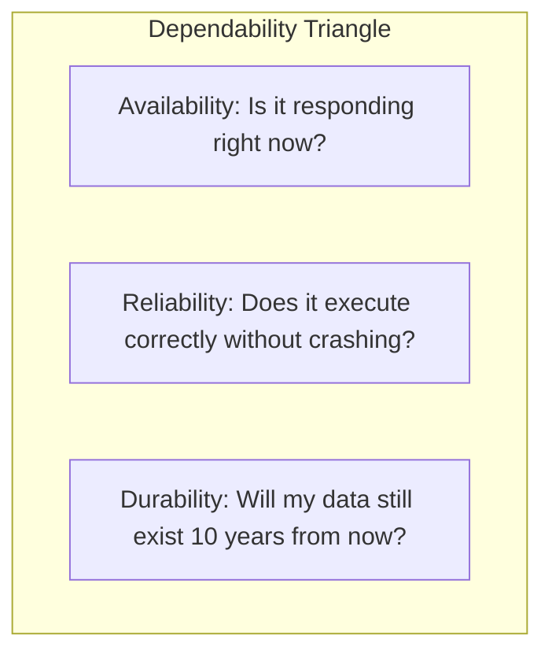

# Availability, Reliability, Durability, and The Nines

## Overview
System dependability is measured through three distinct engineering dimensions:
- **Availability**: The percentage of time a system remains operational and capable of servicing requests.
- **Reliability**: The probability that a system will perform its required function without failure under specified conditions over a given duration (measured by Mean Time Between Failures - MTBF).
- **Durability**: The guarantee that stored data remains uncorrupted and intact over time, surviving physical hardware failures.

## Why It Matters
A system can be 100% available while being completely unreliable (e.g., returning HTTP 500 errors within 1ms for every request). Conversely, an offline database backup is 100% durable even while having 0% operational availability. Distinguishing these concepts is essential when agreeing on contractual SLAs.

## Core Concepts
- **The "Nines" of Availability**:
  - $99\%$ ("Two Nines"): $\approx 3.65$ days of allowable downtime per year.
  - $99.9\%$ ("Three Nines"): $\approx 8.76$ hours of allowable downtime per year.
  - $99.99\%$ ("Four Nines"): $\approx 52.56$ minutes of allowable downtime per year.
  - $99.999\%$ ("Five Nines"): $\approx 5.26$ minutes of allowable downtime per year.
- **MTBF and MTTR**:
  $$\text{Availability} = \frac{\text{MTBF}}{\text{MTBF} + \text{MTTR}}$$
  Where MTBF is Mean Time Between Failures, and MTTR is Mean Time To Repair / Recover.
- **Composite Availability**:
  - **Serial Components** (both must work):
    $$A_{total} = A_1 \times A_2$$
    *Example*: If Web Tier ($99.9\%$) relies on Database ($99.9\%$), total availability = $0.999 \times 0.999 = 99.8\%$.
  - **Parallel Components** (redundant standby):
    $$A_{total} = 1 - (1 - A_1)(1 - A_2)$$
    *Example*: Two redundant $99.9\%$ databases = $1 - (0.001)^2 = 99.9999\%$.

## How It Works
To increase system availability:
1. **Reduce MTBF frequency**: Enforce code review, comprehensive unit/integration testing, canary rollouts, and chaos testing.
2. **Minimize MTTR**: Implement automated health checks, instant DNS failovers, self-healing container orchestrators (Kubernetes), and blameless incident runbooks.

## Trade-offs
| Availability Level | Downtime Allowance (Annual) | Required Engineering Investment |
| :--- | :--- | :--- |
| **99.9% (Three Nines)** | ~8.76 hours | Single cloud region, automated restarts, read replicas |
| **99.99% (Four Nines)** | ~52.56 minutes | Multi-AZ deployment, automated failover, zero-downtime schema migrations |
| **99.999% (Five Nines)** | ~5.26 minutes | Multi-region active-active, consensus protocols, chaos testing, 24/7 SRE |

## When to Use / When NOT to Use
### When to Target Five Nines (99.999%)
- Telecommunications 911 dispatch, air traffic control, medical telemetry, and central banking clearinghouses.

### When 99.9% is Sufficient
- Standard SaaS applications, B2B back-office dashboards, e-commerce storefronts during off-peak hours.

## Real-World Examples
- **AWS S3**: Advertises **99.99% availability** of service objects alongside **99.999999999% (11 9's) durability** by redundantly storing objects across multiple physically separated availability zones.
- **GitHub Outage (2018)**: A brief 43-second network split between US East and US West triggered an uncoordinated automated database failover, resulting in 24 hours of degraded read-only availability while resolving split-brain data.

## Common Pitfalls
- **Ignoring Cascading Availability Math**: Assuming that chaining 5 microservices each rated at 99.9% availability produces a 99.9% system; in reality, $0.999^5 = 99.5\%$ availability!
- **Overpromising SLAs in Contracts**: Guaranteeing five nines without having multi-region automated active-active failover in place.

## Key Takeaways
- Availability is mathematically driven by Mean Time to Repair (MTTR); reducing recovery time improves availability faster than trying to prevent all failures.
- Serial dependencies multiply risk and lower overall availability; redundant parallel paths drastically improve composite availability.
- Durability is about data survival; availability is about service responsiveness.

## Common Interview Questions
1. If your system depends on three external microservices each offering 99.9% availability in serial, what is your theoretical maximum availability?
2. How does AWS S3 achieve 11 nines of durability?
3. How do you design an automated failover system that minimizes MTTR without risking split-brain?

## Further Reading
- [AWS Reliability Guardian: Availability Math](https://docs.aws.amazon.com/whitepapers/latest/real-time-communication-on-aws/availability-and-the-math.html)
- [Google SRE: Embracing Risk and Error Budgets](https://sre.google/sre-book/embracing-risk/)
