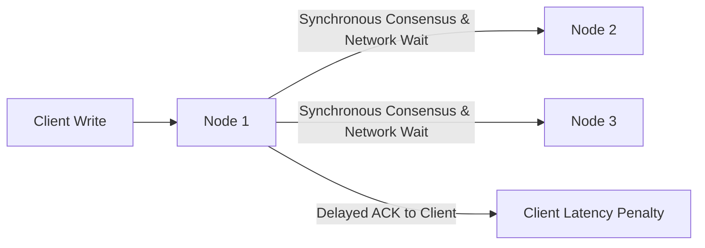

# Consistency vs Performance and Scalability

## Overview
In distributed systems, **consistency** defines whether all participating nodes observe the exact same data values at any given point in time. Achieving strict consistency across physical networks requires coordination, synchronization, and locking mechanisms that directly conflict with **performance** (low latency) and **scalability** (high throughput across many nodes).

## Why It Matters
Physics imposes an immutable limit: data cannot travel faster than the speed of light. Every time a distributed system insists that multiple independent replicas must agree before acknowledging a write, it incurs physical network round-trip delays and coordination lock contention. Understanding this trade-off allows architects to select the right consistency model for each business domain.

## Core Concepts
- **Linearizability (Strong Consistency)**: The highest consistency guarantee. Operations appear to execute atomically at an exact global timestamp. Reads are guaranteed to observe the latest written value.
- **Eventual Consistency**: Replicas asynchronously converge over time. Reads may temporarily return stale values, but given sufficient time without new writes, all replicas will match.
- **The PACELC Theorem**: An extension of the CAP theorem stating that even in the absence of partitions ($E$ for Else), a system must trade Latency ($L$) versus Consistency ($C$).

## How It Works
1. **Synchronous Coordination**:
   - Master node receives write $W$.
   - Master broadcasts $W$ to $N$ replicas over TCP.
   - Master waits for $M$ replicas to acknowledge before returning success to the client.
   - *Result*: Strong consistency, but latency equals the slowest replica's network round trip.
2. **Asynchronous Propagation**:
   - Master receives write $W$, writes to local WAL, and immediately responds to the client (sub-1ms).
   - Master pushes $W$ to replicas asynchronously via a background stream.
   - *Result*: Ultra-low write latency and high throughput, but a concurrent read hitting a lagging replica returns stale data.

## Trade-offs
| Architecture Choice | Write Latency | Read Throughput | Data Freshness |
| :--- | :--- | :--- | :--- |
| **Synchronous Replication** (Raft/2PC) | High (waits for quorum) | Moderate | 100% Up-to-date (Linearizable) |
| **Asynchronous Replication** (MySQL Replicas) | Ultra-low (< 2ms) | Massive (distributed across replicas) | Stale reads possible (Replication Lag) |
| **Quorum Tunable** (DynamoDB / Cassandra) | Tunable via $W$ parameter | Tunable via $R$ parameter | Strong if $R + W > N$ |

## When to Use / When NOT to Use
### When to Choose Strict Consistency Over Performance
- Financial ledgers, stock trading order matching, inventory decrement during flash sales, seat booking systems.

### When to Choose Performance / Scalability Over Consistency
- Social media feeds, video view counts, analytics telemetry, collaborative document editing cursors.

## Real-World Examples
- **Google Spanner**: Invested in specialized atomic clocks and GPS receivers (TrueTime API) to bound clock uncertainty ($\le 7$ms), achieving global external consistency while keeping multi-region commit latencies within acceptable bounds (~50-100ms).
- **Amazon DynamoDB**: Allows engineers to specify consistency at the API call level: `ConsistentRead: true` incurs double the read capacity units and higher latency, whereas standard reads are eventually consistent and twice as fast/cheap.

## Common Pitfalls
- **Defaulting to Strong Consistency Everywhere**: Enforcing two-phase commit (2PC) across microservices, creating massive latency amplification and distributed deadlocks.
- **Neglecting Monotonic Read Violations**: In an eventually consistent system, refreshing a page can bounce a user between a fast replica and a lagging replica, causing deleted comments to intermittently reappear.

## Key Takeaways
- The speed of light guarantees that cross-node consensus always adds latency.
- The PACELC theorem proves that you must choose between Latency and Consistency even when your network is 100% healthy.
- Most large-scale architectures use strong consistency for financial transactions and eventual consistency for high-volume content.

## Common Interview Questions
1. How does PACELC expand upon the classic CAP theorem?
2. If an interviewer asks you to design a globally distributed inventory count system, how would you address consistency versus latency?
3. What is replication lag, and what user experience anomalies does it cause?

## Further Reading
- [Daniel Abadi: Consistency Tradeoffs in Modern Distributed Database System Design (PACELC)](https://cs-www.cs.yale.edu/homes/dna/papers/abadi-pacelc.pdf)
- [Werner Vogels: Eventually Consistent (Communications of the ACM, 2009)](https://cacm.acm.org/magazines/2009/1/15662-eventually-consistent/fulltext)
