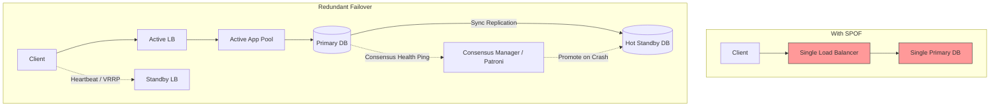

# Single Point of Failure (SPOF), Redundancy, and Failover

## Overview
A **Single Point of Failure (SPOF)** is any individual component or link in a system whose failure immediately halts the operation of the entire system. Eliminating SPOFs requires designing **redundancy** (duplicating critical hardware and software pathways) and implementing automated **failover** mechanisms that seamlessly transition workloads to healthy backups when an active component dies.

## Why It Matters
Modern cloud hardware fails continuously: disks corrupt, NICs drop packets, switches experience power outages, and OS kernels panic. A production system that cannot survive the loss of any single server, switch, or availability zone without downtime is fragile and unsuitable for enterprise scale.

## Core Concepts
- **Redundancy Models**:
  - **$N+1$ Redundancy**: If a system requires $N$ components to handle peak load, exactly 1 redundant component is provisioned.
  - **$2N$ (Active-Passive / Dual Modular)**: Exactly double the required capacity is provisioned.
- **Standby Tiers**:
  - **Cold Standby**: Backup instance is powered off; takes minutes/hours to provision and load state.
  - **Warm Standby**: Backup instance is running, receiving periodic state snapshots; takes seconds to promote.
  - **Hot Standby**: Backup instance runs concurrently, receives live synchronous replication, and assumes traffic in sub-second failover.
- **Heartbeat & Fencing**:
  - Continuous health pinging between nodes.
  - **Fencing (STONITH - Shoot The Other Node In The Head)**: Guarantees a severed primary node is forcefully powered down to prevent both nodes from acting as masters (Split-Brain).

## How It Works
1. **Detection**: Health monitors probe the active node (e.g., via TCP/HTTP pings every 500ms).
2. **Quorum Consensus**: A cluster of arbiters (Raft/ZooKeeper) agrees that the active node has failed after $K$ consecutive missed heartbeats.
3. **Isolation & Fencing**: The failed master is revoked of all write credentials and network VIPs.
4. **Promotion**: The hot standby with the latest WAL log sequence number (LSN) is promoted to Primary.
5. **Traffic Redirection**: The Virtual IP (VIP), DNS record, or Service Mesh router updates routing tables to the new master.

## Trade-offs
| Architecture Pattern | Availability / Recovery Speed | Cost Overhead | Split-Brain Risk |
| :--- | :--- | :--- | :--- |
| **Cold Standby** | Poor (RTO: 15-60 mins) | Minimal (pay only when needed) | Zero |
| **Active-Passive (Hot)** | Excellent (RTO: < 5 seconds) | 100% idle hardware waste | High without strict fencing |
| **Active-Active** | Instantaneous (RTO: 0) | High hardware utilization | Requires distributed conflict resolution |

## When to Use / When NOT to Use
### When to Implement Full Active-Active Redundancy
- Financial gateways, high-volume e-commerce checkouts, and identity providers where even a 30-second failover disrupts thousands of transactions.

### When Simple Warm Standbys Are Acceptable
- Data warehousing batch jobs, non-critical background report generators.

## Real-World Examples
- **GitHub Incident (2018)**: During a brief network partition, automated failover promoted a secondary database that was not fully synchronized with the primary, requiring 24 hours of manual data reconciliation.
- **AWS Direct Connect**: Recommends dual redundant connections terminating in two separate AWS edge routers located in different physical datacenters to avoid a single fiber cut severing corporate connectivity.

## Common Pitfalls
- **Split-Brain Disaster**: Network partition severs the heartbeat between primary and standby; both nodes promote themselves, accept divergent writes, and irreparably corrupt database consistency.
- **Flapping Failovers**: Overly aggressive timeout thresholds (e.g., failing over after 1 missed 100ms ping) trigger endless failover loops during transient network blips.

## Key Takeaways
- Redundancy without automated, tested failover is merely expensive spare hardware.
- Fencing tokens and majority quorum are mandatory to eliminate the split-brain hazard during failover.
- Always calculate Recovery Time Objective (RTO) and Recovery Point Objective (RPO) when designing failovers.

## Common Interview Questions
1. What is split-brain, and what specific architectural primitives prevent it during database failovers?
2. How does Active-Active differ from Active-Passive failover in terms of data replication and routing?
3. How would you design a heartbeat mechanism that avoids false-positive failovers during temporary network jitter?

## Further Reading
- [Patroni: A Template for PostgreSQL High Availability with ZooKeeper/etcd](https://github.com/patroni/patroni)
- [Martin Kleppmann: Please Stop Calling It Consistency (DDIA Chapter 8)](https://dataintensive.net/)
