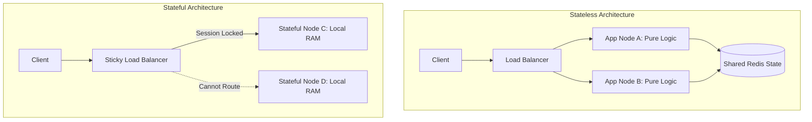

# Stateless vs Stateful Architecture

## Overview
The distinction between **stateless** and **stateful** services is one of the most critical structural decisions in system architecture:
- **Stateless Services**: Treat every request as an independent transaction completely unlinked to any previous request. Application servers retain no local memory or disk state between client calls. Any server in the cluster can handle any request.
- **Stateful Services**: Maintain internal state, persistent context, or active memory across consecutive requests (e.g., open TCP/WebSocket connections, in-memory caches, database storage engines).

## Why It Matters
Stateless applications scale effortlessly: increasing traffic by 10x merely requires launching more identical containers behind a round-robin load balancer. In contrast, scaling stateful systems requires complex data partitioning, session affinity, replication protocols, and failover coordination.

## Core Concepts
- **Session Offloading**: Removing session cookies and shopping cart items from application server memory (`HttpSession`) and storing them in an external high-speed distributed cache (e.g., Redis Cluster, DynamoDB).
- **Sticky Sessions (Session Affinity)**: Routing all requests from a specific user to the exact same physical server instance based on an IP hash or routing cookie. A notorious anti-pattern that inhibits autoscaling and causes traffic hotspots.
- **Ephemeral Containers**: Architectural design where instances can be destroyed, restarted, or rescheduled at any second without data loss or user disruption.

## How It Works
1. **Stateless Flow**:
   - Client sends request with a cryptographically signed Bearer JWT or Session ID header.
   - Load balancer routes request to whichever app node has the least active connections.
   - Node validates JWT locally (statelessly) or queries the centralized Redis cluster in < 1ms to fetch user permissions.
   - Node executes business logic, writes mutations to the primary database, and returns the response.
2. **Stateful Flow (e.g., Database or Game Server)**:
   - Server holds authoritative state in RAM (e.g., player position coordinates or database buffer pool).
   - If server crashes, state must be recovered from persistent disk logs (WAL) or re-synced from peer replicas.

## Trade-offs
| Attribute | Stateless Service | Stateful Service |
| :--- | :--- | :--- |
| **Horizontal Autoscaling** | Trivial (spin up or terminate nodes dynamically) | Hard (requires data repartitioning and rebalancing) |
| **Fault Tolerance** | Instant recovery (router retries on another node) | Slow recovery (requires log replay and replica sync) |
| **Local Read Latency** | Network hop to cache/DB required (0.5-2ms) | Ultra-fast in-memory CPU RAM access (nanoseconds) |
| **Operational Complexity** | Very Low | Very High |

## When to Use / When NOT to Use
### When to Build Stateless Services
- Web application backends, REST/GraphQL APIs, microservice orchestrators, mobile gateways.

### When Stateful Services Are Mandatory
- Relational and NoSQL storage engines, in-memory caches (Redis/Memcached), real-time collaborative document servers, authoritative multiplayer game servers, streaming connection managers.

## Real-World Examples
- **E-Commerce Shopping Carts**: Modern retail platforms (Shopify, Amazon) offload carts to distributed stores (DynamoDB/Redis) so customers can switch seamlessly between mobile apps and desktop browsers without losing cart contents.
- **Discord Voice Gateway**: Stateful infrastructure. Millions of concurrent voice connections terminate on specialized Elixir-based guild servers that hold in-memory routing tables of who is speaking in which audio room.

## Common Pitfalls
- **Local File Upload Anti-Pattern**: Allowing users to upload images or PDFs to the local application server filesystem (`/tmp/uploads`), causing 404 errors when subsequent requests land on different servers.
- **In-Memory Caching Without Invalidation**: Storing configuration or user profiles in a local static hash map inside application memory, leading to divergent, contradictory state across instances.

## Key Takeaways
- The stateless application tier is the secret to modern cloud autoscaling and zero-downtime rolling deployments.
- Push state out of compute instances into specialized, purpose-built stateful infrastructure (PostgreSQL, Redis, S3).
- Avoid sticky sessions whenever possible—they create load hotspots and complicate deployments.

## Common Interview Questions
1. Why is statelessness a prerequisite for horizontal autoscaling in Kubernetes?
2. How do you transition a legacy stateful session application to a modern stateless architecture?
3. What are the engineering challenges of building a stateful multiplayer game server compared to a stateless REST API?

## Further Reading
- [The Twelve-Factor App: VI. Processes (Execute the app as one or more stateless processes)](https://12factor.net/processes)
- [Discord Engineering: How Discord Scaled Elixir to 5,000,000 Concurrent Users](https://discord.com/blog/how-discord-scaled-elixir-to-5-000-000-concurrent-users)
