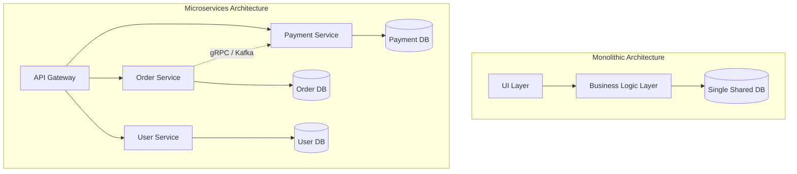

# Monoliths vs Distributed Systems

## Overview
The debate between **monoliths** and **distributed systems (microservices)** represents the classic tension between operational simplicity and organizational scale:
- **Monolith**: An application where the user interface, business logic, and database access layers are packaged and deployed as a single, unified codebase and runtime executable.
- **Modular Monolith**: A monolithic architecture structured into strictly isolated internal modules with explicit public interfaces, sharing a single deployment pipeline.
- **Distributed Microservices**: An architecture where an application is decomposed into independently deployable, loosely coupled services communicating over network protocols (HTTP/gRPC/Kafka).

## Why It Matters
Adopting microservices too early introduces staggering distributed systems overhead—network latency, partial failure modes, distributed transactions, and deployment complexity—for zero business benefit. Conversely, a rapidly growing engineering team of hundreds working in a monolithic repository can suffer severe deployment bottlenecks and merge conflict hell.

## Core Concepts
- **Conway's Law**: *"Organizations which design systems are constrained to produce designs which are copies of the communication structures of these organizations."*
- **Bounded Contexts (DDD)**: Decomposing systems along natural business boundaries where business terminology is unambiguous and self-contained.
- **The Distributed Monolith Anti-Pattern**: An architecture possessing all the operational complexity and network latency of microservices, yet so tightly coupled that deploying one service requires coordinated lockstep deployments of all other services.

## How It Works
1. **Monolith Execution**: Inter-module communication occurs via in-memory function calls on the CPU stack. Data transactions are handled atomically via local ACID database transactions (`BEGIN ... COMMIT`).
2. **Microservices Execution**: Communication requires serializing objects into JSON/Protobuf, transmitting packets across physical networks over TCP/HTTP/2, and managing timeouts, retries, and circuit breakers.

## Trade-offs
| Architectural Dimension | Monolith / Modular Monolith | Distributed Microservices |
| :--- | :--- | :--- |
| **Development Velocity (Small Team)** | Extremely High | Low (heavy infrastructure tax) |
| **Deployment Independence** | Low (single deployment pipeline) | High (teams deploy independently) |
| **Network Latency Overhead** | Zero (in-memory function calls) | High (0.5ms - 5ms per network hop) |
| **Operational Complexity** | Minimal (single process, simple logs) | Staggering (Kubernetes, Envoy, OTel tracing) |
| **Data Consistency** | Simple ACID transactions | Eventual consistency, Sagas, Outbox pattern |

## When to Use / When NOT to Use
### When to Build a Monolith / Modular Monolith
- Early-stage startups, new products with evolving domain boundaries, teams with fewer than 30 engineers.
- Systems requiring ultra-low latency and strict transactional integrity.

### When to Transition to Microservices
- Large organizations with multiple engineering teams (50+ engineers) that need to ship features independently without blocking on a centralized release train.
- Specific sub-components require drastically divergent scaling characteristics (e.g., a video transcoding service needing GPU instances vs a lightweight auth service).

## Real-World Examples
- **Amazon Prime Video (2023)**: Migrated their video quality monitoring service from distributed AWS Step Functions and microservices back to a consolidated monolithic architecture, reducing infrastructure costs by **90%** and drastically improving performance.
- **Shopify**: Operates one of the world's largest Ruby on Rails applications as a disciplined **Modular Monolith**, processing over $100 billion in gross merchandise value with high developer productivity.

## Common Pitfalls
- **Shared Database Anti-Pattern**: Splitting code into separate microservices but pointing them all to the same shared PostgreSQL database, creating hidden coupling and defeating the purpose of independent deployments.
- **Distributed Transactions**: Attempting to execute distributed ACID transactions across multiple microservices instead of embracing event-driven Sagas and eventual consistency.

## Key Takeaways
- Start with a well-structured **Modular Monolith**; extract microservices only when organizational scale or distinct scaling profiles demand it.
- Microservices solve team scaling and deployment coordination bottlenecks, NOT code performance.
- Each microservice must own its private database—never share databases across service boundaries.

## Common Interview Questions
1. Under what circumstances would you recommend migrating from microservices back to a modular monolith?
2. How does Conway's Law influence system architecture decisions?
3. What is the "distributed monolith" anti-pattern, and how do you identify it?

## Further Reading
- [Martin Fowler: Microservice Prerequisites](https://martinfowler.com/bliki/MicroservicePrerequisites.html)
- [Prime Video Tech Blog: Scaling up the Prime Video audio/video monitoring service and reducing costs by 90%](https://www.primevideotech.com/video-streaming/scaling-up-the-prime-video-audio-video-monitoring-service-and-reducing-costs-by-90)
