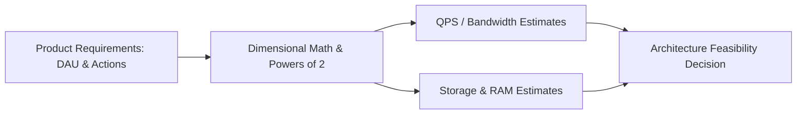

# Back-of-the-Envelope Estimation Thinking

## Overview
**Back-of-the-envelope estimation** is the discipline of using quick mental math, dimensional analysis, and standard heuristics to rapidly approximate system capacity, traffic throughput, memory requirements, and network bandwidth. It allows engineers to validate whether an architectural proposal is physically and economically feasible before writing a single line of code.

## Why It Matters
System design without numbers is just hand-waving. If a proposed design requires storing 50 terabytes of data per day in an in-memory Redis cluster, back-of-the-envelope calculation instantly reveals that the hardware cost will be astronomically prohibitive, allowing you to pivot to SSD-backed LSM-Tree storage (RocksDB/Cassandra) within minutes.

## Core Concepts
- **Key Approximations to Memorize**:
  - Seconds per day: $24 \times 60 \times 60 = 86,400 \approx 100,000\text{ (10}^5\text{) seconds}$ for quick estimates.
  - Queries Per Second rule of thumb:
    $$\text{Average QPS} = \frac{\text{Daily Requests}}{86,400} \approx \frac{\text{Daily Requests}}{10^5}$$
    *Example*: 100 Million daily requests $\approx 1,000$ QPS (Peak typically $2\times$ to $3\times \approx 2,500$ QPS).
- **The 80/20 Rule (Pareto Principle) for Caching**:
  - 20% of your data generates 80% of read traffic.
  - *Cache Sizing Rule*: Size your cache to hold **20% of your daily read working set** in RAM.
- **Powers of Two Anchors**:
  - $2^{10} = 1,024 \approx 1\text{ KB}$ (Kilobyte)
  - $2^{20} = 1,048,576 \approx 1\text{ MB}$ (Megabyte)
  - $2^{30} \approx 1\text{ GB}$ (Gigabyte)
  - $2^{40} \approx 1\text{ TB}$ (Terabyte)
  - $2^{50} \approx 1\text{ PB}$ (Petabyte)

## How It Works: Step-by-Step Calculation Walkthrough
Consider designing a photo sharing service with 500 Million Daily Active Users (DAU):
1. **Traffic Estimation**:
   - Assume each user views 20 photos and uploads 1 photo daily.
   - Upload QPS:
     $$\frac{500,000,000 \times 1}{10^5} = 5,000\text{ writes/sec (Peak } \approx 10,000\text{ QPS)}$$
   - View QPS:
     $$\frac{500,000,000 \times 20}{10^5} = 100,000\text{ reads/sec (Peak } \approx 200,000\text{ QPS)}$$
2. **Storage Estimation**:
   - Average photo size = 200 KB. Metadata = 500 bytes.
   - Daily media storage:
     $$500,000,000 \times 200\text{ KB} = 100\text{ TB/day}$$
   - 5-Year Storage Capacity:
     $$100\text{ TB/day} \times 365 \times 5 \approx 182.5\text{ Petabytes}$$
3. **Bandwidth Estimation**:
   - Ingress: $5,000\text{ QPS} \times 200\text{ KB} = 1\text{ GB/sec} = 8\text{ Gbps}$.
   - Egress: $100,000\text{ QPS} \times 200\text{ KB} = 20\text{ GB/sec} = 160\text{ Gbps}$ (Clearly requires CDN edge offloading!).

## Trade-offs
| Precision Level | Speed | Utility |
| :--- | :--- | :--- |
| **Exact Formulaic Accounting** | Slow (hours of spreadsheet work) | Necessary for final cloud procurement budgets |
| **Order-of-Magnitude Estimation** | Fast (60 seconds on a whiteboard) | Perfect for evaluating competing architectural proposals |

## When to Use / When NOT to Use
### When to Use
- During architectural whiteboarding, interview scoping, capacity planning, and early design reviews.

### When NOT to Use
- When purchasing physical hardware for bare-metal datacenters or allocating exact financial infrastructure budgets (use exact sizing).

## Real-World Examples
- **Enrico Fermi**: Famous for solving the "Fermi problem" (e.g., estimating the number of piano tuners in Chicago) using chain multiplications of estimated ratios. This technique forms the foundation of modern engineering capacity planning.
- **YouTube Ingestion**: Approximating 500 hours of video uploaded every minute immediately dictates that video transcoding must be an asynchronous distributed worker pipeline rather than an inline synchronous HTTP request.

## Common Pitfalls
- **Unit Conversion Errors**: Confusing **bits** with **bytes** (1 Byte = 8 bits). Network bandwidth is rated in bits per second (Gbps), whereas storage is measured in bytes (GB/TB).
- **Ignoring Peak Multipliers**: Designing a system exclusively for average QPS and crashing when evening traffic surges 3x.

## Key Takeaways
- Always round numbers aggressively ($86,400 \approx 100,000$) to enable rapid mental arithmetic.
- Calculate QPS, storage over 5 years, network bandwidth, and 20% cache RAM for every design.
- Bandwidth calculations reveal whether an application requires CDN edge caching.

## Common Interview Questions
1. How do you estimate the cache RAM needed for a read-heavy service with 100 million daily active users?
2. If an API has an ingress bandwidth of 250 MB/sec, what is the network bandwidth requirement in Gbps?
3. How do you estimate the number of server instances needed to support 50,000 QPS?

## Further Reading
- [Section 20: Estimation and Interview Framework (Deep Dive)](../20-estimation-and-interview-framework/01-numbers-every-engineer-should-know.md)
- [Jeff Dean: Numbers Everyone Should Know](http://brenocon.com/dean_perf.html)
