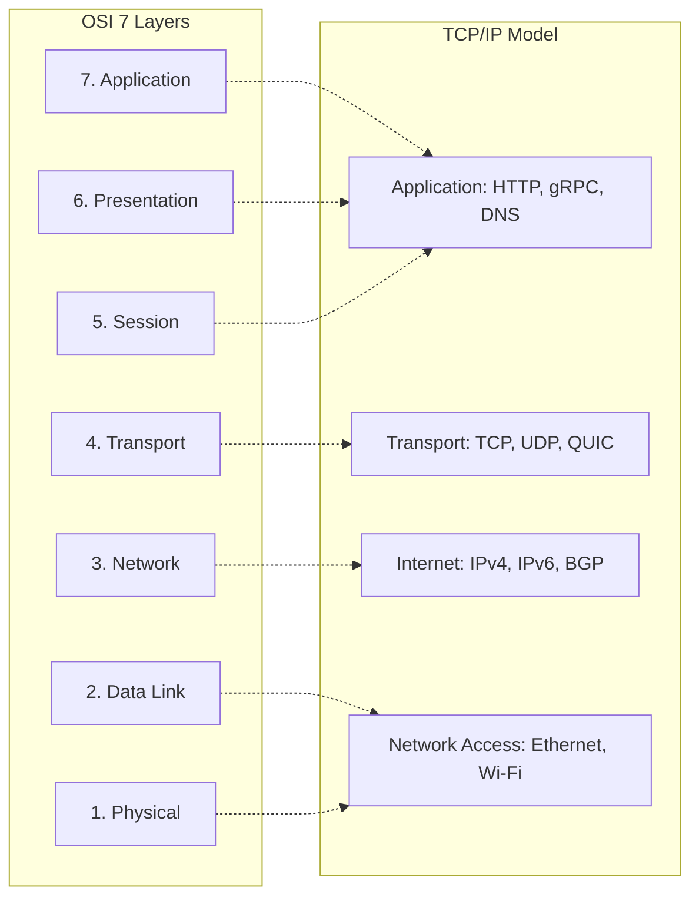

# OSI and TCP/IP Models: A Practical Systems Perspective

## Overview
Networking models provide abstract layered frameworks for conceptualizing how data moves across physical mediums into running application processes:
- **The OSI 7-Layer Model**: A theoretical reference model (Physical, Data Link, Network, Transport, Session, Presentation, Application).
- **The TCP/IP 4-Layer Model**: The pragmatic, implemented architecture of the internet (Link, Internet, Transport, Application).

## Why It Matters
In production system design, backend engineers rarely debug L1 or L2 (fiber optic photons or Ethernet frames). However, deep mastery of **L3 (IP routing / Anycast)**, **L4 (TCP connections, UDP streams, port multiplexing)**, and **L7 (HTTP headers, cookies, TLS termination)** is essential for architecting load balancers, firewalls, and low-latency microservices.

## Core Concepts
- **Encapsulation & Decapsulation**: As data descends the stack, each layer prepends its own header (e.g., Application Data -> TCP Segment -> IP Packet -> Ethernet Frame). Upon arrival, each layer strips its header.
- **Maximum Transmission Unit (MTU)**: The largest packet size that can be transmitted over a network link without fragmentation (standard Ethernet MTU is **1,500 bytes**).
- **Port Multiplexing**: 16-bit identifiers (0-65535) allowing a single IP address to host multiple distinct network services simultaneously (e.g., Port 443 for HTTPS, Port 5432 for PostgreSQL).

## How It Works: Packet Traversal Lifecyle
1. **L7 Application**: User browser creates an HTTP/2 GET request.
2. **L4 Transport**: OS TCP stack wraps the payload in a TCP segment, attaching source/destination ports and sequence numbers.
3. **L3 Internet**: IP stack wraps the segment in an IP packet, attaching source and destination IP addresses.
4. **L2 Link**: Network card resolves the next-hop router via ARP (Address Resolution Protocol) and transmits an Ethernet frame.
5. **Traversing the Web**: Routers inspect only L3 headers to hop across autonomous systems (AS) via BGP.
6. **Arrival**: The destination server decapsulates the headers and delivers the raw byte payload to the socket buffer of the target process.

## Trade-offs
| Layer Focus | Processing Overhead | Routing Intelligence |
| :--- | :--- | :--- |
| **Layer 4 (Transport / TCP)** | Sub-millisecond (kernel-space zero-copy splicing) | Blind to application payload (cannot route by URL path or cookies) |
| **Layer 7 (Application / HTTP)**| Moderate (requires TLS decryption and HTTP parsing) | High (intelligent path-based routing, header auth, rate limiting) |

## When to Use / When NOT to Use
### When to Operate at Layer 4
- Ultra-high throughput raw streaming (gaming, live audio UDP), internal database proxies, and edge DDoS packet scrubbing.

### When to Operate at Layer 7
- Microservice API Gateways, web application routing, authentication middleware, and content-based request caching.

## Real-World Examples
- **AWS Elastic Load Balancing**: Explicitly offers two distinct products reflecting this divide: **AWS Network Load Balancer (NLB - Layer 4)** capable of handling millions of requests per second with ultra-low latency, and **AWS Application Load Balancer (ALB - Layer 7)** for HTTP/HTTPS path-based routing.

## Common Pitfalls
- **Packet Fragmentation Overhead**: Exceeding MTU limits causes routers to split packets into fragments, dramatically increasing packet loss rates and router CPU loads.
- **Ignoring Ephemeral Port Exhaustion**: A server initiating thousands of outbound HTTP connections per second can exhaust the 16-bit ephemeral port range (~65,000 ports) if sockets linger in `TIME_WAIT`.

## Key Takeaways
- System design focuses primarily on Layer 3 (IP), Layer 4 (TCP/UDP), and Layer 7 (HTTP/gRPC).
- L4 routing is fast and blind; L7 routing is intelligent and computationally expensive.
- Encapsulation adds fixed header overhead to every transmitted payload.

## Common Interview Questions
1. How does a Layer 4 load balancer route traffic compared to a Layer 7 load balancer?
2. What is MTU, and what happens when an IP packet exceeds the path MTU?
3. What is the difference between a TCP socket, a port, and an IP address?

## Further Reading
- [W. Richard Stevens: TCP/IP Illustrated, Volume 1 (The Protocols)](https://www.pearson.com/en-us/subject-catalog/p/tcpip-illustrated-volume-1-the-protocols/P200000003504)
- [RFC 1122: Requirements for Internet Hosts -- Communication Layers](https://datatracker.ietf.org/doc/html/rfc1122)
