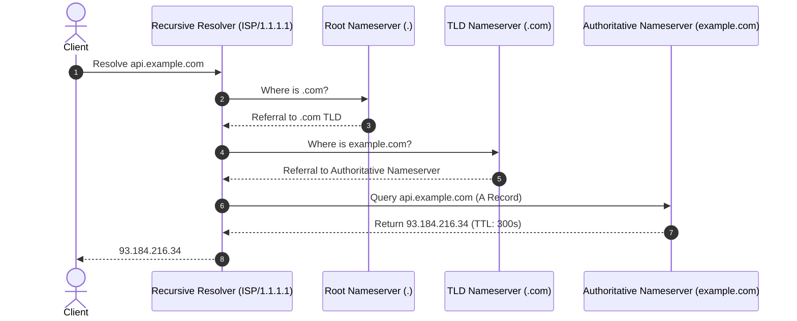

# IP Addressing and Domain Name System (DNS)

## Overview
The **Internet Protocol (IP)** provides the universal addressing and routing mechanism across the global internet. The **Domain Name System (DNS)** serves as the decentralized hierarchical phonebook of the internet, mapping human-readable hostnames (e.g., `api.example.com`) to machine-routable IP addresses (e.g., `93.184.216.34` or IPv6 `2606:2800:220:1:248:1893:25c8:1946`).

## Why It Matters
DNS is the very first network hop for every web and API transaction. A misconfigured DNS record can take an entire company offline globally within seconds. Furthermore, modern architectures leverage DNS as a powerful global traffic management engine for latency routing, geo-fencing, and disaster recovery.

## Core Concepts
- **Common DNS Record Types**:
  - **A**: Maps hostname to an IPv4 address (32-bit).
  - **AAAA**: Maps hostname to an IPv6 address (128-bit).
  - **CNAME**: Canonical Name alias pointing one hostname to another hostname (cannot be set on the root apex domain `@`).
  - **ALIAS / ANAME**: Virtual synthetic record allowing CNAME-like flattening at the zone apex.
  - **MX**: Mail Exchange record designating destination mail servers.
  - **TXT**: Arbitrary text strings used for domain ownership validation and email security (SPF, DKIM, DMARC).
- **Time to Live (TTL)**: Number of seconds recursive resolvers and client OSs are permitted to cache a DNS response before querying authoritative servers again.
- **GeoDNS & Latency-Based Routing**: Authoritative nameservers inspect the requester's IP (via EDNS Client Subnet) and dynamically respond with the IP address of the topologically closest datacenter.

## How It Works: The 4-Tier Hierarchical Query Flow
1. **Stub Resolver**: Client OS checks local browser cache and OS hosts file.
2. **Recursive Resolver**: Queries are sent to configured public or ISP resolvers (e.g., Cloudflare `1.1.1.1`, Google `8.8.8.8`).
3. **Root Nameservers**: 13 logical root server clusters (`a.root-servers.net` to `m.root-servers.net`) distributed worldwide via Anycast respond with referrals to TLD servers.
4. **TLD Nameservers**: Handle top-level domains (`.com`, `.org`, `.net`) and provide referrals to authoritative servers.
5. **Authoritative Nameservers**: The final authority hosting the actual zone file (e.g., AWS Route 53, Cloudflare).

## Trade-offs
| DNS TTL Strategy | Failover Speed | Cache Efficiency & DNS Query Load |
| :--- | :--- | :--- |
| **Short TTL (30 - 60 seconds)** | Rapid failover (traffic updates in < 1 min) | High DNS query volume, higher latency on cold misses |
| **Long TTL (86,400 seconds / 24 hours)** | Terrible failover (traffic stuck on dead IP for a day) | Maximum cache hit ratio, sub-millisecond DNS lookups |

## When to Use / When NOT to Use
### When to Use DNS for Load Balancing
- Global Server Load Balancing (GSLB) across major continental datacenters (e.g., US-East vs EU-West).

### When NOT to Rely Solely on DNS for Load Balancing
- Rapid failover within a datacenter or distributing load across application containers (local L4/L7 load balancers are required due to client DNS caching disregarding TTLs).

## Real-World Examples
- **Dyn DNS DDoS Attack (2016)**: The Mirai botnet targeted Dyn's authoritative DNS infrastructure with tens of millions of IP lookups per second, effectively taking down Twitter, Netflix, GitHub, and Spotify across North America despite their servers being 100% healthy.
- **AWS Route 53 Health Checks**: Constantly monitors backend web endpoints. If an endpoint fails health checks, Route 53 automatically withdraws its IP address from DNS responses.

## Common Pitfalls
- **Ignoring ISP TTL Disregard**: Some mobile carriers and ISPs cache DNS records for days, ignoring your 60-second TTL during an emergency migration.
- **Apex CNAME Limitation**: Attempting to put a standard CNAME record on the root domain (`example.com`), violating RFC 1034 (must use ALIAS/ANAME instead).

## Key Takeaways
- DNS is a distributed, hierarchical, globally cached database.
- Lower TTLs prior to scheduled data center migrations to allow rapid cutover.
- Never use DNS as your sole local load balancing mechanism.

## Common Interview Questions
1. Walk through the complete lifecycle of a DNS resolution when typing `google.com` into a browser.
2. How does GeoDNS determine the user's geographic location, and what are its limitations?
3. What is the difference between an A record, a CNAME record, and an ALIAS record?

## Further Reading
- [RFC 1034: Domain Names - Concepts and Facilities](https://datatracker.ietf.org/doc/html/rfc1034)
- [Cloudflare: How DNS Works](https://www.cloudflare.com/learning/dns/what-is-dns/)
