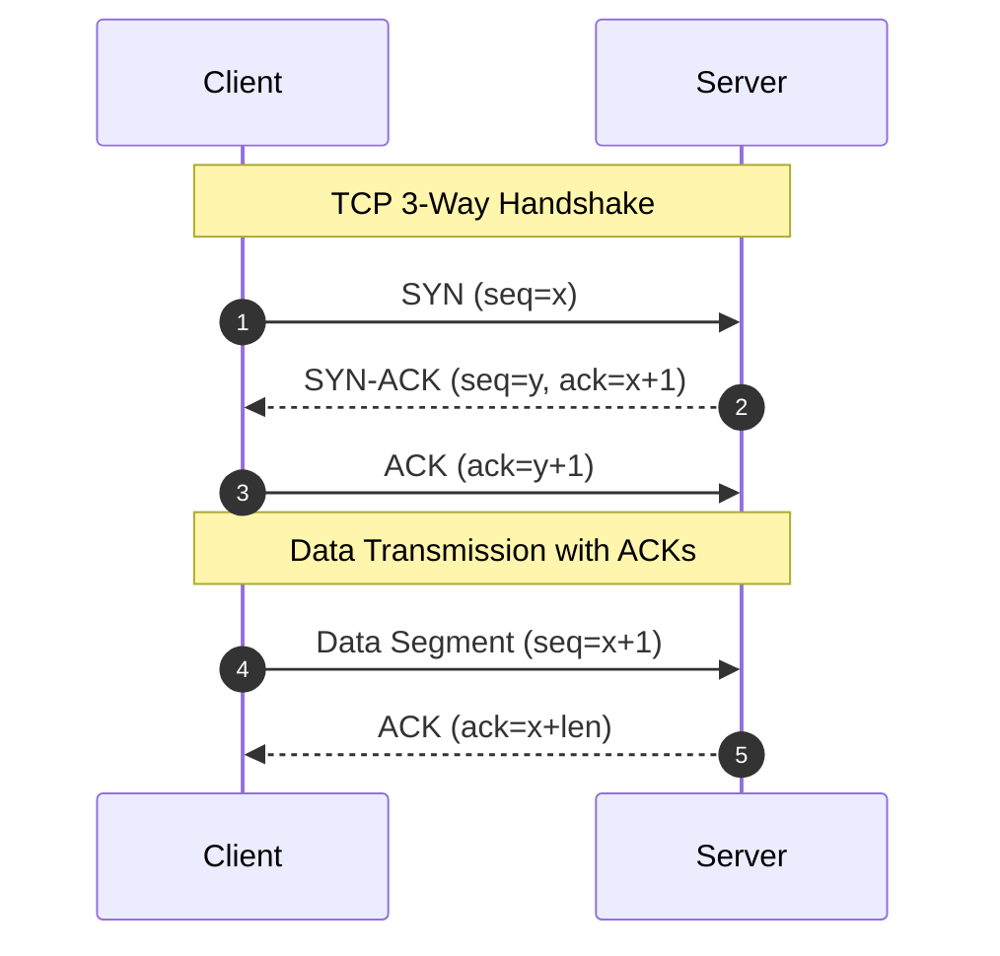

# TCP vs UDP: Handshakes, Reliability, and Congestion Control

## Overview
The Transport Layer (Layer 4) provides host-to-host communication services for applications, dominated by two fundamentally distinct protocols:
- **TCP (Transmission Control Protocol)**: A connection-oriented, reliable, byte-stream protocol guaranteeing in-order delivery, error detection, flow control, and network congestion control.
- **UDP (User Datagram Protocol)**: A connectionless, lightweight, unreliable datagram protocol providing minimal transport framing with zero delivery, ordering, or congestion guarantees.

## Why It Matters
Choosing between TCP and UDP determines whether your application optimizes for **guaranteed reliability** or **ultra-low latency**. Furthermore, understanding TCP congestion control algorithms (like Cubic and BBR) is essential for saturating high-bandwidth transatlantic fiber links.

## Core Concepts
- **TCP 3-Way Handshake**: Connection establishment: `SYN` -> `SYN-ACK` -> `ACK` (incurs 1 full network Round Trip Time - RTT before any application data is sent).
- **TCP 4-Way Teardown**: Connection closure: `FIN` -> `ACK` -> `FIN` -> `ACK` (accompanied by `TIME_WAIT` state to catch lingering delayed packets).
- **Flow Control (Sliding Window)**: Prevents a fast sender from overwhelming a slow receiver's buffer space (advertised via the TCP Receive Window `rwnd`).
- **Congestion Control**: Prevents the sender from overwhelming the intermediate network infrastructure:
  - **Loss-based (TCP Reno / Cubic)**: Interprets packet loss as a congestion signal; ramps up window exponentially, then backs off multiplicatively upon packet drop.
  - **BBR (Bottleneck Bandwidth and RTT - Google)**: Models maximum physical delivery rate and minimum round-trip time, preventing bufferbloat.

## How It Works: The Protocols in Action
1. **TCP Reliability Mechanics**:
   - Every transmitted byte has a sequence number.
   - The receiver sends cumulative ACKs.
   - If an ACK is not received before the Retransmission Timeout (RTO), or if 3 duplicate ACKs arrive (Fast Retransmit), the sender retransmits the missing segment.
   - *Head-of-Line Blocking*: If segment 2 is lost in transit, segments 3, 4, and 5 cannot be delivered to the application until segment 2 is retransmitted and acknowledged.
2. **UDP Datagram Mechanics**:
   - The sender transmits an 8-byte header (Source Port, Destination Port, Length, Checksum) followed by data.
   - No handshake, no state, no retransmissions. If packets drop, they are gone forever.

## Trade-offs
| Feature | TCP | UDP |
| :--- | :--- | :--- |
| **Connection State** | Stateful (requires handshake and memory buffers) | Stateless (zero connection overhead) |
| **Header Size** | 20 - 60 bytes | Exactly 8 bytes |
| **Delivery Guarantee**| 100% Reliable (retransmits dropped packets) | Unreliable (best-effort delivery) |
| **Packet Ordering** | Strictly Guaranteed | None (can arrive out of order) |
| **Latency** | Higher (handshake + retransmission delays) | Minimal (instant transmission) |

## When to Use / When NOT to Use
### When to Choose TCP
- Web browsing (HTTP/1.1, HTTP/2), REST APIs, database queries, file transfers (SSH, SFTP), transactional email (SMTP).

### When to Choose UDP
- Real-time multiplayer video games, VoIP (voice calls), video conferencing (WebRTC media streams), DNS queries, live sports broadcasting.

## Real-World Examples
- **Google BBR**: Developed by Google in 2016 and deployed across YouTube and Google.com. By moving from loss-based congestion control to BBR, Google increased YouTube network throughput by 4% globally and over 14% in developing markets.
- **HTTP/3 (QUIC)**: Replaced TCP entirely with UDP at the transport layer, implementing its own user-space reliability and stream multiplexing to eliminate TCP Head-of-Line blocking.

## Common Pitfalls
- **Head-of-Line Blocking on Lossy Networks**: Using TCP for real-time multiplayer gaming over Wi-Fi/cellular; a single dropped packet freezes the game stream for 200ms while waiting for a retransmission.
- **SYN Flood DDoS**: Attackers send millions of TCP `SYN` packets from spoofed IPs without returning the final `ACK`, exhausting server connection backlogs (mitigated using **SYN Cookies**).

## Key Takeaways
- TCP guarantees reliability and order at the cost of latency and Head-of-Line blocking.
- UDP provides raw speed and zero connection overhead, delegating reliability logic to the application layer if needed.
- BBR congestion control prevents bufferbloat by measuring real physical pipe width rather than relying on packet drops.

## Common Interview Questions
1. Why does HTTP/3 run over UDP instead of TCP?
2. What is TCP Head-of-Line blocking, and why does HTTP/2 still suffer from it?
3. How do SYN cookies defend against SYN flood attacks?

## Further Reading
- [Neal Cardwell et al.: BBR: Congestion-Based Congestion Control (ACM Queue, 2016)](https://queue.acm.org/detail.cfm?id=3022184)
- [RFC 793: Transmission Control Protocol](https://datatracker.ietf.org/doc/html/rfc793)
