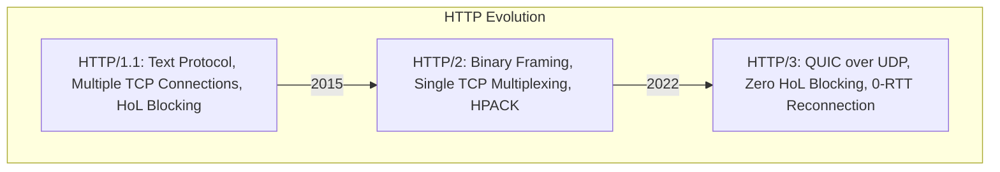

# HTTP Evolution: HTTP/1.1, HTTP/2, HTTP/3 (QUIC), and TLS

## Overview
The **Hypertext Transfer Protocol (HTTP)** is the foundational application-layer protocol of the World Wide Web. Over three decades, HTTP has undergone fundamental architectural rewrites to eliminate transport bottlenecks:
- **HTTP/1.1**: Text-based, keep-alive persistent TCP connections, prone to Head-of-Line blocking.
- **HTTP/2**: Binary framing, single-connection multiplexing, header compression (HPACK), server push.
- **HTTP/3**: Runs over **QUIC (UDP)**, eliminating TCP-level Head-of-Line blocking and enabling connection migration.
- **HTTPS & TLS 1.3**: Cryptographic security layer providing confidentiality, data integrity, and authentication.

## Why It Matters
Modern web pages load an average of 70+ distinct assets (JavaScript bundles, CSS, images, API payloads). Understanding protocol differences enables architects to optimize asset delivery, configure edge CDN termination, and minimize mobile battery consumption.

## Core Concepts
- **HTTP/1.1 Head-of-Line (HoL) Blocking**: Over a single TCP connection, requests must be processed serially. If request 1 stalls on a slow database query, requests 2, 3, and 4 wait in line. Browsers hacked around this by opening 6 parallel TCP connections per domain.
- **HTTP/2 Binary Framing & Multiplexing**: Breaks requests into independent binary frames tagged with a stream ID. Multiple concurrent requests travel over a **single TCP connection** simultaneously.
- **HPACK Compression**: Compresses repetitive HTTP headers using static and dynamic Huffman encoding tables.
- **QUIC & HTTP/3**: Replaces TCP with UDP. Stream multiplexing happens at the transport layer: if packet loss occurs on Stream 1, **Stream 2 and Stream 3 continue processing without interruption**.
- **TLS 1.3 Handshake**: Reduced from 2 RTTs in TLS 1.2 down to **1 RTT** (and 0-RTT for resumed sessions) using Ephemeral Diffie-Hellman key exchange.

## How It Works: Protocol Feature Comparison
| Protocol Feature | HTTP/1.1 | HTTP/2 | HTTP/3 (QUIC) |
| :--- | :--- | :--- | :--- |
| **Transport Layer** | TCP | TCP | UDP (QUIC) |
| **Data Format** | Plain Text | Binary Framing | Binary Framing |
| **Multiplexing** | No (Serial) | Yes (Application-layer) | Yes (Transport-layer) |
| **Head-of-Line Blocking**| Severe (HTTP level) | Partial (TCP level) | **Zero** |
| **TLS Handshake** | 2 RTTs (TLS 1.2) | 1 RTT (TLS 1.3) | 1 RTT (Combined Crypto + Transport) |
| **Connection Migration**| Broken on IP change | Broken on IP change | **Seamless** (via Connection ID) |

## Trade-offs
| Protocol Choice | Latency & Performance | Infrastructure & Operational Cost |
| :--- | :--- | :--- |
| **HTTP/1.1** | Slowest (connection setup overhead) | Universal compatibility, trivial to debug with `curl` |
| **HTTP/2** | Fast on clean broadband networks | High CPU memory during massive fan-out multiplexing |
| **HTTP/3** | Blazing fast on mobile/lossy Wi-Fi | Higher UDP CPU utilization; corporate firewalls sometimes block UDP:443 |

## When to Use / When NOT to Use
### When to Deploy HTTP/2 and HTTP/3
- Public-facing websites, mobile application APIs, and edge CDN termination where network loss and latency vary widely.

### When HTTP/1.1 or gRPC (over HTTP/2) Suffices
- Internal backend microservice-to-microservice RPCs running inside the pristine LAN of a cloud datacenter.

## Real-World Examples
- **Mobile Handover (HTTP/3)**: A smartphone user on a video call walks out of their house, transitioning from Wi-Fi to 5G cellular. Under HTTP/2 (TCP), the IP address change severs the socket, dropping the call. Under HTTP/3, the **QUIC Connection ID** persists across the network shift with zero packet drop.
- **Cloudflare**: In 2021 reported that HTTP/3 reduced page load times by up to 20% on lossy networks compared to HTTP/2.

## Common Pitfalls
- **Domain Sharding in HTTP/2**: Splitting assets across `cdn1.example.com`, `cdn2.example.com` was an essential HTTP/1.1 hack. In HTTP/2, this is a harmful anti-pattern that forces multiple TCP connections and breaks single-connection multiplexing.
- **Ignoring UDP Blocking**: Some enterprise corporate firewalls arbitrarily block all outbound UDP traffic on port 443, requiring modern web clients to support automatic fallback to HTTP/2.

## Key Takeaways
- HTTP/1.1 was text-based and serial; HTTP/2 introduced binary multiplexing over single TCP sockets.
- HTTP/3 moves to UDP (QUIC) to eradicate TCP-level Head-of-Line blocking and support mobile connection migration.
- TLS 1.3 cuts cryptographic connection setup time in half (1 RTT).

## Common Interview Questions
1. Why does HTTP/2 still suffer from Head-of-Line blocking if it multiplexes requests?
2. How does QUIC handle connection migration when a mobile phone switches from Wi-Fi to cellular?
3. What security improvements did TLS 1.3 introduce over TLS 1.2?

## Further Reading
- [RFC 9114: HTTP/3](https://datatracker.ietf.org/doc/html/rfc9114)
- [RFC 8446: The Transport Layer Security (TLS) Protocol Version 1.3](https://datatracker.ietf.org/doc/html/rfc8446)
