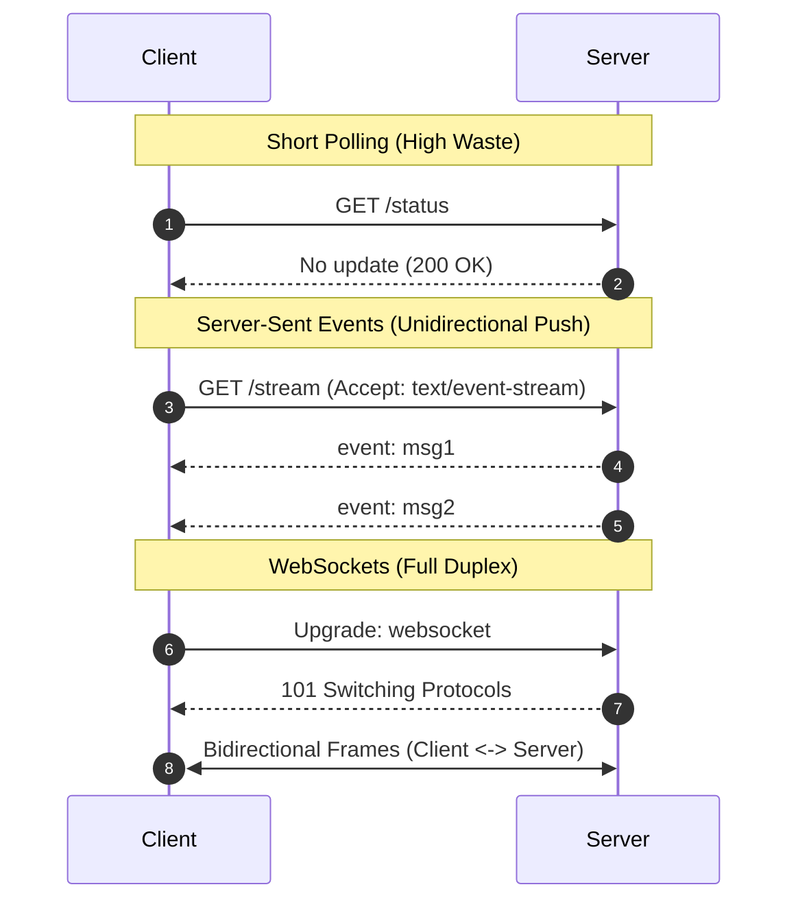

# Real-Time Protocols: WebSockets, Server-Sent Events, and Long Polling

## Overview
Traditional HTTP follows a strict client-initiated request-response lifecycle. For applications requiring instant server-to-client updates, engineers deploy specialized real-time protocols:
- **Short Polling**: Client repeatedly fires standard HTTP requests on a fixed timer (e.g., every 2 seconds).
- **Long Polling**: Server holds the HTTP request open until new data arrives or a timeout occurs.
- **Server-Sent Events (SSE)**: Unidirectional, persistent HTTP connection where the server pushes text events to the client.
- **WebSockets**: Full-duplex, bidirectional, persistent TCP connection established via an initial HTTP upgrade handshake.

## Why It Matters
Holding millions of concurrent persistent connections open consumes substantial server memory and file descriptors. Choosing the wrong protocol can exhaust server connection pools or drain client mobile batteries.

## Core Concepts
- **Full-Duplex vs Half-Duplex vs Simplex**:
  - *Full-Duplex*: Both client and server can transmit data simultaneously over the same connection (WebSockets).
  - *Unidirectional (Simplex)*: Only the server pushes data once the connection is established (SSE).
- **Framing Overhead**: Standard HTTP requests require 500-1,000 bytes of headers. WebSocket binary frames add only **2 to 10 bytes** of framing overhead per message.
- **Proxy & Firewall Traversal**: SSE runs over standard HTTP/2, passing effortlessly through corporate proxies and firewalls. WebSockets require explicit support for the HTTP `101 Switching Protocols` upgrade header.

## Trade-offs
| Protocol | Directionality | Protocol Base | Framing Overhead | Auto-Reconnect |
| :--- | :--- | :--- | :--- | :--- |
| **Short Polling** | Client -> Server | HTTP/1.1 | Massive (new headers every call) | Manual |
| **Long Polling** | Client -> Server | HTTP/1.1 | High (headers on every cycle) | Manual |
| **Server-Sent Events**| Server -> Client | HTTP/2 | Low | **Native in browser (`EventSource`)** |
| **WebSockets** | **Bidirectional** | TCP (custom) | **Minimal (2-10 bytes)** | Manual application logic |

## When to Use / When NOT to Use
### When to Use WebSockets
- Collaborative multi-user editing (Google Docs/Figma), real-time multiplayer gaming, bidirectional chat applications (WhatsApp/Slack), financial crypto order books with user trades.

### When to Use Server-Sent Events (SSE)
- Stock tickers, live sports scores, ChatGPT/LLM streaming responses, notification feeds, build progress logs.

### When to Avoid WebSockets
- Simple notification systems or unidirectional feeds where SSE provides built-in auto-reconnection, multiplexing over HTTP/2, and zero custom firewall configuration.

## Real-World Examples
- **OpenAI ChatGPT**: Uses **Server-Sent Events (SSE)** to stream generated tokens to the browser. Since the user does not send input during text generation, SSE is vastly simpler and more reliable than a WebSocket.
- **Discord**: Uses **WebSockets** for chat and presence tracking, maintaining a shared gateway connection pool multiplexing thousands of servers.

## Common Pitfalls
- **Load Balancer Idle Timeouts**: Intermediary load balancers (e.g., AWS ALB) terminate idle TCP connections after 60 seconds unless application heartbeat/ping-pong frames are implemented.
- **WebSocket Scaling Bottleneck**: Forgetting that WebSocket servers are inherently stateful; broadcasting a message to a room requires a distributed pub/sub backplane (e.g., Redis Pub/Sub) across gateway nodes.

## Key Takeaways
- Use **SSE** for unidirectional server-to-client streaming (simpler, HTTP/2 native, built-in reconnection).
- Use **WebSockets** only when true low-latency bidirectional communication is mandatory.
- Long polling is legacy; avoid it in greenfield systems.

## Common Interview Questions
1. Why did OpenAI choose Server-Sent Events instead of WebSockets for streaming ChatGPT responses?
2. How do you scale a WebSocket server cluster horizontally to 10 million concurrent connections?
3. What happens to a WebSocket connection when an intermediary load balancer restarts?

## Further Reading
- [RFC 6455: The WebSocket Protocol](https://datatracker.ietf.org/doc/html/rfc6455)
- [HTML Living Standard: Server-Sent Events](https://html.spec.whatwg.org/multipage/server-sent-events.html)
