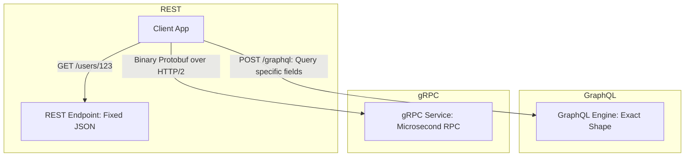

# API Paradigms: REST, gRPC, and GraphQL Overview

## Overview
Modern distributed architectures connect clients and microservices through three dominant API paradigms:
- **REST (Representational State Transfer)**: Resource-oriented, text-based (JSON over HTTP/1.1 or HTTP/2), stateless, ubiquitous.
- **gRPC (Google Remote Procedure Call)**: Action-oriented RPC, binary serialization (Protocol Buffers over HTTP/2), strictly typed, high performance.
- **GraphQL**: Query-oriented, single-endpoint declarative data fetching (JSON over HTTP), eliminates over-fetching and under-fetching.

## Why It Matters
Selecting the wrong API paradigm impacts client developer productivity, payload size over mobile networks, and microservice throughput. High-scale architectures routinely deploy **GraphQL or REST at the public edge** and **gRPC for internal east-west microservice communication**.

## Core Concepts
- **Over-Fetching vs Under-Fetching**:
  - *Over-fetching*: Downloading an entire 50-field user object when the UI only displays a username (typical in REST).
  - *Under-fetching*: Firing 4 consecutive REST calls (`/users`, `/orders`, `/products`, `/reviews`) to render a single screen.
- **Interface Definition Language (IDL)**: gRPC uses `.proto` files to define strongly typed service contracts, auto-generating client SDKs in Go, Java, Python, TypeScript, and C++.
- **Binary vs Text Serialization**: Protobuf serializes data into compact binary tags, executing **5x to 10x faster** with 30-50% smaller payloads than JSON serialization.

## Trade-offs
| Feature | REST | gRPC | GraphQL |
| :--- | :--- | :--- | :--- |
| **Data Format** | JSON (Plain Text) | Protocol Buffers (Binary) | JSON (Plain Text) |
| **Protocol** | HTTP/1.1 or HTTP/2 | HTTP/2 (Multiplexed) | HTTP/1.1 or HTTP/2 |
| **Schema Strictness** | Optional (OpenAPI) | **Mandatory & Strictly Typed** | **Mandatory (Schema SDL)** |
| **Client Control** | Low (Server defines response) | Low (Fixed RPC return) | **Absolute (Client requests fields)**|
| **Browser Compatibility**| 100% Native | Requires gRPC-Web proxy | 100% Native |
| **Caching** | Excellent (Native HTTP GET)| Difficult (HTTP POST / RPC) | Challenging (Single POST endpoint) |

## When to Use / When NOT to Use
### When to Use gRPC
- High-throughput internal microservice-to-microservice communication where CPU serialization latency must be minimized.
- Polyglot backend teams needing type-safe, auto-generated SDKs.

### When to Use GraphQL
- Complex mobile and frontend applications aggregating data across dozens of disparate backend microservices.
- Public developer APIs with unpredictable query requirements (e.g., GitHub API v4).

### When to Use REST
- Public third-party partner APIs, CRUD applications, webhooks, and services relying heavily on edge CDN caching.

## Real-World Examples
- **Netflix**: Uses GraphQL as an API Gateway orchestration layer for mobile and smart TV clients, which internally fans out to thousands of microservices via **gRPC**.
- **Uber**: Replaced legacy JSON-over-HTTP internal RPCs with gRPC and Protocol Buffers, dramatically reducing service tail latencies and eliminating interface contract bugs.

## Common Pitfalls
- **The GraphQL N+1 Query Disaster**: Resolving nested relations (e.g., fetching 100 authors and each author's books) triggers 101 separate database queries unless mitigated via **DataLoader** batching.
- **Debugging gRPC Payloads**: Unlike JSON, raw gRPC network frames are unreadable binary streams, requiring specialized tooling (`grpcurl`, Wireshark protobuf dissectors) for debugging.

## Key Takeaways
- Use **GraphQL** or **REST** at the public client-facing boundary; use **gRPC** for internal high-throughput microservice communication.
- Protocol Buffers eliminate type mismatches and reduce CPU serialization overhead.
- GraphQL solves mobile over-fetching but requires defensive query depth limiting and DataLoader batching.

## Common Interview Questions
1. How does gRPC achieve significantly higher throughput and lower latency than REST over JSON?
2. What is the N+1 problem in GraphQL, and how does the DataLoader pattern resolve it?
3. Why is edge caching significantly more difficult with GraphQL compared to REST?

## Further Reading
- [gRPC Official Documentation](https://grpc.io/docs/)
- [GraphQL: A Data Query Language (Facebook, 2015)](https://spec.graphql.org/)
