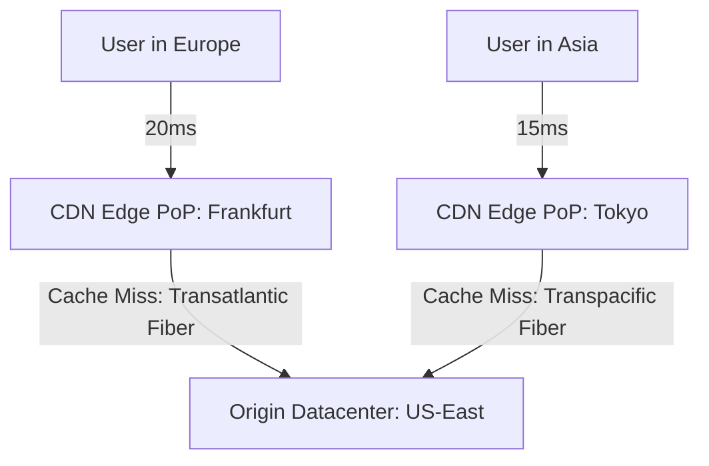

# Content Delivery Networks (CDN) and Edge Caching

## Overview
A **Content Delivery Network (CDN)** is a geographically distributed network of proxy servers (Points of Presence - PoPs) deployed close to end users. CDNs cache static assets (images, videos, JavaScript, CSS) and accelerate dynamic API requests to reduce origin server load and minimize physical network propagation latency.

## Why It Matters
Without a CDN, a user in Sydney requesting a 2MB webpage from an origin server in Virginia, USA must cross 15,000 km of undersea fiber cables, incurring 200ms+ of physical latency per round trip. With a CDN, the request is terminated in Sydney within **10ms**, reducing origin server bandwidth costs by up to 90%.

## Core Concepts
- **Edge Point of Presence (PoP)**: Datacenter facilities placed near major internet exchange points (IXPs) worldwide.
- **Push vs Pull CDN**:
  - *Pull CDN*: The CDN automatically fetches (pulls) the asset from the origin on the first cache miss and caches it for future requests (ideal for high-traffic web assets).
  - *Push CDN*: Content is explicitly uploaded (pushed) to the CDN before users request it (ideal for large software releases and game patches).
- **Dynamic Site Acceleration (DSA)**: Accelerates non-cacheable API calls by maintaining pre-warmed persistent TCP/TLS connections from the edge PoP to the origin across optimized private backbone networks.
- **Origin Shield**: A centralized caching tier positioned between edge PoPs and the origin server to prevent cache miss storms.

## How It Works: Cache Invalidation Strategies
1. **Time to Live (TTL)**: Headers (`Cache-Control: max-age=3600`) dictate how long an asset lives at the edge before revalidation.
2. **Purge by URL / Tag**: Explicitly invalidating cached keys via API when content changes (e.g., purging `/products/123` on price change).
3. **Asset Fingerprinting / Cache Busting**: Appending unique content hashes to static asset URLs (`app.a8f9c2.js`). When code changes, the URL changes, rendering stale caches irrelevant and allowing infinite TTLs (`max-age=31536000, immutable`).

## Trade-offs
| Dimension | Benefit | Risk / Trade-off |
| :--- | :--- | :--- |
| **Edge Caching** | Sub-15ms global latency, 90%+ origin offload | Serving stale content during rapid inventory/price shifts |
| **Purge-on-Update** | Immediate content freshness | High purge API overhead, potential origin stampede |
| **Edge Compute (Workers)**| Personalization and auth at the edge | Limited execution runtime memory, vendor lock-in |

## When to Use / When NOT to Use
### When to Use a CDN
- Public websites, media streaming, global mobile apps, e-commerce storefronts, software distribution.

### When NOT to Rely on Caching at the Edge
- Highly personalized, sensitive user banking portals, real-time private messaging payloads (though DSA can still accelerate routing).

## Real-World Examples
- **Fastly & Cloudflare**: Provide programmable edge compute (V8 isolates and WebAssembly) allowing authentication validation, A/B testing, and image resizing to execute in under 5ms directly at the edge.
- **Super Bowl Live Streams**: Akamai and AWS CloudFront distribute live video segments to tens of millions of concurrent viewers, absorbing tens of terabits per second of outbound traffic that would instantly incinerate origin media encoders.

## Common Pitfalls
- **Accidental Caching of Private Data**: Misconfiguring `Cache-Control: public` on user profile endpoints, causing CDN edges to serve User A's private personal info to User B.
- **Cache Invalidation Delays**: Relying on manual purges during breaking UI deploys, resulting in HTML files referencing old, deleted JavaScript bundle chunks.

## Key Takeaways
- Use **asset fingerprinting** with immutable 1-year cache headers for static frontend assets.
- Deploy an **Origin Shield** to prevent hundreds of edge PoPs from stampeding the origin on cache misses.
- Never cache authenticated endpoints without explicit `Cache-Control: private, no-store` headers.

## Common Interview Questions
1. How does a CDN accelerate dynamic, uncacheable API requests?
2. What is the difference between a Push CDN and a Pull CDN?
3. How do you guarantee that users immediately receive updated frontend code without waiting for CDN TTLs to expire?

## Further Reading
- [Cloudflare: How CDNs Work](https://www.cloudflare.com/learning/cdn/what-is-a-cdn/)
- [RFC 9111: HTTP Caching](https://datatracker.ietf.org/doc/html/rfc9111)
