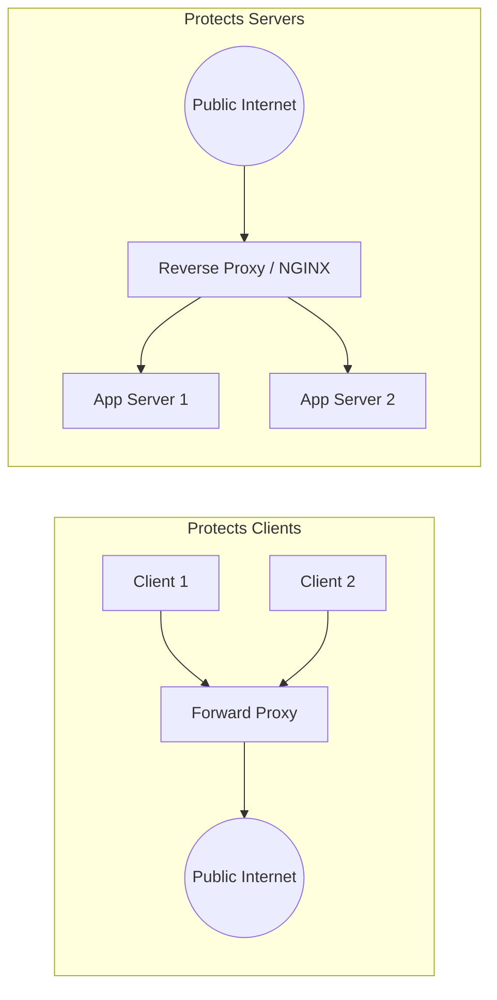

# Proxies: Forward Proxies vs Reverse Proxies

## Overview
A **proxy server** acts as an intermediary for requests between clients and destination servers:
- **Forward Proxy**: Sits in front of a group of **clients**, intercepting outbound requests to the internet. Destination web servers only see the IP address of the forward proxy.
- **Reverse Proxy**: Sits in front of a group of **backend servers**, intercepting inbound requests from the internet. Clients only see the IP address of the reverse proxy.

## Why It Matters
Understanding proxy orientation is essential for security architecture. Forward proxies govern internal enterprise network egress, compliance, and privacy. Reverse proxies are the foundational building block of backend infrastructure, providing load balancing, SSL termination, and DDoS shielding.

## Core Concepts
- **Forward Proxy Capabilities**:
  - *Client Anonymity*: Masks internal corporate IP addresses.
  - *Content Filtering*: Blocks access to malicious or unauthorized domains.
  - *Egress Caching*: Caches popular external downloads, conserving enterprise corporate WAN bandwidth.
- **Reverse Proxy Capabilities**:
  - *Load Balancing*: Distributes incoming requests across backend pools.
  - *SSL/TLS Termination*: Decrypts HTTPS traffic at the edge, freeing backend application servers from CPU-heavy cryptographic handshakes.
  - *Security & Obfuscation*: Hides backend server IP addresses, operating systems, and network topologies from attackers.
  - *Compression & Caching*: Gzips responses and serves cached static content.

## Trade-offs
| Proxy Type | Position | Primary Beneficiary | Primary Risk / Bottleneck |
| :--- | :--- | :--- | :--- |
| **Forward Proxy** | Client-side egress | The Client (privacy, control) | Single bottleneck for corporate outbound traffic |
| **Reverse Proxy** | Server-side ingress | The Server (scalability, security)| Single point of failure if proxy pool crashes |

## When to Use / When NOT to Use
### When to Deploy a Reverse Proxy
- Mandatory in front of all production web applications (e.g., placing NGINX, HAProxy, or Envoy in front of Node.js, Python, or Go processes).

### When to Deploy a Forward Proxy
- Corporate enterprise security, egress filtering for compliance (preventing data exfiltration), developer VPN environments.

## Real-World Examples
- **NGINX / Envoy Reverse Proxy**: Used in front of web services worldwide. Directing public internet traffic directly into an application server (e.g., Python Gunicorn or Node.js Express) leaves the application vulnerable to slow-client HTTP attacks and CPU starvation.
- **Corporate Squid Forward Proxy**: Deployed in enterprise offices to monitor corporate laptops, enforce DLP (Data Loss Prevention) rules, and inspect outbound traffic for malware.

## Common Pitfalls
- **Exposing Backend Instances Directly**: Allowing public internet traffic to bypass the reverse proxy directly to backend EC2 instances, exposing them to port scans and direct attacks.
- **Misconfiguring `X-Forwarded-For`**: Failing to properly configure the reverse proxy to append client IP addresses, causing backend analytics and security rate limiters to see 100% of traffic coming from `127.0.0.1`.

## Key Takeaways
- Forward proxies protect and control **clients**; Reverse proxies protect and scale **servers**.
- Always terminate TLS and enforce rate limiting at the reverse proxy layer.
- Ensure backend services trust the `X-Forwarded-For` header only from verified internal reverse proxies.

## Common Interview Questions
1. What is the fundamental difference between a forward proxy and a reverse proxy?
2. Why is it considered an architectural anti-pattern to expose application runtimes (like Node.js or Flask) directly to the internet without a reverse proxy?
3. How does SSL termination at a reverse proxy affect internal network security?

## Further Reading
- [NGINX: Understanding NGINX HTTP Proxying and Reverse Proxying](https://www.digitalocean.com/community/tutorials/understanding-nginx-http-proxying-load-balancing-buffering-and-caching)
- [Envoy Proxy Architecture Overview](https://www.envoyproxy.io/docs/envoy/latest/intro/arch_overview/arch_overview)
