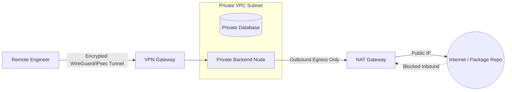

# Network Address Translation (NAT), Firewalls, and VPNs

## Overview
Network security and connectivity at scale depend on three foundational Layer 3 / Layer 4 primitives:
- **NAT (Network Address Translation)**: Remaps one IP address space into another, allowing hundreds of private instances to share a single public IPv4 address.
- **Firewall**: Network security system monitoring and controlling incoming and outgoing traffic based on predetermined rules (Packet Filtering, Stateful, and Web Application Firewalls - WAF).
- **VPN (Virtual Private Network)**: Creates an encrypted point-to-point tunnel across public networks, extending private network boundaries securely.

## Why It Matters
A production cloud environment (AWS VPC, GCP Virtual Private Cloud) places sensitive databases and microservices in **private subnets** with zero public IP addresses. Understanding NAT gateways, stateful security groups, and VPN tunnels is mandatory for securing infrastructure against unauthorized intrusion.

## Core Concepts
- **SNAT (Source NAT)**: Modifies the source IP of outbound packets from private instances so external internet servers can route replies back to the NAT gateway.
- **DNAT (Destination NAT / Port Forwarding)**: Modifies the destination IP of incoming packets, directing public traffic to a specific private internal host.
- **Firewall Generations**:
  - *Packet Filtering (Stateless)*: Inspects individual packets in isolation (Source/Destination IP and Port). Fast, but unaware of connection state.
  - *Stateful Inspection*: Tracks active TCP connection states (`SYN`, `ESTABLISHED`). Automatically allows inbound replies to legitimately established outbound requests.
  - *Web Application Firewall (WAF)*: Operates at Layer 7, inspecting HTTP payloads for SQL injection, cross-site scripting (XSS), and malicious user-agents.
- **VPN Tunneling Protocols**: Encapsulates private packets inside encrypted public envelopes using **IPsec** or **WireGuard** with ChaCha20-Poly1305 cryptography.

## Trade-offs
| Security Appliance | Layer | Operational Overhead | Performance Impact |
| :--- | :--- | :--- | :--- |
| **Stateful Security Group** | Layer 4 | Low (cloud-native rules) | Negligible (sub-millisecond line rate) |
| **NAT Gateway** | Layer 3/4 | Moderate (cost per gigabyte egress) | Minimal (bandwidth limits apply) |
| **Web Application Firewall** | Layer 7 | High (rule tuning and false positive risk) | 2ms - 10ms processing latency |

## When to Use / When NOT to Use
### When to Deploy Private Subnets with NAT
- Mandatory for all production databases, Redis caches, background workers, and internal microservices.

### When to Expose Services to Public Subnets
- Exclusively for ingress load balancers, CDN edge gateways, and public NAT instances.

## Real-World Examples
- **AWS NAT Gateway Outage / Cost Traps**: Cloud engineers frequently encounter massive surprise cloud bills when high-throughput internal analytics jobs accidentally route petabytes of S3 traffic through a NAT Gateway instead of a free **VPC S3 Gateway Endpoint**.
- **WireGuard**: Modern Linux kernel-space VPN protocol providing 4x higher throughput and 80% lower latency than legacy OpenVPN or IPsec tunnels.

## Common Pitfalls
- **Placing Databases in Public Subnets**: Assigning public IPv4 addresses to database servers and relying solely on a password for security, exposing the database to continuous brute-force dictionary attacks.
- **NAT Gateway Bandwidth Saturation**: Exceeding the maximum network throughput of a single NAT gateway instance, resulting in dropped packets across all private subnet egress calls.

## Key Takeaways
- Keep all data tiers and application servers in **private subnets**; use a NAT Gateway for outbound-only internet access (e.g., OS security updates).
- Stateful firewalls automatically allow response traffic for established outbound TCP connections.
- Use VPC Endpoints to route cloud service traffic directly, bypassing expensive NAT bandwidth charges.

## Common Interview Questions
1. How does Source NAT (SNAT) differ from Destination NAT (DNAT)?
2. What is the difference between a stateful security group and a stateless network ACL (NACL)?
3. Why should production databases never have public IP addresses, even if protected by strong passwords?

## Further Reading
- [AWS VPC Documentation: NAT Gateways](https://docs.aws.amazon.com/vpc/latest/userguide/vpc-nat-gateway.html)
- [Jason A. Donenfeld: WireGuard: Next Generation Kernel Network Tunnel](https://www.wireguard.com/papers/wireguard.pdf)
