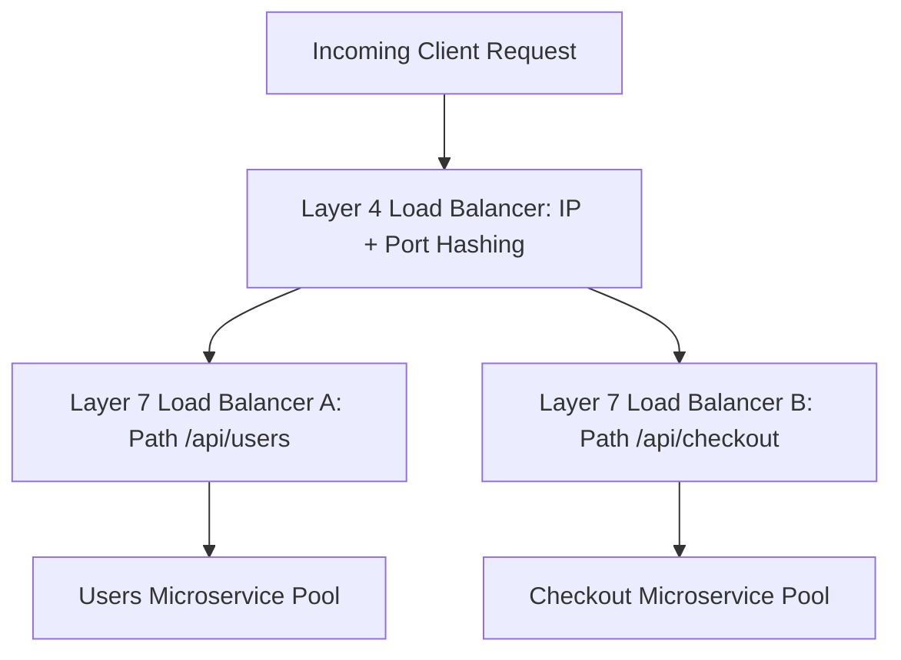

# Layer 4 vs Layer 7 Load Balancing

## Overview
A **load balancer** distributes network and application traffic across a pool of backend servers to prevent overload, maximize throughput, and ensure high availability. Load balancing operates fundamentally at two distinct network layers:
- **Layer 4 (Transport / L4)**: Routes traffic based purely on network and transport protocols (IP addresses and TCP/UDP ports) without inspecting the application data payload.
- **Layer 7 (Application / L7)**: Terminates client connections, inspects the application payload (HTTP headers, cookies, URL paths, JSON bodies), and routes intelligently based on content.

## Why It Matters
Modern cloud architectures must process hundreds of thousands of requests per second. Using an L7 load balancer for raw high-throughput video streams wastefully exhausts CPU on cryptographic handshakes and HTTP parsing. Conversely, using an L4 load balancer makes intelligent microservice routing, header-based canary deployments, and API authentication impossible.

## Core Concepts
- **Connection Splicing vs Termination**:
  - *L4 (Non-terminating / Splicing)*: Direct Server Return (DSR) or IPVS routing. The load balancer routes TCP packets directly to backends without terminating the TCP handshake.
  - *L7 (Dual Termination)*: The balancer terminates the client's TCP and TLS sessions, parses the HTTP request, and establishes a *separate* internal connection to the backend server.
- **Direct Server Return (DSR)**: High-performance L4 optimization where request packets flow through the load balancer, but large response packets bypass the balancer completely, flowing directly from backends to clients.

## Trade-offs
| Feature | Layer 4 (L4) | Layer 7 (L7) |
| :--- | :--- | :--- |
| **Throughput & Capacity** | **Massive (Millions of PPS)** | Moderate (Tens of thousands RPS) |
| **Latency Added** | Sub-millisecond (< 0.1ms) | 1ms - 5ms (parsing & decryption) |
| **Routing Granularity** | IP address & Port only | URL path, headers, cookies, HTTP verbs |
| **TLS Offloading** | Pass-through (backends handle TLS) | **Terminates TLS at the proxy edge** |
| **Resource Consumption**| Very low CPU/RAM (kernel-space) | High CPU/RAM (user-space parsing) |

## When to Use / When NOT to Use
### When to Deploy Layer 4
- Edge tier ingress handling millions of raw packets, database connection proxying, WebSockets/video streaming, gaming servers.

### When to Deploy Layer 7
- Microservice API Gateways, path-based routing (`/auth` vs `/billing`), canary percentage traffic splitting, gRPC load balancing.

## Real-World Examples
- **Google Maglev**: Google's distributed L4 network load balancer deployed on commodity Linux servers, routing billions of requests across Google services using consistent hashing and kernel-bypass packet forwarding.
- **Envoy & NGINX**: Industry-standard L7 reverse proxies providing advanced HTTP/2 and HTTP/3 multiplexing, circuit breaking, and distributed tracing injection.

## Common Pitfalls
- **Using L4 for gRPC**: In gRPC (HTTP/2), multiple RPC calls are multiplexed across a single long-lived TCP connection. An L4 balancer assigns the entire TCP connection to one backend server, causing massive server load imbalance while other backends sit idle.
- **Memory Exhaustion on Slow Clients**: Exposing L7 balancers without request buffering configurations, allowing slow-client attacks (Slowloris) to pin open worker threads.

## Key Takeaways
- L4 is fast, blind packet forwarding; L7 is intelligent, payload-aware request routing.
- High-scale systems place an L4 balancer at the edge to distribute traffic across a horizontal pool of L7 proxies.
- gRPC requires an L7 load balancer to balance individual multiplexed RPC calls.

## Common Interview Questions
1. Why does gRPC fail to balance load properly behind a Layer 4 load balancer?
2. What is Direct Server Return (DSR), and how does it dramatically improve load balancer throughput?
3. How does TLS termination at Layer 7 simplify backend microservice architecture?

## Further Reading
- [Google Research: Maglev: A Fast and Reliable Software Network Load Balancer (2016)](https://research.google/pubs/pub44824/)
- [Envoy Proxy: Layer 4 vs Layer 7 Architecture](https://www.envoyproxy.io/docs/envoy/latest/intro/arch_overview/intro/arch_overview)
