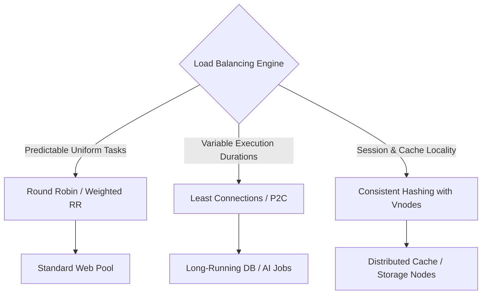

# Load Balancing Algorithms

## Overview
Load balancing algorithms dictate the mathematical distribution of incoming requests across a cluster of healthy upstream servers. Choosing the right algorithm directly affects server utilization, tail latency, and cache efficiency.

## Why It Matters
Deploying an algorithm unsuited to your workload profile leads to severe cluster degradation. For example, using Round Robin when request processing times vary between 10ms and 10 seconds causes small worker instances to quickly saturate their thread pools and crash, while neighboring nodes remain idle.

## Core Concepts & Algorithms
1. **Round Robin**: Sequentially routes each incoming request to the next server in the list. Assumes identical server capacity and uniform request execution times.
2. **Weighted Round Robin**: Assigns integer weights proportional to physical server hardware capacity (e.g., Server A has weight 3, Server B has weight 1).
3. **Least Connections**: Dispatches traffic to the server currently processing the fewest active concurrent connections. Highly effective for long-lived database connections or streaming.
4. **Weighted Least Connections**: Normalizes active connections against server weight capacity:
   $$\text{Load Factor} = \frac{\text{Active Connections}}{\text{Weight}}$$
   Routes to the server with the lowest load factor.
5. **Power of Two Random Choices (P2C)**: Picks two servers at random and chooses the one with fewer active connections. Mathematically proven to eliminate the herd effect in large distributed clusters while operating in $O(1)$ time.
6. **Consistent Hashing**: Hashes request keys (e.g., `user_id`) to a circular hash ring, guaranteeing that identical keys land on the same physical backend server with minimal remapping when nodes fail.

## Trade-offs
| Algorithm | CPU Overhead | Load Uniformity | Cache Locality |
| :--- | :--- | :--- | :--- |
| **Round Robin** | Zero ($O(1)$) | High for uniform requests, Poor for variable tasks | None |
| **Least Connections**| Low ($O(1)$ with heap) | **Exceptional for variable duration workloads**| None |
| **Consistent Hashing**| Low ($O(\log N)$ binary search)| Good (with virtual nodes) | **Maximum (keeps caches hot)** |
| **Power of Two (P2C)** | Minimal ($O(1)$) | Excellent (avoids stampedes) | None |

## When to Use / When NOT to Use
### When to Use Least Connections / P2C
- Heavy computation endpoints, video transcoding tasks, SQL query pools, long-lived WebSocket sessions.

### When to Use Consistent Hashing
- In-memory cache tiers (Redis/Memcached), stateful game servers, rate limiters, session stores where cache hits are critical.

### When to Avoid Simple Round Robin
- Heterogeneous server fleets (mixing small and large VMs) or workloads with high execution variance.

## Real-World Examples
- **NGINX & Envoy P2C**: Envoy uses the **Power of Two Choices (P2C)** algorithm as its default load balancer for high-throughput microservices to avoid centralized connection tracking bottlenecks.
- **Memcached Client Libraries**: Implement consistent hashing rings across client SDKs to ensure cache keys consistently route to the correct cache node without a central broker.

## Common Pitfalls
- **The Herd Effect with Global Least Connections**: In large clusters with distributed load balancers, multiple balancers simultaneously detect Server X as having the fewest connections, overwhelming Server X with a sudden flood of traffic.
- **Consistent Hashing without Virtual Nodes**: Failing to configure virtual nodes leads to severe key clustering, overloading individual servers by 200-300%.

## Key Takeaways
- Use **Weighted Least Connections** or **P2C** for web APIs with variable processing times.
- Use **Consistent Hashing** whenever maintaining backend cache locality is required.
- Round Robin should only be used for homogeneous servers processing identical, instantaneous tasks.

## Common Interview Questions
1. How does the Power of Two Random Choices algorithm outperform Round Robin and global Least Connections?
2. What happens to key distribution in consistent hashing when a physical server crashes?
3. How does Weighted Least Connections calculate the target server?

## Further Reading
- [Michael Mitzenmacher: The Power of Two Choices in Randomized Load Balancing (1996)](https://www.eecs.harvard.edu/~michaelm/postscripts/tpds2001.pdf)
- [Envoy Documentation: Load Balancing Algorithms](https://www.envoyproxy.io/docs/envoy/latest/intro/arch_overview/upstream/load_balancing/load_balancers)
