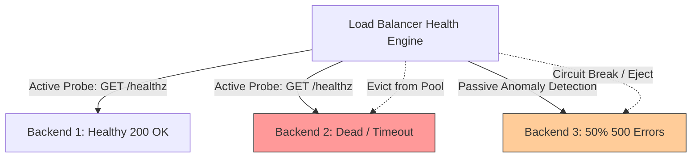

# Health Checks, Flapping Prevention, and Sticky Sessions

## Overview
A load balancer must dynamically track backend server availability to ensure traffic is never routed to failing or overloaded instances:
- **Active Health Checks**: The balancer periodically probes upstream servers (e.g., HTTP `GET /healthz` every 5 seconds) to verify responsiveness.
- **Passive Health Checks**: The balancer monitors real in-flight customer traffic, temporarily ejecting instances that return excessive 5xx errors or connection timeouts.
- **Sticky Sessions (Session Affinity)**: Routing subsequent requests from a specific client to the exact same backend server based on cookies or IP hashes.

## Why It Matters
Naive health checks frequently trigger catastrophic outages: a database timeout can cause all 100 backend servers to fail their deep health check simultaneously, causing the load balancer to declare the entire cluster dead and dropping 100% of customer traffic. Meanwhile, sticky sessions create severe load imbalances that undermine horizontal scaling.

## Core Concepts
- **Shallow vs Deep Health Checks**:
  - *Shallow Health Check*: Verifies local process liveness (e.g., web server running and responding 200 OK). Fast and safe.
  - *Deep Health Check*: Tests downstream dependencies (e.g., executing a query against the primary database and Redis). Vulnerable to cascading failure storms.
- **Flapping Prevention & Hysteresis**: Prevents an unstable server from constantly bouncing in and out of the upstream pool. Requires consecutive successes to mark healthy and consecutive failures to mark unhealthy:
  - *Threshold Unhealthy*: 3 consecutive failures.
  - *Threshold Healthy*: 5 consecutive successes.
- **Outlier Detection (Passive)**: Automatically ejects an instance for 30 seconds if its 5xx error rate exceeds 15% over a 10-second rolling window.

## Trade-offs
| Mechanism | Availability Benefit | Operational Risk |
| :--- | :--- | :--- |
| **Deep Health Check** | Guarantees backend can complete real queries | Risk of cascading cluster-wide self-inflicted blackout |
| **Shallow Health Check**| Reliable cluster stability | Traffic may route to an instance with broken DB access |
| **Sticky Sessions** | Keeps legacy stateful code functioning | Load hotspots, broken autoscaling, session loss on restarts |

## When to Use / When NOT to Use
### When to Use Shallow Checks + Passive Outlier Detection
- Production microservices. Use shallow checks (`/live`) for container orchestrators and passive circuit breaking for upstream dependency failures.

### When to AVOID Sticky Sessions
- All modern stateless web architectures. Offload session state to Redis or use signed JWT tokens instead.

## Real-World Examples
- **Cascading Health Check Blackout**: A major cloud incident occurred when a database slowed down under heavy traffic. Every web server's `/health` endpoint checked the database synchronously, failed the 2-second timeout, and was evicted by the load balancer, taking down the entire service worldwide.

## Common Pitfalls
- **Health Check Storms**: 50 load balancer worker processes independently pinging 200 backend nodes every second, generating $50 \times 200 = 10,000$ internal health requests per second that saturate backend CPU!
- **Sticky Session Traffic Clustering**: Corporate enterprise offices with 5,000 employees routing through a single NAT gateway IP get pinned to a single server under IP-hash stickiness, crashing that instance while others remain idle.

## Key Takeaways
- Decouple **Liveness** (is the process alive?) from **Readiness** (is it ready to receive traffic?).
- Never include slow or non-critical third-party external APIs inside health check endpoints.
- Avoid sticky sessions—they create traffic skew and destroy cloud autoscaling benefits.

## Common Interview Questions
1. What is the danger of putting downstream database queries inside a load balancer health check?
2. How does hysteresis prevent server flapping in load balancers?
3. How do you transition an application away from sticky sessions to support zero-downtime rolling deployments?

## Further Reading
- [Kubernetes Documentation: Configure Liveness, Readiness and Startup Probes](https://kubernetes.io/docs/tasks/configure-pod-container/configure-liveness-readiness-startup-probes/)
- [Envoy Documentation: Outlier Detection (Passive Health Checking)](https://www.envoyproxy.io/docs/envoy/latest/intro/arch_overview/upstream/outlier)
