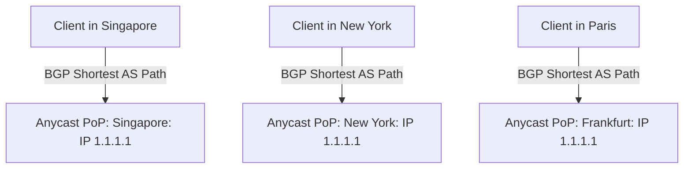

# Global Server Load Balancing (GSLB), Anycast, and Geo-Routing

## Overview
High-scale applications operate multiple geographically dispersed datacenters across continents. Directing global users to the optimal regional facility requires **Global Server Load Balancing (GSLB)**, executed primarily through two distinct routing mechanisms:
- **GeoDNS (DNS-Based GSLB)**: Authoritative DNS servers dynamically return different regional IP addresses based on the requester's geographic location.
- **BGP Anycast**: Multiple physical datacenters announce the **identical IP address** via Border Gateway Protocol (BGP). The global internet routing mesh automatically steers packets to the topologically closest datacenter.

## Why It Matters
Global routing cuts hundreds of milliseconds of transatlantic and transpacific latency off initial user connections. Crucially, BGP Anycast provides instant, automated DDoS mitigation and disaster failover at the internet routing layer without waiting for DNS TTL expirations.

## Core Concepts
- **BGP Anycast Mechanics**:
  - Autonomous Systems (AS) advertise the exact same IP prefix (e.g., `/24`) from hundreds of edge locations worldwide.
  - Internet routers evaluate the shortest AS-Path and route client packets to the nearest Point of Presence (PoP).
  - If a PoP fails, BGP withdraws the route, and internet routers automatically redirect subsequent packets to the next closest healthy PoP in seconds.
- **GeoDNS Mechanics**:
  - Uses the client's IP (or EDNS Client Subnet) to look up country/continent in a GeoIP database (MaxMind).
  - Responds with the specific regional VIP (e.g., returning `198.51.100.1` for US users and `203.0.113.1` for European users).
- **Failover Capabilities**:
  - Anycast failover occurs at the **network layer** in seconds.
  - GeoDNS failover depends on **DNS caching TTLs**, often taking minutes or hours to propagate fully.

## Trade-offs
| Dimension | BGP Anycast | GeoDNS |
| :--- | :--- | :--- |
| **Failover Speed** | **Near instantaneous (seconds via BGP withdraw)**| Slow (bounded by DNS TTLs: 1-15 mins) |
| **TCP State Stability** | Risk of route flapping breaking long TCP sessions | High (IP address remains constant) |
| **Implementation Complexity**| Extreme (requires owning BGP AS and IP space) | Low (configured via cloud DNS providers) |
| **DDoS Absorption** | **Superior (distributes attack across global PoPs)**| Weak (attack targets resolved regional IP) |

## When to Use / When NOT to Use
### When to Use BGP Anycast
- Edge CDN termination (Cloudflare, Fastly), public DNS resolvers (1.1.1.1, 8.8.8.8), DDoS mitigation scrubbing layers.

### When to Use GeoDNS
- Compliance boundaries (e.g., forcing European patient data to remain in EU datacenters), long-running persistent TCP connections sensitive to route shifts.

## Real-World Examples
- **Cloudflare & AWS Route 53 Anycast**: Operate global Anycast networks. When an attacker launches a 1 Tbps volumetric DDoS attack, the traffic is naturally diluted and absorbed across hundreds of worldwide edge PoPs simultaneously, preventing origin saturation.
- **Netflix Open Connect**: Directs video streaming traffic via GeoDNS and local ISP appliances to ensure 4K video streams pull from the closest physical storage cache inside the user's local internet provider.

## Common Pitfalls
- **BGP Route Flapping and TCP Resets**: In unstable network conditions, BGP routes can oscillate between two datacenters mid-connection. Because TCP connection state is not shared between datacenters, the client receives a `TCP RST` and the connection drops.
- **GeoIP Misattribution**: Assuming GeoIP databases are 100% accurate; IP blocks frequently get reassigned across countries, misrouting users to distant continents.

## Key Takeaways
- BGP Anycast shares a single IP globally; internet routing directs packets to the closest PoP.
- Anycast absorbs DDoS attacks naturally and fails over in seconds.
- Use GeoDNS when legal data residency rules dictate strict geographic boundaries.

## Common Interview Questions
1. How does BGP Anycast route a user to the nearest datacenter?
2. What causes TCP connection resets in an Anycast architecture during network instability?
3. How does Anycast mitigate massive volumetric DDoS attacks?

## Further Reading
- [Cloudflare: What is Anycast?](https://www.cloudflare.com/learning/cdn/glossary/anycast-network/)
- [RFC 4786: Operation of Anycast Services](https://datatracker.ietf.org/doc/html/rfc4786)
