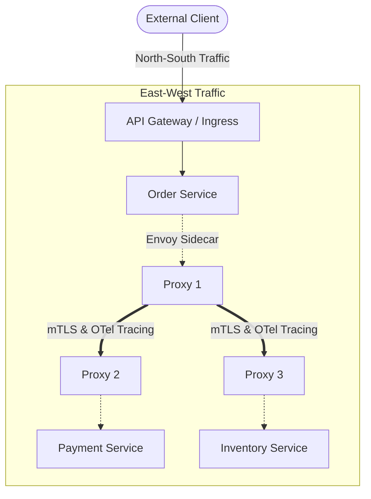

# API Gateways and Service Mesh Architecture

## Overview
Modern cloud-native architectures manage traffic across two distinct planes:
- **North-South Traffic**: Traffic entering the cluster from external clients (handled by an **API Gateway**).
- **East-West Traffic**: Internal service-to-service communication between microservices within the cluster (handled by a **Service Mesh**).

## Why It Matters
Allowing every individual microservice to implement its own public authentication, rate limiting, and SSL termination creates massive duplication and security vulnerabilities. Conversely, attempting to route internal service-to-service calls back out through an API Gateway adds unnecessary latency hops and central bottlenecks.

## Core Concepts
- **API Gateway Responsibilities (North-South)**:
  - *Edge Authentication & Authorization*: Validating JWTs, API keys, and OAuth tokens before requests reach microservices.
  - *Rate Limiting & Quota Management*: Protecting downstream backends from abuse.
  - *Request Routing & Transformation*: Path routing, protocol translation (HTTP to gRPC), and header enrichment.
  - *Cross-Origin Resource Sharing (CORS)*: Centralized header configuration.
- **Service Mesh Responsibilities (East-West)**:
  - *Sidecar Pattern*: Deploying a lightweight proxy (Envoy) alongside every application container sharing the same network namespace.
  - *Mutual TLS (mTLS)*: Cryptographically verifying and encrypting all internal service-to-service traffic automatically.
  - *Traffic Shifting*: Canary releases, A/B testing, and fault injection without modifying application code.
  - *Observability*: Standardized distributed tracing and metrics injection across all polyglot microservices.

## Trade-offs
| Architecture Component | Primary Role | Operational Overhead | Latency Added |
| :--- | :--- | :--- | :--- |
| **API Gateway** (Kong, Apigee, AWS API GW) | Public edge entry, auth, billing | Low to Moderate | 2ms - 10ms |
| **Service Mesh** (Istio, Linkerd, Consul) | Internal security, mTLS, traffic management | **High (complex control plane & proxy sidecars)**| 1ms - 3ms per internal hop |

## When to Use / When NOT to Use
### When to Deploy an API Gateway
- Almost universally necessary when exposing backend microservices to public web and mobile clients.

### When to Deploy a Service Mesh
- Large organizations managing hundreds of microservices where automated zero-trust security (mTLS) and standardized distributed tracing are mandatory.

### When to AVOID a Service Mesh
- Small to mid-sized teams with fewer than 20 microservices; the operational cognitive load of managing an Istio control plane far outweighs the benefits.

## Real-World Examples
- **Lyft**: Created **Envoy Proxy** to solve internal microservice observability and resilience, establishing the modern blueprint for service mesh architectures.
- **Netflix Zuul**: Serves as the primary public API Gateway for Netflix streaming traffic, managing billions of requests daily with dynamic routing filters and edge security.

## Common Pitfalls
- **Adopting a Service Mesh for Small Teams**: Introducing Istio into a 5-microservice architecture, resulting in days lost debugging Kubernetes sidecar injection and certificate rotation issues.
- **Fat API Gateways**: Writing heavy business logic inside API Gateway Lua/JavaScript plugins, turning the gateway into an unmaintainable monolithic bottleneck.

## Key Takeaways
- API Gateways manage **North-South** public ingress; Service Meshes manage **East-West** internal communication.
- The Sidecar proxy pattern intercepts network traffic transparently without code changes.
- Never write core business domain logic inside the API Gateway layer.

## Common Interview Questions
1. What is the difference between North-South and East-West traffic in microservice architectures?
2. How does a Service Mesh implement mutual TLS (mTLS) transparently without changing application code?
3. When is a Service Mesh an anti-pattern or unnecessary operational overhead?

## Further Reading
- [Matt Klein: Service Mesh Data Plane vs Control Plane](https://medium.com/@mattklein123/service-mesh-data-plane-vs-control-plane-2774e720fa94)
- [Istio Architecture Overview](https://istio.io/latest/docs/ops/deployment/architecture/)
