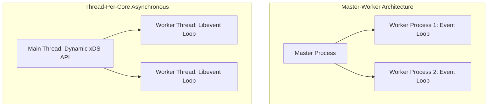

# Production Reverse Proxies: NGINX, HAProxy, and Envoy

## Overview
High-performance reverse proxies form the backbone of modern web infrastructure. Three battle-tested technologies dominate production deployments:
- **NGINX**: Event-driven, asynchronous worker architecture; legendary for static content caching, web serving, and HTTP reverse proxying.
- **HAProxy**: High-performance, event-driven, single-threaded/multithreaded pure TCP and HTTP proxy; renowned for stability, queueing, and metrics.
- **Envoy Proxy**: Modern, cloud-native C++ proxy designed for dynamic microservices, advanced Layer 7 routing, and service mesh architectures.

## Why It Matters
Understanding the internal event loops, concurrency models, and configuration paradigms of these proxies allows architects to deploy the right tool for the job—whether maximizing raw TCP socket throughput, serving gigabytes of cached media, or dynamically managing microservice discovery.

## Core Concepts & Architectural Comparison
1. **NGINX Architecture**:
   - Single master process spawns unprivileged worker processes (typically 1 worker per CPU core).
   - Uses non-blocking I/O multiplexing (`epoll` on Linux, `kqueue` on BSD).
   - Static configuration files (`nginx.conf`) requiring a process reload (`nginx -s reload`) to apply changes.
2. **HAProxy Architecture**:
   - Highly optimized event loop designed for deterministic sub-millisecond packet forwarding.
   - World-class TCP connection queueing and health-check state engines.
   - Comprehensive runtime statistical socket API for live metric inspection.
3. **Envoy Proxy Architecture**:
   - Fully dynamic, API-driven configuration via **xDS management APIs** (LDS, RDS, CDS, EDS), updating routing and clusters with **zero process restarts**.
   - First-class support for HTTP/3, gRPC, and bidirectional streaming.
   - Built-in distributed tracing, access logging, and rate limiting integration.

## Trade-offs
| Dimension | NGINX | HAProxy | Envoy Proxy |
| :--- | :--- | :--- | :--- |
| **Core Strength** | Static file serving & web caching | Pure TCP/HTTP throughput & stability | Dynamic cloud-native microservice routing |
| **Dynamic Reconfiguration** | Requires config reload / NGINX Plus | Runtime CLI socket / Dataplane API | **Native Dynamic xDS gRPC APIs** |
| **gRPC & HTTP/3** | Supported | Supported | **Industry Standard First-Class Support** |
| **Memory Footprint** | Extremely low (few MBs) | Minimal (very light) | Moderate (higher due to C++ abstractions) |
| **Scripting / Extensibility**| Lua, JavaScript (njs) | Lua | C++, WebAssembly (WASM), Lua |

## When to Use / When NOT to Use
### When to Choose Envoy
- Cloud-native Kubernetes environments, microservices requiring dynamic service discovery without restarts, Istio service mesh deployments.

### When to Choose NGINX
- Public-facing edge web servers, SSL termination combined with static file caching, WordPress/PHP frontends.

### When to Choose HAProxy
- Extreme high-throughput TCP load balancing, dedicated database proxying (PostgreSQL/MySQL), scenarios requiring deterministic queueing.

## Real-World Examples
- **GitHub**: Uses **HAProxy** as its front-tier load balancing layer, handling tens of billions of requests daily with sub-millisecond queueing precision.
- **Netflix & Airbnb**: Standardized entirely on **Envoy** for internal and external edge routing due to Envoy's dynamic discovery APIs and deep observability.

## Common Pitfalls
- **Frequent NGINX Reloads in Kubernetes**: Reloading NGINX every time a pod scales up or down in an elastic cluster leaks worker processes and drops idle keep-alive connections (Envoy's xDS eliminates this).
- **Misconfigured Buffer Sizes**: Setting proxy buffer sizes too low forces large HTTP responses to spill to local disk, destroying reverse proxy throughput.

## Key Takeaways
- NGINX excels at static caching and edge web serving.
- HAProxy delivers the most robust and predictable pure load balancing and queueing performance.
- Envoy is the undisputed standard for modern dynamic microservices and cloud-native Kubernetes environments.

## Common Interview Questions
1. How does Envoy's dynamic xDS API differ from traditional configuration reloads in NGINX?
2. How do event-driven proxies handle tens of thousands of concurrent connections on a single CPU core?
3. What are the trade-offs of using Envoy as a Kubernetes Ingress Controller compared to NGINX?

## Further Reading
- [Envoy Proxy Architecture Overview](https://www.envoyproxy.io/docs/envoy/latest/intro/arch_overview/intro/arch_overview)
- [HAProxy Architecture Guide](https://www.haproxy.com/documentation/hapee/latest/get-started/architecture/)
