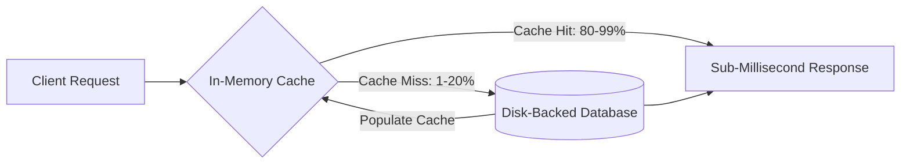

# Caching Fundamentals and Cache Hit Ratio

## Overview
A **cache** is a high-speed, temporary data storage layer that stores a subset of data—typically in fast memory (RAM)—so that future requests for that data are served significantly faster than querying the primary storage tier (SSD or hard disk).

The primary metric of cache performance is the **Cache Hit Ratio**:
$$\text{Hit Ratio} = \frac{\text{Cache Hits}}{\text{Cache Hits} + \text{Cache Misses}}$$

## Why It Matters
Reading data from in-memory RAM takes **~100 nanoseconds**, whereas reading from an SSD takes **~100 microseconds (1,000x slower)**, and querying a relational database across a network can take **10 to 50 milliseconds (100,000x slower)**. A high cache hit ratio directly reduces database server hardware costs by orders of magnitude while delivering snappy user experiences.

## Core Concepts
- **Effective Latency Formula**:
  $$\text{Effective Latency} = (H \times L_{cache}) + ((1 - H) \times L_{backend})$$
  Where $H$ is the Hit Ratio, $L_{cache}$ is cache latency, and $L_{backend}$ is backend storage latency.
  *Example*: If $L_{cache} = 1\text{ms}$ and $L_{backend} = 50\text{ms}$:
  - At $80\%$ Hit Ratio: $(0.8 \times 1) + (0.2 \times 50) = 0.8 + 10 = \mathbf{10.8\text{ ms}}$
  - At $99\%$ Hit Ratio: $(0.99 \times 1) + (0.01 \times 50) = 0.99 + 0.5 = \mathbf{1.49\text{ ms}}$ (A **7.2x performance leap**!)
- **Principle of Locality**:
  - *Temporal Locality*: Data accessed recently is likely to be accessed again in the near future (e.g., viral news articles).
  - *Spatial Locality*: Data stored near recently accessed items is likely to be needed soon (e.g., sequential array memory or consecutive table rows).
- **Working Set Size (WSS)**: The total volume of active application data accessed during a given time window (e.g., 24 hours). If your physical cache size is smaller than your working set, cache thrashing occurs, causing hit ratios to plummet.

## Trade-offs
| Caching Priority | Advantage | Disadvantage / Risk |
| :--- | :--- | :--- |
| **High Hit Ratio Target (>95%)** | Maximum database protection & low latency | Requires massive RAM capacity; higher infrastructure cost |
| **Aggressive Short TTLs** | Data freshness guaranteed | Lower hit ratio; frequent database query spikes |
| **Long TTLs / No Expiration** | Maximum hit ratio | Severe risk of serving stale, invalid data to users |

## When to Use / When NOT to Use
### When Caching is Essential
- High read-to-write ratios ($> 10:1$), compute-intensive aggregation queries, static asset distribution, user session lookups.

### When Caching is an Anti-Pattern
- Pure write-heavy workloads with near-zero read re-use (e.g., raw IoT telemetry ingestion).
- Real-time safety-critical data where reading a stale value causes severe financial or physical harm.

## Real-World Examples
- **Facebook (Meta) Memcached Cluster**: Manages thousands of distributed Memcached servers caching trillions of items, sustaining billions of requests per second with an average cache hit ratio exceeding **98%**.
- **Twitter/X Timeline Cache**: Stores the personalized home timelines of active users entirely in Redis memory pools so opening the mobile app loads feeds in under 20ms.

## Common Pitfalls
- **Over-Sizing Cache for Stale Keys**: Caching items that are read only once, polluting memory and evicting truly valuable hot keys.
- **Ignoring Serialization Overhead**: Spending more CPU cycles serializing and deserializing JSON objects into Redis than the time saved by avoiding the database query.

## Key Takeaways
- The Cache Hit Ratio non-linearly impacts effective system latency; moving from 90% to 99% hit ratio slashes database load by 10x.
- Size your cache based on the **working set size**, not total database storage.
- Always monitor hit ratio, miss latency, and eviction rates in production telemetry.

## Common Interview Questions
1. If your system has an average cache hit ratio of 90%, what happens to database traffic if the hit ratio drops to 80%?
2. How do you calculate the working set size of an application?
3. Under what conditions does adding a cache actually degrade system latency?

## Further Reading
- [Facebook Engineering: Scaling Memcache at Facebook (NSDI 2013)](https://www.usenix.org/conference/nsdi13/technical-sessions/presentation/nishtala)
- [Martin Fowler: Two Hard Things in Computer Science](https://martinfowler.com/bliki/TwoHardThings.html)
