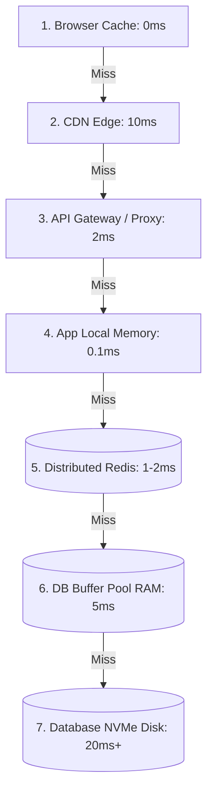

# Caching Across the Stack: Client to Database

## Overview
Caching in production is not a single layer; it is an integrated, multi-tiered hierarchy spanning the entire path from the user's device down to physical database silicon:
1. **Client / Browser Cache**: Local device storage (HTTP browser cache, Service Worker Cache API).
2. **CDN Edge Cache**: Hundreds of globally distributed Points of Presence (Cloudflare, CloudFront).
3. **API Gateway / Reverse Proxy Cache**: Front-door ingress caches (NGINX, Varnish).
4. **Application In-Memory Cache**: Process-local heap memory (Guava, Caffeine, Go sync.Map).
5. **Distributed In-Memory Cache**: Shared multi-node memory clusters (Redis, Memcached).
6. **Database Buffer Pool**: Internal database engine RAM pages (InnoDB Buffer Pool, Postgres Shared Buffers).

## Why It Matters
Terminating a request as close to the client as possible yields exponential latency and cost savings. An asset served from browser cache costs $0 and takes 0ms. If that request penetrates all the way to disk-backed storage, it consumes network bandwidth, proxy compute, application thread memory, and database I/O.

## Core Concepts & Tier Breakdown
- **Tier 1: Browser Cache**: Controlled via HTTP headers (`Cache-Control: max-age=3600, immutable`, `ETag`, `Last-Modified`). Zero network latency.
- **Tier 2: Edge CDN**: Caches static assets and public API payloads geographically adjacent to users.
- **Tier 3: Reverse Proxy (NGINX/Varnish)**: Sits in front of the application pool, serving cached HTML fragments or full responses.
- **Tier 4: Process-Local Memory (Caffeine/LruCache)**: Instantaneous nanosecond read access inside application heap memory, but state is lost on process restart and not shared across instances.
- **Tier 5: Distributed Cache (Redis)**: Centralized, shared in-memory cluster accessible by all stateless application instances over LAN in ~1ms.
- **Tier 6: Database Buffer Pool**: The database itself caches frequently read 16KB disk pages in RAM to avoid expensive disk seeks.

## Trade-offs
| Caching Tier | Read Latency | Consistency Coherence | Storage Capacity |
| :--- | :--- | :--- | :--- |
| **App Local RAM (Heap)**| **Nanoseconds** | Very Hard (Divergent across instances)| Limited by VM RAM (1-8 GB) |
| **Distributed (Redis)** | 1ms - 2ms | High (Single source of truth) | High (Terabytes across cluster)|
| **Edge CDN** | 10ms - 20ms | Eventual (Purge propagation delay) | Massive (Petabytes) |
| **Browser Cache** | **0ms** | Poor (Client-controlled) | Strictly limited by client device|

## When to Use / When NOT to Use
### When to Use Process-Local Memory Caching
- Static configuration values, cryptographic public keys, or immutable metadata read thousands of times per second per node.

### When to Use Distributed Caching (Redis)
- Shared user sessions, dynamic shopping carts, database query results, rate limiting counters.

## Real-World Examples
- **GitHub Page Rendering**: Employs a multi-layer cache: client browser caches assets, Fastly CDN caches public repo pages, internal Redis caches markdown-rendered HTML blobs, and MySQL buffer pools cache raw git commit metadata.

## Common Pitfalls
- **Cache Incoherence with Local Heap Caches**: Storing mutable user permissions in process-local application memory; Node 1 updates the user's role to banned, but Node 2 continues serving authorized requests for 10 minutes from its stale local cache.
- **Double Caching**: Caching the identical large data payload simultaneously in local heap memory, Redis, and reverse proxies, wasting expensive RAM across all tiers.

## Key Takeaways
- Design caching as a multi-tier defense in depth.
- Process-local caches are fast (nanoseconds) but risk state divergence across nodes.
- Distributed caches (Redis) provide consistent, shared state across horizontally scaled stateless application instances.

## Common Interview Questions
1. How does a database buffer pool interact with an external distributed cache like Redis?
2. When would you choose an in-process local cache over an external Redis cluster?
3. How do HTTP `ETag` and `If-None-Match` headers implement conditional caching at the browser tier?

## Further Reading
- [Ilya Grigorik: High Performance Browser Networking (HTTP Caching)](https://hpbn.co/http-caching/)
- [PostgreSQL Documentation: Chapter 19 - Resource Consumption (shared_buffers)](https://www.postgresql.org/docs/current/runtime-config-resource.html)
