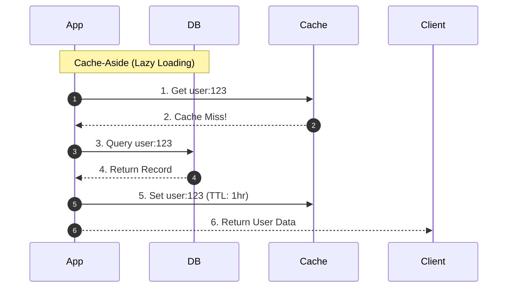

# Caching Strategies: Cache-Aside, Write-Through, Write-Back, and Write-Around

## Overview
A **caching strategy** (or caching pattern) defines the sequence and ownership of data mutations and lookups between the application, the cache, and the underlying database:
- **Cache-Aside (Lazy Loading)**: Application manages cache lookups and writes explicitly.
- **Read-Through**: Application treats the cache as the primary store; the cache transparently fetches missing data from the database.
- **Write-Through**: Application writes data to the cache, which synchronously updates the database before acknowledging success.
- **Write-Back (Write-Behind)**: Application writes data to the cache, which acknowledges immediately and asynchronously flushes updates to the database in background batches.
- **Write-Around**: Writes bypass the cache completely, writing directly to the database.

## Why It Matters
Selecting the wrong caching pattern causes subtle concurrency bugs, severe write latency spikes, or catastrophic data loss. For instance, using Write-Back without persistence guarantees can lose critical customer orders if the cache crashes before flushing to the database.

## Core Concepts & Step-by-Step Mechanics
1. **Cache-Aside (Lazy Loading)**:
   - *Read*: Check cache -> On miss, read DB -> Populate cache -> Return.
   - *Write*: Write DB -> Invalidate (delete) cache key.
   - *Advantage*: Only requested data is cached; cache node failures do not halt writes.
2. **Write-Through**:
   - Application writes to cache -> Cache writes synchronously to DB -> Cache returns success.
   - *Advantage*: Data in cache is never stale.
   - *Disadvantage*: Higher write latency (incurs two network writes).
3. **Write-Back (Write-Behind)**:
   - Application writes to cache -> Cache acknowledges immediately -> Background worker batches writes to DB.
   - *Advantage*: Unbelievably fast write latency and absorbs high write bursts.
   - *Risk*: **Data Loss**. If the cache crashes before the async flush, unwritten data is lost forever.
4. **Write-Around**:
   - Write goes directly to DB, bypassing cache.
   - *Advantage*: Prevents cache pollution from write-heavy data that is rarely read again.

## Trade-offs
| Pattern | Write Latency | Read Latency | Data Consistency Guarantee | Data Loss Risk |
| :--- | :--- | :--- | :--- | :--- |
| **Cache-Aside** | Low (direct to DB) | Fast on hits, slow on cold misses | Eventual (requires eviction) | **Zero** |
| **Write-Through** | Slow (incurs cache + DB sync write)| Instant (cache is always pre-warmed)| **Strong** | **Zero** |
| **Write-Back** | **Ultra-Fast (sub-1ms in RAM)** | Instant | Eventual | **High (if cache crashes)** |
| **Write-Around** | Low | Slow on first read (cold miss) | Eventual | **Zero** |

## When to Use / When NOT to Use
### When to Use Cache-Aside
- General-purpose read-heavy web applications, user profiles, product catalogs. The industry standard default.

### When to Use Write-Back
- High-frequency write-heavy workloads with tolerable loss windows (e.g., video view counters, IoT GPS coordinates, gaming telemetry).

### When to Use Write-Around
- Data written once and read infrequently (e.g., legal compliance audit logs, regulatory archival records).

## Real-World Examples
- **Operating System Page Cache**: Uses **Write-Back** caching. When a process writes to disk, the Linux kernel writes to RAM (dirty pages) and immediately returns; the `pdflush` kernel thread flushes dirty pages to physical disk asynchronously.
- **E-Commerce Inventory**: Employs **Cache-Aside** with cache invalidation upon checkout to ensure customers never purchase out-of-stock items.

## Common Pitfalls
- **Updating Cache Instead of Deleting in Cache-Aside**: Concurrently writing new values directly into the cache causes race conditions; always **delete** the cache key on DB update so the next read safely re-populates the latest committed state.
- **Unbounded Write-Back Buffers**: Allowing write-back queues to grow faster than database write throughput, leading to out-of-memory crashes and massive data loss.

## Key Takeaways
- **Cache-Aside** is the most versatile and resilient pattern for standard production systems.
- Always **invalidate (delete)** cache keys on database updates rather than updating them in place.
- Use **Write-Back** only when extreme write throughput justifies the inherent risk of data loss.

## Common Interview Questions
1. Why is deleting a cache key safer than updating it when writing data in Cache-Aside?
2. What are the operational failure modes of a Write-Back cache?
3. How does the Write-Through pattern impact write latency compared to Write-Around?

## Further Reading
- [AWS Architecture: Caching Strategies and Best Practices](https://aws.amazon.com/caching/best-practices/)
- [Martin Kleppmann: Transactions in Distributed Systems (DDIA Chapter 7)](https://dataintensive.net/)
