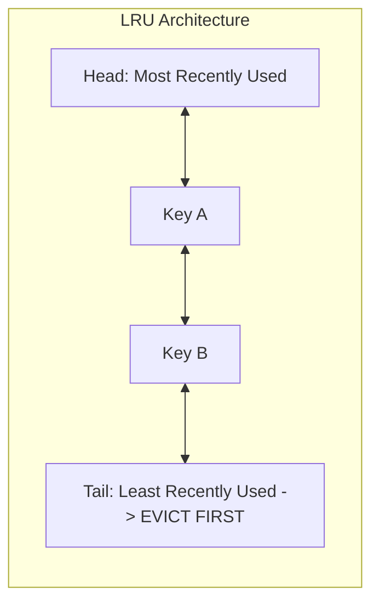

# Cache Eviction Policies: LRU, LFU, FIFO, and Adaptive Algorithms

## Overview
Caches operate in finite physical memory (RAM). When the cache becomes full and new data must be stored, a **cache eviction policy** algorithmically determines which existing data items must be removed to free memory space.



## Why It Matters
A poor eviction policy evicts valuable, frequently accessed hot keys, causing cache hit ratios to plunge and overloading downstream databases. Choosing the right algorithm ensures that memory is populated strictly by the high-value working set.

## Core Concepts & Algorithms
1. **LRU (Least Recently Used)**:
   - Evicts the item that has not been accessed for the longest duration of time.
   - Based on temporal locality: if you haven't read it recently, you probably won't read it soon.
   - Implemented in $O(1)$ time complexity using a **Hash Map paired with a Doubly Linked List**.
2. **LFU (Least Frequently Used)**:
   - Tracks an access counter for each key; evicts the item with the lowest total access frequency.
   - *Weakness*: Suffers from cache pollution from historical access bursts (e.g., an item accessed 1,000 times yesterday will linger in memory forever even if never accessed again).
3. **FIFO (First-In, First-Out)**:
   - Evicts items strictly in the order they were inserted, regardless of access patterns.
   - Vulnerable to Bélády’s Anomaly and poor hit ratios.
4. **W-TinyLFU (Window TinyLFU - Caffeine Cache)**:
   - Modern state-of-the-art policy. Combines a small LRU admission window with a frequency bloom filter (Count-Min Sketch) with aging/decay mechanisms to resist burst pollution.

## How It Works: LRU Implementation Mechanics
```python
# O(1) LRU Cache: Hash Map + Doubly Linked List
class Node:
    def __init__(self, key, value):
        self.key, self.value = key, value
        self.prev = self.next = None

class LRUCache:
    def __init__(self, capacity: int):
        self.capacity = capacity
        self.cache = {} # key -> Node
        self.head, self.tail = Node(0, 0), Node(0, 0)
        self.head.next, self.tail.prev = self.tail, self.head

    def _remove(self, node):
        node.prev.next, node.next.prev = node.next, node.prev

    def _add_to_head(self, node):
        node.next, node.prev = self.head.next, self.head
        self.head.next.prev = self.head.next = node

    def get(self, key: int) -> int:
        if key in self.cache:
            node = self.cache[key]
            self._remove(node)
            self._add_to_head(node) # Mark recently used
            return node.value
        return -1

    def put(self, key: int, value: int):
        if key in self.cache:
            self._remove(self.cache[key])
        node = Node(key, value)
        self._add_to_head(node)
        self.cache[key] = node
        if len(self.cache) > self.capacity:
            # Evict from tail (Least Recently Used)
            lru = self.tail.prev
            self._remove(lru)
            del self.cache[lru.key]
```

## Trade-offs
| Algorithm | Time Complexity | Memory Overhead | Resilience to Scan Scrapes |
| :--- | :--- | :--- | :--- |
| **LRU** | $O(1)$ | Moderate (2 pointers per node) | **Poor (large full-table scans flush entire cache)** |
| **LFU** | $O(1)$ | High (access counters + frequency lists)| Poor (historical items linger) |
| **FIFO** | $O(1)$ | Minimal | Terrible |
| **W-TinyLFU** | $O(1)$ | Very Low (4-bit frequency counters) | **Superior (near-optimal hit ratio)** |

## When to Use / When NOT to Use
### When to Use LRU / W-TinyLFU
- Standard web application and database query caching. Default choice for Redis (`allkeys-lru`) and in-memory caches.

### When to Avoid Simple LRU
- Systems where background batch analytics perform full sequential scans; a single scan will completely flush the active working set out of an LRU cache.

## Real-World Examples
- **Redis Maxmemory Policies**: Supports `allkeys-lru`, `volatile-lru`, `allkeys-lfu`, and `volatile-ttl`. Redis implements an **Approximated LRU** by sampling 5 random keys and evicting the oldest among the sample, achieving 99% of true LRU efficiency without the memory pointer overhead.
- **Caffeine (Java) / Ristretto (Go)**: Use **Window TinyLFU**, outperforming traditional LRU caches by 10-30% hit ratio across production benchmarks.

## Common Pitfalls
- **Unbounded Memory Caches**: Deploying an in-memory hash map without an eviction policy or maximum capacity limit, leading to catastrophic JVM OutOfMemoryError crashes under production traffic.
- **LFU Frequency Saturation**: Failing to implement frequency decay in LFU, allowing ancient viral content to permanently block new hot keys.

## Key Takeaways
- True LRU requires a **Hash Map + Doubly Linked List** to achieve $O(1)$ `get` and `put` operations.
- Redis uses an **approximated LRU** algorithm using random sampling to save memory.
- Modern high-performance systems use **W-TinyLFU** to prevent scan pollution.

## Common Interview Questions
1. How do you implement a thread-safe LRU cache with $O(1)$ time complexity?
2. What is the scan pollution problem in an LRU cache, and how do 2Q or W-TinyLFU algorithms solve it?
3. How does Redis approximate the LRU algorithm without maintaining a global linked list?

## Further Reading
- [Ben Manes: Designing a High Performance Cache (W-TinyLFU Paper, 2015)](https://arxiv.org/abs/1512.00727)
- [Redis Documentation: Key Eviction Policies](https://redis.io/docs/reference/eviction/)
