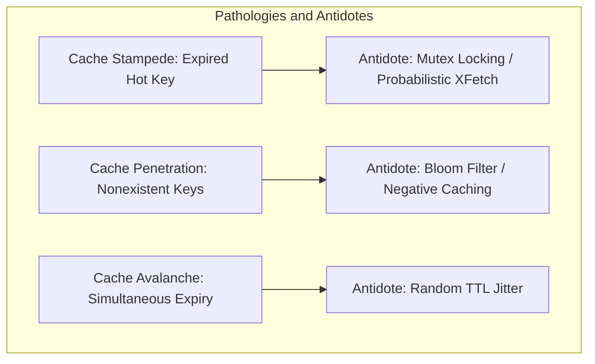

# Cache Invalidation, Stampede, Penetration, and Avalanche

## Overview
Operating distributed caches introduces notorious production pathologies that can bring down entire systems within seconds:
- **Cache Stampede (Thundering Herd)**: A highly popular key expires, causing thousands of concurrent requests to hit the backend database simultaneously.
- **Cache Penetration**: Requests for non-existent keys bypass the cache completely and overwhelm the database.
- **Cache Avalanche**: A massive cluster of keys expires at the exact same second, unleashing a tidal wave of traffic onto the database.
- **Cache Breakdown**: A single super-hot key expires right during a viral traffic peak.

## Why It Matters
Phil Karlton famously observed: *"There are only two hard things in Computer Science: cache invalidation and naming things."* Mismanaging cache invalidation is the leading cause of downstream database collapse and cascading cloud outages.

## Core Concepts & Mitigation Mechanics

### 1. Cache Stampede (Thundering Herd)
- **The Failure**: Key `celebrity:news` expires at 12:00:00. At 12:00:01, 50,000 users request it. All 50,000 requests find a cache miss, and all 50,000 query the database simultaneously.
- **Mitigation A (Distributed Mutex)**: Only the first request acquires a lock in Redis (`SET lock:key token NX EX 5`) and queries the DB; all other 49,999 requests wait and re-read from cache.
- **Mitigation B (Probabilistic Early Expiration - XFetch)**:
  Workers recompute the cache *before* it strictly expires based on read frequency and computation time:
  $$-\beta \times \delta \times \ln(\text{random}()) > \text{TTL} - \text{now}$$

### 2. Cache Penetration
- **The Failure**: An attacker queries random nonexistent user IDs (`/users/-9999`). The cache never stores these keys, so 100% of malicious requests bypass the cache and execute expensive database table scans.
- **Mitigation A (Bloom Filter)**: Maintain a compact Bloom filter in memory containing all valid IDs. If the filter returns false, reject with 404 immediately.
- **Mitigation B (Negative Caching)**: Cache `null` values with a short TTL (e.g., 60 seconds).

### 3. Cache Avalanche
- **The Failure**: A midnight batch job loads 500,000 products with `TTL = 86400` (24 hours). The following midnight, all 500,000 keys expire at the identical microsecond.
- **Mitigation (TTL Jitter)**: Add a randomized time delta to every TTL:
  $$\text{Effective TTL} = \text{Base TTL} + \text{random}(-300\text{s}, +300\text{s})$$

## Trade-offs
| Pathology Defense | Implementation Complexity | Protection Level | Side Effects |
| :--- | :--- | :--- | :--- |
| **Distributed Mutex Lock** | Moderate (Redis Lua script) | **100% Stampede Protection** | Slight latency queuing on lock wait |
| **Probabilistic XFetch** | High (algorithmic tuning) | Excellent | Slight extra background recompute load |
| **Bloom Filter** | Moderate | **100% Penetration Protection**| Rare false positives require DB check |
| **TTL Jitter** | Minimal (one line of code) | **100% Avalanche Protection** | None |

## When to Use / When NOT to Use
### Mandatory Production Protections
- **TTL Jitter**: Mandatory for 100% of all cached keys in production.
- **Bloom Filters**: Essential for public-facing search endpoints vulnerable to scraping and bot attacks.

## Real-World Examples
- **Reddit Outages**: Historically suffered from cache stampedes on front-page comment threads, inspiring the development of probabilistic early expiration libraries and distributed single-flight request coalescing (Go `singleflight`).
- **AWS ElastiCache**: Recommends applying randomized TTL jitter across all caching tiers by default to avoid cascading database failovers.

## Common Pitfalls
- **Setting Uniform TTLs in Batch Syncs**: Setting `TTL = 3600` on 100,000 keys during an hourly cache warm-up script, guaranteeing an avalanche exactly 60 minutes later.
- **Lock Deadlocks in Mutex Stampede Protection**: Failing to set an auto-expiry on the distributed stampede lock, causing all subsequent reads to hang indefinitely if the worker thread crashes before releasing the lock.

## Key Takeaways
- Always add **TTL Jitter** to prevent cache avalanches.
- Use **Go `singleflight`** or **Redis Mutex locks** to protect against the Thundering Herd.
- Protect against cache penetration using **Bloom Filters** or **Negative Caching**.

## Common Interview Questions
1. How does the Thundering Herd problem occur, and how do distributed mutexes mitigate it?
2. How does a Bloom filter protect a relational database from cache penetration attacks?
3. How do you implement TTL jitter, and what is its mathematical impact on cache expiration?

## Further Reading
- [Vattani et al.: Optimal Probabilistic Cache Invalidation (XFetch Algorithm)](http://www.vldb.org/pvldb/vol8/p886-vattani.pdf)
- [Go singleflight Package Documentation](https://pkg.go.dev/golang.org/x/sync/singleflight)
