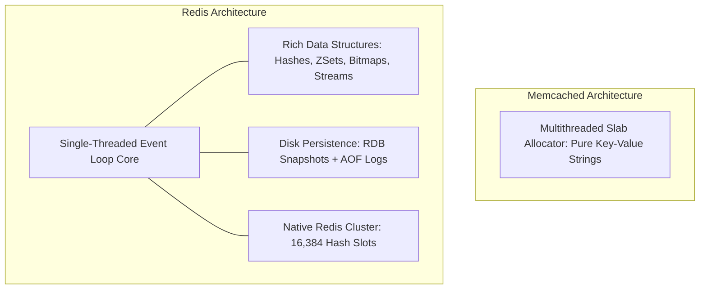

# Distributed Caching: Redis vs Memcached

## Overview
When an application tier scales horizontally across multiple servers, caching requires a dedicated distributed in-memory data store. Two open-source technologies dominate the enterprise:
- **Redis (Remote Dictionary Server)**: Feature-rich in-memory data structure store supporting strings, hashes, lists, sets, sorted sets, streams, Pub/Sub, persistence, and clustering.
- **Memcached**: High-performance, multithreaded, simple key-value memory caching system designed for pure string storage and horizontal scale-out.

## Why It Matters
Deploying Memcached when you need atomic counters or sorted ranking sets forces complex, slow application-layer logic. Conversely, selecting Redis for basic caching without understanding its single-threaded CPU characteristics or memory overhead can lead to performance bottlenecks under simple massive scale.

## Core Concepts & Architectural Comparison
1. **Concurrency & Threading Model**:
   - *Memcached*: **Multithreaded**. Uses kernel locking and scales seamlessly across all CPU cores on a 64-core machine.
   - *Redis*: **Single-threaded event loop** for command execution (utilizing non-blocking `epoll`), supplemented by background threads for I/O and asynchronous deletion (`UNLINK`).
2. **Data Structure Versatility**:
   - *Memcached*: Pure string/blob key-value pairs (max key size 250 bytes, max value 1MB).
   - *Redis*: Native rich data structures with in-engine operations (e.g., `ZADD`, `HINCRBY`, `PFADD` for HyperLogLog).
3. **Memory Management**:
   - *Memcached*: **Slab Allocator**. Pre-allocates memory chunks of fixed sizes, completely preventing memory fragmentation at the cost of slight internal wasted space.
   - *Redis*: Uses dynamic allocators (Jemalloc), which can suffer from memory fragmentation over time under heavy mutation.
4. **Persistence & Clustering**:
   - *Memcached*: 100% Volatile RAM. Zero disk persistence. Clustering is handled client-side via consistent hashing.
   - *Redis*: Optional persistence via **RDB (Point-in-time snapshots)** and **AOF (Append-Only Log)**. Native server-side **Redis Cluster** with 16,384 hash slots.

## Trade-offs
| Feature | Redis | Memcached |
| :--- | :--- | :--- |
| **Data Types** | Rich (Strings, Hashes, Lists, ZSets, Geospatial)| Strings / Raw Blobs only |
| **Threading Model** | Single-threaded core execution | **Multithreaded (scales with CPU cores)**|
| **Persistence** | **Yes (RDB snapshots & AOF logs)** | None (Pure Volatile RAM) |
| **Replication / HA** | **Native Master-Replica + Sentinel/Cluster** | None (Client handles sharding) |
| **Memory Fragmentation**| Can be high (requires Jemalloc tuning) | **Zero (Slab allocator)** |
| **Max Value Size** | 512 MB | 1 MB (configurable up to custom limits) |

## When to Use / When NOT to Use
### When to Choose Redis
- The universal default for 90% of modern applications: sessions, real-time leaderboards (`ZSet`), rate limiters, pub/sub messaging, geospatial queries.

### When to Choose Memcached
- Pure, simple key-value caching where payloads are static text/HTML fragments, and machines have high core counts (32+ vCPUs) that can fully saturate multithreading.

## Real-World Examples
- **Twitter/X**: Uses **Redis** extensively for timeline caching and follower graphs, taking advantage of Redis list and set operations directly in RAM.
- **Facebook**: Deployed the world's largest **Memcached** deployment for dedicated, high-throughput social graph caching, optimizing the C codebase with custom slab classes.

## Common Pitfalls
- **Blocking Commands on Redis**: Executing $O(N)$ commands like `KEYS *` or huge `SMEMBERS` on production Redis clusters; because Redis is single-threaded, a 2-second command freezes all other operations across the entire cluster.
- **Over-Reliance on Redis Persistence**: Treating Redis as a primary durable database; under high write loads, background AOF disk syncs can stall the main thread (AOF fsync latency).

## Key Takeaways
- Redis is an in-memory **data structures server** with persistence, replication, and clustering.
- Memcached is a **multithreaded pure key-value cache** with superior memory slab allocation.
- Never run `KEYS *` in production Redis; always use `SCAN`.

## Common Interview Questions
1. Why is Redis considered single-threaded, and how does it still achieve over 100,000 QPS on a single instance?
2. How does Memcached's slab allocator prevent memory fragmentation compared to dynamic allocators?
3. How does Redis Cluster partition keys across its 16,384 hash slots?

## Further Reading
- [Redis Official Documentation](https://redis.io/docs/)
- [Antirez (Salvatore Sanfilippo): Redis Architecture Notes](http://antirez.com/)
