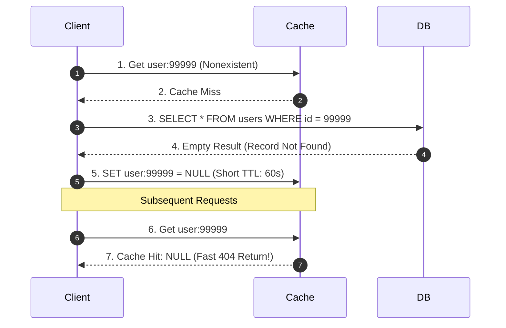

# Negative Caching: Mitigating Repeated Misses

## Overview
**Negative caching** is the architectural pattern of explicitly caching **negative query responses** (e.g., "Entity Not Found", HTTP 404, or `null` values) in the caching tier to protect downstream databases from repetitive lookups for nonexistent records.

## Why It Matters
Without negative caching, querying a non-existent entity is significantly more computationally expensive than querying a valid one. A query for an existing item hits the cache in 1ms. A query for a nonexistent item triggers a cache miss, forces a database table scan or index lookup, and yields nothing to cache—leaving the database completely unprotected against repeated identical requests.

## Core Concepts
- **Asymmetric Cost of Misses**: Valid records enjoy a 99% cache hit ratio. Invalid records suffer a **0% hit ratio**, repeatedly pummeling the database.
- **Short TTL Enforcement**: Negative entries must carry significantly shorter TTLs (e.g., 30 to 120 seconds) than positive entries (hours or days) to prevent locking out newly registered entities.
- **Negative Caching Sentinel Value**: Storing a compact tombstone token (e.g., `__NULL__` or a JSON `{"_nil": true}`) rather than an empty string to differentiate between an empty payload and a missing record.

## Trade-offs
| Strategy | Database Protection | Memory Footprint Overhead | Freshness Risk |
| :--- | :--- | :--- | :--- |
| **Negative Caching with Short TTL** | **High (absorbs repeat misses)** | Moderate (stores sentinel keys) | Brief delay (30-60s) if entity is created immediately after query |
| **No Negative Caching** | Zero (DB takes 100% of misses) | Zero RAM overhead | Immediate visibility upon creation |
| **Bloom Filter Filtering** | Absolute (zero DB misses) | Extremely low (few bits per key)| Complexity of maintaining distributed Bloom filters |

## When to Use / When NOT to Use
### When to Use Negative Caching
- Public-facing user profile lookups, username availability checkers, inventory SKU lookups, DNS resolution (NXDOMAIN).

### When NOT to Use
- Highly dynamic systems where records are created milliseconds after verification, unless the creation handler explicitly evicts the negative cache key.

## Real-World Examples
- **DNS NXDOMAIN Caching (RFC 2308)**: DNS recursive resolvers negatively cache `NXDOMAIN` (Non-Existent Domain) responses based on the authoritative zone's SOA record TTL, preventing the internet from repeatedly flooding root nameservers for mistyped domains.
- **E-Commerce Search**: Caching `null` results for out-of-catalog search terms typed by millions of users during advertising campaigns.

## Common Pitfalls
- **Long Negative TTLs**: Caching negative results for 24 hours; a user signs up with username `john_doe`, but friends cannot find the profile because the negative `null` cache entry persists for a day.
- **Memory Exhaustion via Key Bombing**: An attacker generates millions of random nonexistent keys; storing a negative cache entry for each random key exhausts Redis memory. (Mitigate using **Bloom filters** or strict maxmemory eviction).

## Key Takeaways
- Negative caching stores `null` or 404 responses to shield the database from repeated misses.
- Always assign negative cache entries a **much shorter TTL** than positive data.
- Pair negative caching with cache eviction on entity creation to ensure immediate visibility.

## Common Interview Questions
1. How does negative caching protect a database against scraping and malicious brute-force attacks?
2. What are the risks of setting an excessively long TTL on negative cache entries?
3. How does DNS implement negative caching via RFC 2308?

## Further Reading
- [RFC 2308: Negative Caching of DNS Queries (DNS NCACHE)](https://datatracker.ietf.org/doc/html/rfc2308)
- [Martin Fowler: Caching Patterns](https://martinfowler.com/eaaCatalog/identityMap.html)
