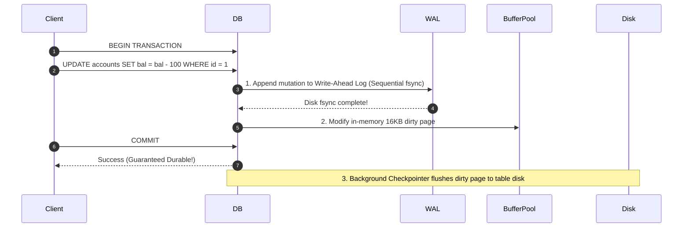

# Relational Databases: ACID, Transactions, and the Write-Ahead Log

## Overview
A **Relational Database Management System (RDBMS)** structures data into strictly defined tables consisting of rows and columns, enforcing relationships via foreign keys and mathematical relational algebra. The defining hallmark of enterprise relational databases is support for **ACID transactions**:
- **Atomicity**: All operations in a transaction succeed, or none do ("all or nothing").
- **Consistency**: A transaction transitions the database from one valid state to another, satisfying all schema constraints, checks, and foreign keys.
- **Isolation**: Concurrent transactions execute without interfering with one another.
- **Durability**: Once committed, transaction updates persist permanently, surviving OS crashes or hardware power loss.

## Why It Matters
Without ACID guarantees, power cuts during financial transfers cause money to vanish from one account without appearing in the other. Relational databases guarantee financial and operational integrity through battle-tested crash recovery algorithms.

## Core Concepts
- **The Write-Ahead Log (WAL)**: The foundational mechanism ensuring durability and crash recovery. Before any in-memory data page is modified in the database buffer pool, the exact delta mutation must be appended sequentially to the WAL on disk and physically flushed (`fsync`).
- **ARIES Crash Recovery**: Algorithm for Recovery and Isolation Exploiting Semantics. When a crashed database boots up:
  1. *Analysis Pass*: Identifies dirty pages and active in-flight transactions at the time of the crash.
  2. *Redo Pass*: Replays all committed changes in the log forward to bring the database to the exact crash state.
  3. *Undo Pass*: Rolls back all incomplete, uncommitted transactions backward to ensure clean consistency.
- **Checkpointing**: Periodic background flushing of dirty memory pages to disk tables, allowing older segments of the WAL to be safely truncated.

## Trade-offs
| Dimension | Relational ACID Database | Non-ACID / Eventual Store |
| :--- | :--- | :--- |
| **Data Integrity** | **Absolute (zero money lost, zero partial writes)**| Eventual (reconciliation logic needed) |
| **Write Throughput** | Limited by disk `fsync` and lock contention | Massive (appends without coordination) |
| **Schema Flexibility**| Strict (requires migrations) | Dynamic (schemaless JSON / Key-Value) |
| **Horizontal Sharding**| Difficult (cross-shard joins/transactions are slow)| Native (built-in sharding and partitioning) |

## When to Use / When NOT to Use
### When to Use Relational ACID Databases
- Financial accounting, banking ledgers, checkout and payment systems, enterprise ERPs, and identity authentication tables.

### When NOT to Use
- High-volume time-series sensor telemetry, massive clickstream analytics, unstructured document graphs.

## Real-World Examples
- **Stripe & PayPal**: Standardize strictly on relational ACID databases (PostgreSQL, CockroachDB) for their core balance ledgers to ensure zero double-spending.
- **AWS Aurora**: Re-architected MySQL/PostgreSQL for the cloud by offloading the Write-Ahead Log directly to a distributed storage fleet, achieving 5x standard MySQL throughput.

## Common Pitfalls
- **Long-Running Transactions**: Keeping a transaction open while awaiting an external HTTP API response (e.g., Stripe charge), holding row locks open for seconds and causing database connection pool starvation.
- **Premature NoSQL Migration**: Moving from PostgreSQL to NoSQL because "SQL doesn't scale", only to reimplement transactions, joins, and consistency checks badly in application code.

## Key Takeaways
- Relational databases guarantee ACID correctness.
- The **Write-Ahead Log (WAL)** guarantees durability; random disk page flushes happen asynchronously in the background.
- Never make external network calls inside an active database transaction.

## Common Interview Questions
1. How does the Write-Ahead Log (WAL) guarantee durability before data pages are written to disk?
2. What are the three phases of the ARIES crash recovery algorithm?
3. Why are long-running database transactions hazardous to database health?

## Further Reading
- [C. Mohan et al.: ARIES: A Transaction Recovery Method (ACM TODS, 1992)](https://dl.acm.org/doi/10.1145/128765.128770)
- [PostgreSQL Documentation: Chapter 30 - Reliability and the Write-Ahead Log](https://www.postgresql.org/docs/current/wal-intro.html)
