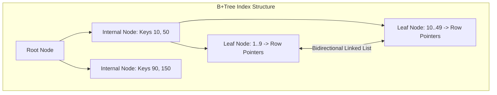

# Database Indexing Deep Dive: B-Trees, Hash, and Composite Indexes

## Overview
A database **index** is an auxiliary data structure that improves the speed of data retrieval operations on a database table at the cost of additional storage space and slower write operations. Without an index, the database engine must execute a **Full Table Scan ($O(N)$)**, reading every single disk page sequentially from disk.

## Why It Matters
On a table with 50 million rows, a query without an index can take **30 to 60 seconds** as it reads gigabytes of raw data from disk. With an appropriate B+Tree index, the database executes a binary tree traversal requiring **3 to 4 disk page reads**, answering the query in **sub-2 milliseconds**.

## Core Concepts & Index Types
1. **B+Tree Index (The Industry Standard)**:
   - Self-balancing, multi-way search tree with high fan-out (typically 100 to 500 children per node).
   - *Key Property*: Internal nodes store only routing keys; **all actual data pointers reside exclusively in leaf nodes**.
   - Leaf nodes are linked sequentially via a **bidirectional linked list**, making range scans (`WHERE age BETWEEN 20 AND 30`) exceptionally fast.
2. **Hash Index**:
   - $O(1)$ lookups based on an in-memory hash table.
   - *Limitation*: Only supports exact equality matches (`=`). **Useless for range queries or sorting** (`<`, `>`, `ORDER BY`).
3. **Composite Index (Multi-Column)**:
   - An index spanning multiple columns: `CREATE INDEX idx ON orders (tenant_id, status, created_at)`.
   - **The Leftmost Prefix Rule**: The query must filter on the leftmost indexed column (`tenant_id`) to leverage the index. A query filtering only on `created_at` cannot use this index.
4. **Covering Index (Index-Only Scan)**:
   - An index that contains all columns requested by a `SELECT` statement:
     `SELECT user_id, email FROM users WHERE user_id = 42;`
   - If the index stores `(user_id, email)`, the database retrieves the result directly from the B+Tree leaf without ever visiting the main table heap on disk.
5. **Index Selectivity**:
   - The ratio of distinct values to total rows:
     $$\text{Selectivity} = \frac{\text{Count Distinct}(column)}{\text{Total Rows}}$$
   - Columns with high selectivity (UUIDs, email addresses) benefit tremendously from indexes. Columns with low selectivity (boolean flags, gender) should rarely be indexed alone.

## Trade-offs
| Index Factor | Benefit | Cost / Trade-off |
| :--- | :--- | :--- |
| **Adding a B+Tree Index** | $O(\log N)$ read lookups and fast range scans | Adds write latency (every `INSERT`/`UPDATE` must balance the tree)|
| **Covering Index** | Eliminates expensive table heap lookups | Consumes additional disk space and buffer pool RAM |
| **Composite Index** | Optimizes complex multi-column queries | Useless if queries do not match leftmost prefix order |

## When to Use / When NOT to Use
### When to Index
- Primary keys and foreign key join columns.
- Columns appearing frequently in `WHERE`, `ORDER BY`, and `GROUP BY` clauses with high selectivity.

### When NOT to Index
- Small tables (< 1,000 rows); a full table scan in RAM is faster than traversing an index tree.
- Low-cardinality columns (e.g., `is_active: boolean`).
- Extremely write-heavy append-only tables where read queries are rare.

## Real-World Examples
- **Composite Index Ordering in E-Commerce**:
  `WHERE tenant_id = 42 AND status = 'SHIPPED' ORDER BY created_at DESC LIMIT 20`
  Creating an index on `(tenant_id, status, created_at)` allows the database to locate the exact range for `tenant_id` and `status` and traverse the leaf nodes in reverse order, executing in **1ms with zero in-memory sorting**.

## Common Pitfalls
- **Over-Indexing**: Creating 20 indexes on a single table, causing every `INSERT` statement to execute 21 distinct disk writes and severely degrading batch ingestion performance.
- **Function Calls Invalidating Indexes**: Writing `WHERE YEAR(created_at) = 2026`, preventing the database from using an index on `created_at` (must write `WHERE created_at >= '2026-01-01' AND created_at < '2027-01-01'`).

## Key Takeaways
- B+Trees are the default database index because their high fan-out minimizes tree height (3-4 levels) and leaf-node linked lists enable lightning-fast range queries.
- Follow the **Leftmost Prefix Rule** for composite indexes: Equality columns first, followed by sorting/range columns.
- **Covering indexes** eliminate table lookups completely.

## Common Interview Questions
1. Why do databases use B+Trees rather than standard Binary Search Trees (BST) or Red-Black trees?
2. What is the Leftmost Prefix Rule in composite indexes, and how does column order matter?
3. What is an Index-Only Scan (Covering Index), and why is it so much faster than a standard index lookup?

## Further Reading
- [Use The Index, Luke! A Guide to Database Performance](https://use-the-index-luke.com/)
- [Database Internals: Part 1 - Storage Engines (Alex Petrov)](https://www.databass.dev/)
