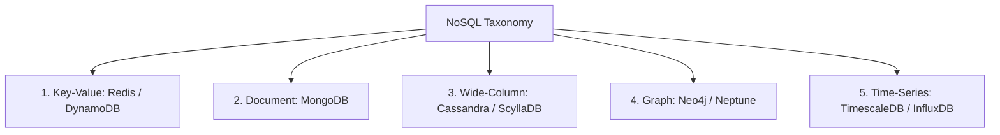

# NoSQL Database Types: Key-Value, Document, Wide-Column, Graph, and Time-Series

## Overview
**NoSQL ("Not Only SQL")** databases emerged to handle massive horizontal scalability, high write velocities, flexible schemas, and specialized data structures that traditional relational databases struggle to accommodate. NoSQL spans five distinct architectural families:
1. **Key-Value Stores**: Simplest data model; maps unique keys to arbitrary binary payloads (Redis, DynamoDB).
2. **Document Databases**: Stores semi-structured hierarchical JSON/BSON documents (MongoDB, Couchbase).
3. **Wide-Column Stores**: Multi-dimensional sparse matrices indexed by row, column family, and timestamp (Cassandra, ScyllaDB, HBase).
4. **Graph Databases**: Stores nodes, edges, and properties optimized for relationship traversal (Neo4j, Amazon Neptune).
5. **Time-Series Databases**: Optimized for sequential timestamped append-only telemetry (TimescaleDB, InfluxDB).

## Why It Matters
Attempting to query 6 degrees of social network relationships in a relational database requires dozens of self-joins that crash the query planner. Conversely, using a graph database for financial accounting ledgers is an operational disaster. Matching data access patterns to the correct storage model is a staff-level engineering skill.

## Detailed Comparison Across the 5 Families
| Family | Representative Tech | Data Model | Primary Query Pattern | Scaling Model |
| :--- | :--- | :--- | :--- | :--- |
| **Key-Value** | Redis, DynamoDB | `Key -> Blob` | Lookup by primary key ($O(1)$) | Consistent hashing |
| **Document** | MongoDB, Couchbase | JSON / BSON | Nested attribute filters, secondary indexes | Sharded clusters |
| **Wide-Column**| Cassandra, ScyllaDB | `Row -> ColFamily -> Value`| Partition key + clustering key range scans | Masterless peer-to-peer ring |
| **Graph** | Neo4j, Neptune | Nodes & Directed Edges | Pointer chasing ($O(1)$ graph traversal)| Typically single-master / read replicas |
| **Time-Series**| TimescaleDB, InfluxDB | Timestamp + Metrics + Tags | Time-window aggregations (rollups) | Time-based chunk partitioning |

## Trade-offs
| Database Family | Strengths | Weaknesses |
| :--- | :--- | :--- |
| **Wide-Column (Cassandra)** | Linear write scaling, zero single point of failure | No joins, queries must be designed upfront per table |
| **Document (MongoDB)** | Developer ergonomics, flexible evolving schemas | Cross-document transactions are slow; memory-heavy |
| **Graph (Neo4j)** | Million-hop relationship queries in milliseconds | Difficult to shard horizontally across machines |
| **Key-Value (Redis)** | Sub-millisecond latency, extreme simplicity | Cannot query by internal value attributes |

## When to Use / When NOT to Use
### When to Choose Wide-Column (Cassandra)
- Massive write-heavy workloads (e.g., messaging message history, IoT metrics, Discord message storage) requiring petabyte scale across hundreds of nodes.

### When to Choose Graph (Neo4j)
- Social network friend recommendations, fraud detection rings, identity and access management (IAM) permission trees.

### When to Choose Document (MongoDB)
- User catalogs, content management platforms, rapid prototyping where object schemas change weekly.

## Real-World Examples
- **Discord Message Storage**: Migrated billions of chat messages from MongoDB to **Apache Cassandra**, and subsequently to **ScyllaDB**, utilizing wide-column storage to sustain billions of daily message writes without locks.
- **Uber Knowledge Graph**: Utilizes graph data modeling to map physical road networks, traffic constraints, and driver-rider proximity relationships.

## Common Pitfalls
- **Using Cassandra Like a Relational DB**: Attempting to run ad-hoc queries with `ALLOW FILTERING` in Cassandra, scanning entire distributed clusters and causing massive CPU timeouts.
- **Unbounded Document Growth in MongoDB**: Embedding unbounded arrays (e.g., embedding all comments inside a single blog post document), hitting MongoDB's 16MB document size limit and forcing expensive disk reallocations.

## Key Takeaways
- NoSQL is not a single technology; it is a suite of specialized data models.
- **Cassandra** is king for massive, linearly scalable write throughput.
- **Graph databases** solve relationship traversal via index-free adjacency.

## Common Interview Questions
1. Why does Cassandra scale writes horizontally better than traditional relational databases?
2. What is "index-free adjacency" in graph databases, and why does it make relationship queries so fast?
3. How does wide-column storage differ from traditional relational row storage?

## Further Reading
- [Avinash Lakshman and Prashant Malik: Cassandra - A Decentralized Structured Storage System (ACM SIGOPS, 2010)](https://www.cs.cornell.edu/projects/ladis2009/papers/lakshman-ladis2009.pdf)
- [Neo4j Graph Database Concepts](https://neo4j.com/docs/getting-started/current/)
