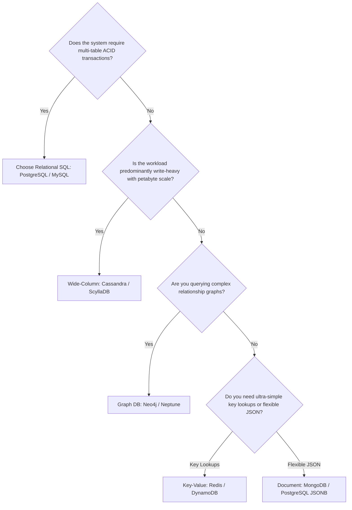

# SQL vs NoSQL: An Engineering Decision Framework

## Overview
The decision between **Relational (SQL)** and **Non-Relational (NoSQL)** databases is one of the most critical architectural forks in system design. Rather than relying on dogma, staff engineers use a structured decision framework grounded in access patterns, transaction boundaries, schema evolution, and scale requirements.

## Why It Matters
Debunking the myth: *"SQL cannot scale, so modern apps must use NoSQL."* Relational databases like PostgreSQL scale comfortably to tens of thousands of QPS and terabytes of data on single instances, and horizontally via Citus or CockroachDB. Choosing NoSQL prematurely forces developers to manually write application-layer joins, integrity checks, and custom transactions.

## The 6-Dimension Decision Matrix
| Evaluation Dimension | Choose Relational (SQL) | Choose NoSQL |
| :--- | :--- | :--- |
| **1. Data Relationships & Joins** | Complex relational queries, foreign keys, many-to-many joins | Data is self-contained or queries can be denormalized |
| **2. Transactional Guarantees** | Strict multi-table ACID transactions required (Banking/Billing) | Eventual consistency or single-row atomic writes suffice |
| **3. Schema Predictability** | Structured, predictable schema requiring strict data typing | Highly dynamic, polymorphous, or evolving JSON schemas |
| **4. Scale Limits (Single Node)** | Reads scale via replicas; writes fit on single node (<20K writes/s)| Write throughput exceeds single physical server capacity |
| **5. Query Flexibility** | Ad-hoc queries, analytical reporting, dynamic filtering | Queries are strictly known upfront and mapped to partition keys|
| **6. Operational Maturity** | Decades of battle-tested backup, recovery, and tooling | Requires specialized cluster tuning (compaction, gossip, vnodes)|

## Detailed Decision Flowchart
1. **Financial & Ledger Systems**: Always choose **SQL (PostgreSQL / CockroachDB)**. Zero tolerance for lost updates or inconsistency.
2. **High-Velocity Messaging History**: Choose **Wide-Column NoSQL (Cassandra / DynamoDB)**. Partitioned by `conversation_id`, sorted by `timestamp`.
3. **User Profiles & Catalogs**: Choose **SQL with JSONB** or **Document NoSQL (MongoDB)**.
4. **Social Follower Connections**: Choose **Graph NoSQL (Neo4j)** or specialized relational adjacency lists.
5. **Real-Time Leaderboards**: Choose **Key-Value NoSQL (Redis Sorted Sets)**.

## Trade-offs
| Architectural Choice | Primary Advantage | Primary Compromise |
| :--- | :--- | :--- |
| **Defaulting to PostgreSQL** | Infinite query flexibility, ACID safety, JSONB support | Horizontal write scaling requires manual sharding or distributed SQL |
| **Defaulting to Cassandra/DynamoDB**| Unbounded horizontal write throughput | Zero joins; changing query patterns requires creating new tables and backfilling |

## When to Use / When NOT to Use
### When SQL is the Superior Choice
- 90% of business applications, SaaS backends, e-commerce checkouts, subscription billing, inventory systems.

### When NoSQL is Mandatory
- Ingesting 200,000 writes/second from globally distributed devices, tracking live delivery driver coordinates, storing trillions of chat logs.

## Real-World Examples
- **Segment (Twilio)**: Migrated from a sprawling microservice MongoDB cluster back to **PostgreSQL**, reporting massive operational simplicity, lower latency, and reduced infrastructure bills.
- **Uber**: Uses a custom layer called **Schemaless** built on top of MySQL instances acting as a wide-column append-only key-value store, combining MySQL's rock-solid storage engine with NoSQL horizontal scaling.

## Common Pitfalls
- **The "NoSQL Means No Work" Trap**: Believing NoSQL eliminates data modeling; in Cassandra, data modeling is far stricter than SQL because queries must be mathematically planned around partition keys before writing tables.
- **Ignoring PostgreSQL JSONB**: Deploying a separate MongoDB cluster purely to store dynamic JSON attributes when modern PostgreSQL natively supports indexed, high-performance binary JSON (`JSONB`).

## Key Takeaways
- Start with **PostgreSQL** by default unless concrete technical metrics prove relational limits have been breached.
- NoSQL trades query flexibility and multi-table ACID transactions for unbounded horizontal write scaling.
- In Cassandra/DynamoDB, you model your tables around your **queries**, not around real-world entities.

## Common Interview Questions
1. In what scenario would you recommend a relational database over NoSQL, even at large scale?
2. How do modern relational databases handle semi-structured data via JSONB?
3. How does data modeling in Cassandra differ fundamentally from data modeling in MySQL?

## Further Reading
- [Martin Kleppmann: Data Models and Query Languages (DDIA Chapter 2)](https://dataintensive.net/)
- [Uber Engineering: Designing Schemaless, Uber's Scalable Datastore](https://www.uber.com/blog/schemaless-sql-database/)
