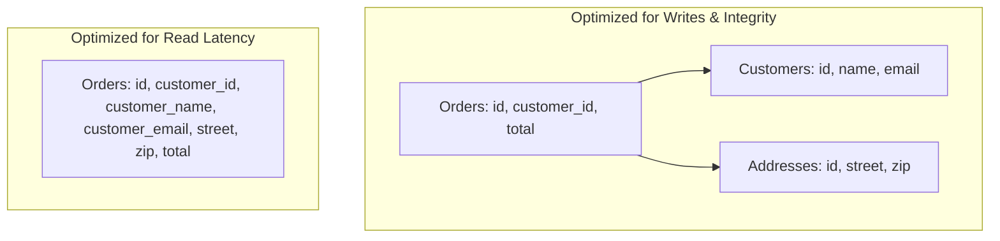

# Normalization vs Denormalization

## Overview
Database schema design balances two competing forces:
- **Normalization**: The process of organizing data in a database to reduce redundancy and eliminate update anomalies by decomposing tables into smaller, linked entities adhering to normal forms (1NF, 2NF, 3NF, BCNF).
- **Denormalization**: The deliberate introduction of redundancy into a schema by copying data across tables to eliminate expensive multi-table `JOIN` operations and optimize read performance.

## Why It Matters
In high-scale systems, joining 5 large normalized tables across millions of rows requires extensive memory sorting, hash joins, and random disk page fetches that push query latencies into hundreds of milliseconds. Strategic denormalization trades disk storage for lightning-fast, single-table reads.

## Core Concepts & The Normal Forms
1. **First Normal Form (1NF)**: Each column contains atomic (indivisible) values; no repeating groups or arrays.
2. **Second Normal Form (2NF)**: Meets 1NF, and all non-key attributes are fully functionally dependent on the entire primary key (no partial key dependencies).
3. **Third Normal Form (3NF)**: Meets 2NF, and no non-key attribute depends transitively on the primary key (no transitive dependencies; e.g., storing `zip_code` and `city` in the user table).
4. **Update, Insertion, and Deletion Anomalies**:
   - *Update Anomaly*: Updating a customer's address in a denormalized order table requires updating 10,000 historical rows. If the query fails halfway, customer records become inconsistent.
   - *Deletion Anomaly*: Deleting an order accidentally deletes the only historical record of a customer.

## How It Works: Strategic Denormalization Patterns
1. **Pre-Computed Aggregates**: Storing `comment_count` directly on the `posts` table instead of running `SELECT COUNT(*) FROM comments WHERE post_id = ?` on every page load. Updated via database triggers or transactional code increments.
2. **Read-Heavy Snapshotting**: Copying user address and product price at the time of purchase into the `order_items` table. This serves both performance and business audit compliance (future price changes must not alter historical receipts!).

## Trade-offs
| Architectural Property | Normalized (3NF) | Denormalized |
| :--- | :--- | :--- |
| **Read Performance** | Slower (requires multi-table `JOIN`s) | **Sub-millisecond (single-table lookup)**|
| **Write Performance** | **Fast (single write in one place)** | Slower (must update all redundant copies)|
| **Data Consistency** | **Guaranteed (Single Source of Truth)**| Risk of divergent data / anomalies |
| **Storage Overhead** | Minimal | High (redundant columns duplicated) |

## When to Use / When NOT to Use
### When to Normalize (3NF)
- Write-heavy transactional systems (OLTP), core accounting ledgers, systems where data changes frequently and inconsistency is intolerable.

### When to Denormalize
- Read-heavy workloads ($> 100:1$ read/write ratio), dashboard aggregations, document and wide-column NoSQL databases, data warehouses (OLAP Star/Snowflake schemas).

## Real-World Examples
- **Twitter/X Home Timelines**: Tweets are aggressively denormalized directly into follower in-memory timeline lists. Storing only tweet IDs and executing 800 relational joins on every user refresh would bring Twitter's database fleet to a standstill.
- **Amazon Order History**: Product titles, seller names, and prices are permanently denormalized into the order record at the moment of checkout.

## Common Pitfalls
- **Denormalizing Without Transactions**: Copying data across tables without wrapping the mutations in an atomic transaction, leaving orphan or contradictory records when crashes occur.
- **Premature Denormalization**: Denormalizing tables before hitting performance bottlenecks, creating technical debt and complex multi-table update logic for zero measurable gain.

## Key Takeaways
- **Normalize for writes and integrity; denormalize for read performance.**
- Denormalization is mandatory in NoSQL databases because they do not support relational joins.
- Always use transactions or event-driven reconcilers when updating denormalized data copies.

## Common Interview Questions
1. What is an update anomaly, and how does database normalization prevent it?
2. When is denormalization preferred over adding database indexes?
3. How do you maintain data consistency across redundant denormalized fields?

## Further Reading
- [E. F. Codd: A Relational Model of Data for Large Shared Data Banks (1970)](https://dl.acm.org/doi/10.1145/362384.362685)
- [Designing Data-Intensive Applications: Chapter 3 (Storage and Retrieval)](https://dataintensive.net/)
