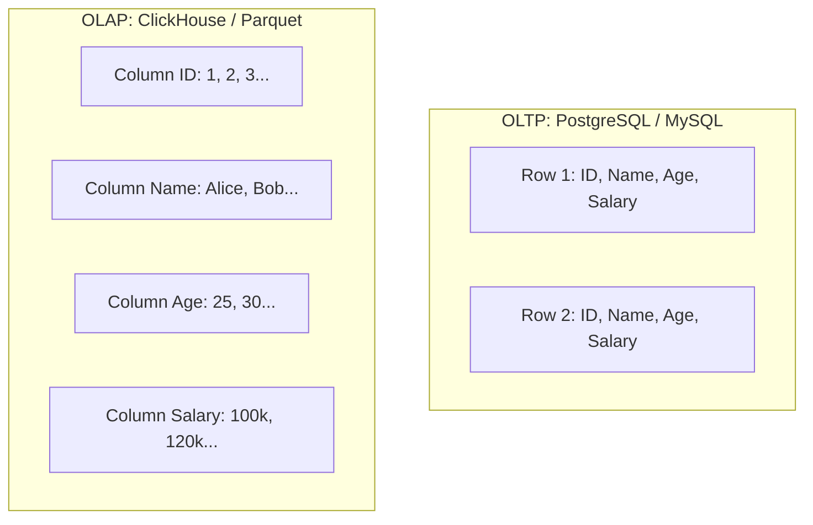

# OLTP vs OLAP: Row-Oriented vs Columnar Storage

## Overview
Data processing in production architectures splits into two fundamentally divergent paradigms based on query access patterns:
- **OLTP (Online Transaction Processing)**: High-throughput, low-latency, concurrent reads and writes of individual rows (e.g., e-commerce orders, user logins, banking transactions).
- **OLAP (Online Analytical Processing)**: Complex analytical queries scanning millions of rows across a few columns to compute aggregations, trends, and business intelligence reports.

## Why It Matters
Running an analytical query like `SELECT AVG(salary) FROM employees WHERE department = 'Engineering'` on a row-oriented OLTP database forces the disk controller to read every single employee's full row (names, addresses, phone numbers) from disk into RAM, wasting 95% of I/O bandwidth. In a columnar database, the disk controller reads **only the salary and department columns**, executing 100x faster.

## Core Concepts & Architectural Comparison
1. **Row-Oriented Layout (OLTP)**:
   - Data is stored on disk row by row: `[Row1_col1, Row1_col2, ...] [Row2_col1, Row2_col2, ...]`.
   - *Advantage*: Writing a new row or fetching an entire user record by ID requires writing/reading a single contiguous block of disk.
2. **Column-Oriented Layout (OLAP)**:
   - Data is stored on disk column by column: `[Col1_row1, Col1_row2, ...] [Col2_row1, Col2_row2, ...]`.
   - *Advantage*: An analytical query reading 2 columns out of a 100-column table skips 98% of the data on disk.
3. **Columnar Compression**:
   - Because all values in a column share the exact same data type, compression algorithms (Run-Length Encoding, Dictionary Encoding, Bit-Packing) achieve **5x to 10x compression ratios**, allowing petabytes of analytical data to fit in modest disk arrays.
4. **Vectorized Query Execution**:
   - Modern columnar engines (ClickHouse, DuckDB) process blocks of column data using **SIMD (Single Instruction, Multiple Data)** CPU registers, processing millions of rows per CPU cycle.

## Trade-offs
| Dimension | OLTP (Row-Oriented) | OLAP (Columnar) |
| :--- | :--- | :--- |
| **Typical Query** | `SELECT * WHERE id = ?` | `SELECT dept, AVG(salary) GROUP BY dept` |
| **Latency Target** | Sub-10ms (Real-time user facing) | Seconds to minutes (Analytical reports) |
| **Write Pattern** | High-frequency random `INSERT` / `UPDATE` | Bulk batch append (Millions of rows at once) |
| **Update / Delete**| In-place single-row mutations | Extremely expensive (requires rewriting columnar blocks)|
| **Compression** | Poor (mixing strings, ints, dates in a row)| **Phenomenal (5x - 10x compression ratio)** |

## When to Use / When NOT to Use
### When to Choose OLTP (Row-Oriented)
- Primary transactional databases: PostgreSQL, MySQL, CockroachDB. Handling user registration, shopping carts, checkout, auth.

### When to Choose OLAP (Columnar)
- Data warehousing and analytics: ClickHouse, Snowflake, Google BigQuery, Amazon Redshift, Apache Druid, Parquet files on S3.

## Real-World Examples
- **Uber Data Platform**: Separates its online dispatch database (OLTP on MySQL/Schemaless) from its analytical pipeline. CDC streams real-time trip data into **Apache Hudi / ClickHouse** (OLAP) so data scientists can run queries over billions of historical rides.
- **Financial Fraud Detection**: Streams transaction logs into ClickHouse to calculate rolling 30-day user spending averages in 5 milliseconds.

## Common Pitfalls
- **Running Analytical Reports on the Primary OLTP Database**: A marketing manager runs a massive cross-table analytical query during Black Friday, exhausting PostgreSQL buffer pool RAM and crashing the online checkout API. (Always offload analytics to read replicas or a dedicated OLAP warehouse!).
- **Treating OLAP Databases Like OLTP**: Attempting to execute single-row `UPDATE user SET email = ? WHERE id = 1` inside ClickHouse or Snowflake, causing massive table re-compaction and disk thrashing.

## Key Takeaways
- Never run heavy analytical aggregation queries on your primary OLTP production database.
- Row-oriented storage is optimized for writing and reading entire rows.
- Columnar storage is optimized for reading and aggregating a subset of columns across millions of rows.

## Common Interview Questions
1. Why is columnar storage exponentially faster than row-oriented storage for analytical aggregation queries?
2. How does Run-Length Encoding (RLE) achieve high compression on columnar data?
3. How do you stream data from an OLTP transactional database into an OLAP data warehouse in near real-time?

## Further Reading
- [Daniel Abadi et al.: The Design and Implementation of Modern Column-Oriented Database Systems (2013)](https://www.nowpublishers.com/article/Details/DBS-024)
- [ClickHouse Architecture Overview](https://clickHouse.com/docs/en/development/architecture)
