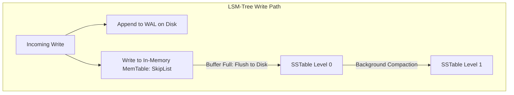

# Storage Engines: B+Trees vs Log-Structured Merge (LSM) Trees

## Overview
A database **storage engine** is the low-level software component responsible for reading, writing, and organizing data pages on physical storage (SSD/NVMe). Modern databases are divided between two dominant storage architectures:
- **B+Tree Storage Engines**: Read-optimized, in-place update structures operating on fixed-size pages (e.g., 16KB pages in MySQL InnoDB and PostgreSQL).
- **LSM-Tree (Log-Structured Merge-Tree) Storage Engines**: Write-optimized, append-only structures appending writes to an in-memory buffer before flushing immutable sequential sorted files to disk (e.g., RocksDB, Cassandra, ScyllaDB).

## Why It Matters
Storage hardware has a physical reality: **sequential writes are orders of magnitude faster than random writes**, even on modern NVMe SSDs. B+Trees require random in-place page updates that cause severe write amplification. LSM-Trees convert random writes into sequential disk streams, achieving extraordinary write throughput.

## Core Concepts & Architectural Comparison
1. **B+Tree In-Place Updates**:
   - Modifying a single 50-byte record requires updating the corresponding 16KB page in the buffer pool.
   - When the page is flushed to disk, 16,384 bytes are written to disk for a 50-byte change (**High Write Amplification**).
   - *Advantage*: Point lookups and range scans find data in a fixed, known tree location with minimal read amplification.
2. **LSM-Tree Structure & Mechanics**:
   - **MemTable**: In-memory sorted data structure (typically a SkipList or Red-Black Tree) accepting concurrent writes.
   - **Write-Ahead Log (WAL)**: Sequential disk log guaranteeing crash recovery for the MemTable.
   - **SSTable (Sorted String Table)**: Immutable, sorted disk files. Once written, an SSTable is never modified.
   - **Compaction**: Background merge-sort process that reads multiple older SSTables, discards overwritten/deleted keys (tombstones), and writes a newly consolidated, sorted SSTable to the next level.
   - **Bloom Filters**: Stored in RAM for each SSTable to verify key non-existence, eliminating unnecessary disk seeks on reads.

## Trade-offs
| Metric | B+Tree (InnoDB, Postgres) | LSM-Tree (RocksDB, Cassandra) |
| :--- | :--- | :--- |
| **Write Throughput** | Moderate (bound by random I/O) | **Exceptional (sequential appends)** |
| **Write Amplification**| High (16KB dirty page flushes) | Moderate to High (due to Compaction) |
| **Read Amplification** | **Lowest (single deterministic lookup)**| Higher (must search MemTable + SSTables)|
| **Space Amplification**| Moderate (page internal fragmentation)| Low (sequential packed SSTables) |
| **Latency Stability** | Predictable | Periodic latency spikes during heavy Compaction|

## When to Use / When NOT to Use
### When to Choose B+Tree Engines
- General-purpose workloads with balanced read-write ratios or read-heavy applications where predictable, low read latency is paramount (e.g., user authentication, billing).

### When to Choose LSM-Tree Engines
- High-velocity write-heavy workloads (e.g., logging pipelines, financial market tick data, time-series metrics, distributed messaging logs).

## Real-World Examples
- **RocksDB**: Highly optimized embedded LSM-tree engine developed by Meta, used as the underlying storage foundation for CockroachDB, TiKV, Kafka Streams, and MySQL (MyRocks).
- **Apache Cassandra**: Employs an LSM-tree architecture to sustain millions of writes per second across commodity servers without locking tables.

## Common Pitfalls
- **Compaction Storms in LSM-Trees**: If write ingestion outpaces background compaction bandwidth, uncompacted SSTables accumulate (Level 0 file explosion). Read latency collapses as queries must search 50 separate SSTable files on disk.
- **Tombstone Pollution in Cassandra**: Deleting millions of rows creates "tombstones" (deletion markers). Subsequent range queries must scan thousands of tombstones, causing query timeouts.

## Key Takeaways
- B+Trees optimize for **fast, predictable reads** at the cost of random write I/O.
- LSM-Trees optimize for **massive write throughput** by turning random writes into sequential disk streams.
- LSM-Trees rely on **Bloom Filters** and background **Compaction** to maintain acceptable read latency.

## Common Interview Questions
1. Why are sequential disk writes so much faster than random writes, even on solid-state NVMe drives?
2. What is the role of an SSTable and a MemTable in an LSM-tree storage engine?
3. How do Bloom filters mitigate high read amplification in LSM-tree databases?

## Further Reading
- [Patrick O'Neil et al.: The Log-Structured Merge-Tree (LSM-Tree) (1996)](https://www.cs.umb.edu/~poneil/lsmtree.pdf)
- [RocksDB Architecture Overview](https://github.com/facebook/rocksdb/wiki/RocksDB-Basics)
