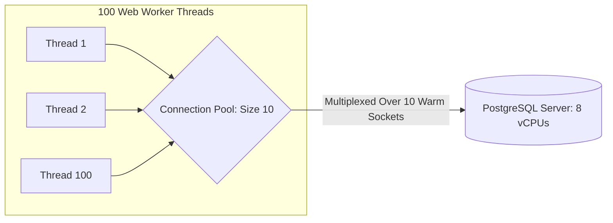

# Database Connection Pooling and Resource Management

## Overview
Establishing a connection to a database server is an expensive operation requiring a TCP 3-way handshake, TLS cryptographic negotiation, authentication validation, and backend process memory allocation. A **database connection pool** maintains a pre-warmed cache of active database connections that application threads borrow, execute queries on, and return to the pool.

## Why It Matters
Without connection pooling, an API receiving 5,000 requests per second will attempt to open 5,000 simultaneous TCP connections to PostgreSQL. In PostgreSQL, each client connection spawns a dedicated operating system process consuming **10MB to 20MB of RAM**. Opening 5,000 connections instantly consumes 50 GB of RAM, triggering CPU context-switching thrashing and crashing the database via the Linux Out-Of-Memory (OOM) killer.

## Core Concepts
- **Connection Lifecycle**:
  - *Borrow*: Application thread requests a connection; if all are in use, the thread blocks for up to `connectionTimeout` (e.g., 5 seconds).
  - *Execute*: Thread runs query.
  - *Return*: Thread closes connection object, returning the active socket back to the pool (never actually closing the underlying TCP socket).
- **The HikariCP Pool Sizing Formula**:
  Contrary to intuition, **fewer connections yield higher throughput**. Sizing pools to hundreds of connections degrades performance due to disk queue contention and CPU context switching.
  $$\text{Optimal Pool Size} = (\text{CPU Cores} \times 2) + \text{Effective Spindle Count}$$
  *Example*: For a database server with 8 CPU cores and an SSD (spindle count = 1):
  $$\text{Connections} = (8 \times 2) + 1 = 17\text{ connections!}$$
- **Connection Leak**: A catastrophic bug where an application thread acquires a connection but fails to return it (e.g., due to an unhandled exception without a `finally` or `try-with-resources` block), permanently starving the pool until all application requests hang.

## Trade-offs
| Pool Strategy | Benefit | Risk / Trade-off |
| :--- | :--- | :--- |
| **Small Dedicated Pool (~20 connections)** | Maximum DB CPU cache efficiency, zero thrashing | High-load traffic spikes queue at the pool |
| **Large Pool (~500 connections)** | Lower thread queueing delay under brief bursts | Destroys database performance; risk of DB OOM |
| **External Proxy Pooler (PgBouncer)** | Scales to 10,000+ client app connections | Incompatible with session-level SQL features (`LISTEN`/`NOTIFY`)|

## When to Use / When NOT to Use
### When Connection Pooling is Mandatory
- 100% of all production relational database applications (PostgreSQL, MySQL, Oracle).

### When to Deploy an External Connection Pooler (PgBouncer)
- In serverless architectures (AWS Lambda) or microservice clusters running hundreds of Kubernetes pods, where total pod count multiplied by local pool size exceeds maximum database connection limits.

## Real-World Examples
- **AWS Aurora Serverless & RDS Proxy**: AWS built **Amazon RDS Proxy** specifically to solve connection exhaustion caused by serverless AWS Lambda functions scaling to 10,000 concurrent containers.
- **HikariCP**: The fastest Java connection pool, engineered using byte-code instrumentation and lock-free concurrency to process millions of connection checkouts per second with zero overhead.

## Common Pitfalls
- **Setting Connection Pool Size = Number of Web Threads**: Configuring a pool of 200 connections on 50 Kubernetes pods, sending $50 \times 200 = 10,000$ simultaneous connections to a 16-core database server.
- **Connection Leaks on Exception Paths**: Omitting proper cleanup blocks, leaking one connection per failed query until the pool is 100% exhausted.

## Key Takeaways
- Establishing database connections is expensive; connection pools keep a small set of warm sockets alive.
- **Fewer connections mean higher throughput**; follow the HikariCP sizing formula ($	ext{Cores} 	imes 2 + 	ext{Disk}$).
- Deploy an external pooler (PgBouncer / RDS Proxy) when scaling serverless or microservice containers.

## Common Interview Questions
1. Why does increasing a database connection pool from 20 to 500 often reduce total system throughput?
2. What is a connection leak, and how do connection pool libraries detect it?
3. How does transaction-level pooling in PgBouncer differ from session-level pooling?

## Further Reading
- [HikariCP: About Pool Sizing (Brett Wooldridge)](https://github.com/brettwooldridge/HikariCP/wiki/About-Pool-Sizing)
- [PostgreSQL Documentation: PgBouncer Connection Pooler](https://www.pgbouncer.org/)
