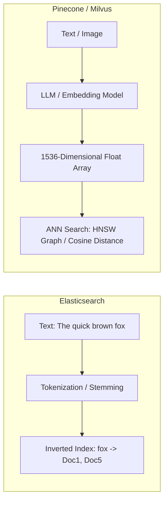

# Search and Vector Databases Overview

## Overview
Modern architectures require specialized storage engines to handle search problems that relational and traditional NoSQL databases are fundamentally incapable of executing efficiently:
- **Full-Text Search Engines**: Inverted index databases optimized for unstructured text matching, fuzzy search, tokenization, and BM25 relevance ranking (Elasticsearch, OpenSearch).
- **Vector Databases**: High-dimensional vector stores optimized for semantic similarity search, artificial intelligence embeddings, and Retrieval-Augmented Generation - RAG (Pinecone, Milvus, Qdrant, pgvector).

## Why It Matters
A relational `LIKE '%search_term%'` query forces a brutal full table scan across millions of disk pages. An **Inverted Index** resolves keyword queries in milliseconds. Meanwhile, traditional search cannot understand concepts: searching for *"affordable commute vehicle"* will miss an article titled *"cheap city bicycle"* because zero words overlap. **Vector databases** solve semantic meaning search using mathematical vector space embeddings.

## Core Concepts & Architectural Comparison
1. **Full-Text Search (Inverted Index)**:
   - Maps individual tokens/words to the list of document IDs where they occur.
   - Text processing pipeline: Character Filtering -> Tokenization -> Lowercasing -> Stemming (converting `running` to `run`) -> Stop Word Removal.
   - **BM25 Scoring**: Algorithms evaluating Term Frequency (TF) and Inverse Document Frequency (IDF) to score document relevance.
2. **Vector Databases & Embeddings**:
   - Machine learning models (OpenAI `text-embedding-3`, BERT) convert text, audio, or images into high-dimensional vectors (arrays of 768 or 1536 floating-point numbers).
   - Semantic similarity is calculated using geometric distance metrics:
     - **Cosine Similarity**: Measures the angle between two vectors (independent of magnitude).
     - **Euclidean Distance (L2)**: Measures straight-line distance.
     - **Dot Product**: Measures angle and magnitude.
3. **Approximate Nearest Neighbor (ANN) Search**:
   - Comparing a query vector against 100 million vectors sequentially ($O(N)$) is too slow.
   - **HNSW (Hierarchical Navigable Small World)**: Builds a multi-layer graph of vectors, achieving $O(\log N)$ search latency similar to a skip list.
   - **IVFFlat (Inverted File Index)**: Clusters vectors into Voronoi cells, searching only within the closest cluster centroids.

## Trade-offs
| Search Engine Type | Query Mechanism | Strengths | Weaknesses |
| :--- | :--- | :--- | :--- |
| **Full-Text (Elasticsearch)**| Inverted Index (BM25) | Exact keyword matching, typos (fuzzy), filters | Zero semantic understanding |
| **Vector DB (Milvus/Pinecone)**| ANN Index (HNSW / Cosine)| Conceptual understanding, multimodal search | High RAM consumption; poor exact keyword filtering|
| **Hybrid Search** | Reciprocal Rank Fusion (RRF)| **Best of both worlds (Exact words + Semantic meaning)**| Requires syncing two indexes |

## When to Use / When NOT to Use
### When to Choose Full-Text Search (Elasticsearch)
- E-commerce product search with exact SKU matching, legal document discovery, log aggregation and analysis (ELK Stack).

### When to Choose Vector Databases
- LLM Retrieval-Augmented Generation (RAG), semantic question answering, reverse image search, facial recognition, personalized recommendation systems.

## Real-World Examples
- **Pinterest Visual Search**: Uses vector embeddings to allow users to photograph a piece of furniture and find visually identical items across billions of catalog images using ANN search.
- **Notion AI**: Stores document chunks as vector embeddings in vector databases, retrieving relevant knowledge snippets in under 30ms to inject into LLM prompt contexts.

## Common Pitfalls
- **High Memory Footprint of HNSW Indexes**: HNSW vector graphs must reside entirely in RAM for fast traversal; storing 50 million 1536-dimensional vectors in memory can require 300+ GB of RAM, causing massive cloud costs.
- **Ignoring Hybrid Search**: Relying purely on vector search for product catalogs; a user searching for exact part number `GTX-4080` will receive semantically related graphics cards rather than the exact product they want to buy.

## Key Takeaways
- Inverted indexes power keyword search; Vector databases power semantic meaning search.
- Exact vector distance search ($O(N)$) does not scale; production systems use **Approximate Nearest Neighbor (ANN)** algorithms like HNSW.
- The state of the art in production is **Hybrid Search**: combining BM25 keyword matching with dense vector similarity.

## Common Interview Questions
1. How does an inverted index work, and why does it outperform SQL `LIKE` queries?
2. What is Approximate Nearest Neighbor (ANN) search, and how does the HNSW graph algorithm work?
3. How do you implement a Retrieval-Augmented Generation (RAG) system using vector databases?

## Further Reading
- [Malkov & Yashunin: Efficient and robust approximate nearest neighbor search using Hierarchical Navigable Small World graphs (IEEE TPAMI 2018)](https://arxiv.org/abs/1603.09320)
- [Elasticsearch: The Definitive Guide](https://www.elastic.co/guide/en/elasticsearch/guide/current/index.html)
