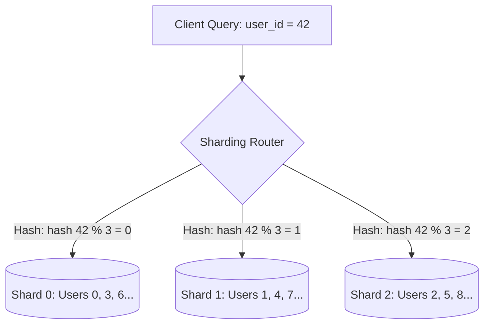

# Database Sharding Strategies: Range, Hash, Directory, and Geo

## Overview
**Sharding** is the architectural pattern of horizontally partitioning a database into smaller, independent physical databases (shards) across multiple server instances. Unlike read replicas, each individual shard holds a distinct, mutually exclusive subset of the overall data.

## Why It Matters
When a single database server hits its physical limits—storage exceeds 10 Terabytes, write throughput exceeds 20,000 IOPS, or memory working sets exhaust physical RAM—scaling up is impossible. Sharding enables theoretically unbounded horizontal scaling by distributing data across dozens or hundreds of commodity servers.

## Core Concepts & Sharding Strategies
1. **Range-Based Sharding**:
   - Data is partitioned based on contiguous ranges of a key (e.g., Shard 1 holds names A-F, Shard 2 holds G-M).
   - *Advantage*: Range queries (`WHERE name BETWEEN 'Alice' AND 'Bob'`) target a single shard.
   - *Fatal Flaw*: Massive write hotspots if keys are monotonic (e.g., sharding by timestamp causes 100% of all current writes to strike today's shard).
2. **Hash-Based Sharding**:
   - Applies a hash function (MD5, MurmurHash3) to the shard key:
     $$\text{Shard ID} = \text{Hash}(\text{shard\_key}) \pmod N$$
   - *Advantage*: Uniform, random distribution of writes across all shards.
   - *Disadvantage*: Range scans require an expensive **Scatter-Gather** query querying all $N$ shards in parallel.
3. **Directory-Based (Lookup) Sharding**:
   - A central lookup service or table maps partition keys to physical shard locations (e.g., `Tenant_123 -> Shard_4`).
   - *Advantage*: Unbelievably flexible; individual hot tenants can be dynamically relocated to dedicated hardware.
   - *Disadvantage*: Central lookup table is a single point of failure and adds a network lookup hop.
4. **Geographic Sharding (Geo-Sharding)**:
   - Partitions data based on user geographic residency (e.g., European users on EU shards, US users on US shards).
   - Essential for complying with international data residency laws (GDPR).

## Trade-offs
| Sharding Strategy | Write Distribution | Range Query Efficiency | Operational Rebalancing |
| :--- | :--- | :--- | :--- |
| **Hash-Based** | **Uniform & Balanced** | Poor (Requires Scatter-Gather) | Hard (requires resharding data) |
| **Range-Based** | Prone to Severe Hotspots| **Excellent (Single-shard query)**| Easy (Split existing range) |
| **Directory-Based**| Highly Customizable | Moderate | **Trivial (Update lookup pointer)**|
| **Geo-Based** | Dependent on regional user base| High for local queries | Moderate |

## When to Use / When NOT to Use
### When to Shard
- Total data volume exceeds ~5 Terabytes and cannot fit on a single node.
- Write IOPS exceed the maximum physical throughput of high-end NVMe disk controllers.

### When NOT to Shard
- Premature optimization! If your database is under 1 Terabyte, vertical scaling and read replicas are 100x simpler, cheaper, and safer.

## Real-World Examples
- **Instagram (2011)**: Sharded PostgreSQL across multiple instances using custom 64-bit ID generation containing the Shard ID in the integer bits, routing writes without a central lookup table.
- **Discord**: Sharded ScyllaDB clusters across thousands of logical buckets by `channel_id`, ensuring all messages in a chat channel reside on the same shard.

## Common Pitfalls
- **Cross-Shard Joins**: Attempting to join tables residing on different physical shards, forcing the application tier to fetch millions of rows across the network and perform in-memory joins.
- **Cross-Shard Distributed Transactions**: Requiring Two-Phase Commit (2PC) across multiple shards, collapsing throughput from 20,000 QPS down to 200 QPS.

## Key Takeaways
- Select a **Shard Key** that groups related data accessed together onto the same physical node (e.g., `customer_id`).
- Hash-based sharding guarantees uniform write distribution; Range-based sharding optimizes range scans but risks hotspots.
- Sharding introduces immense operational complexity—exhaust all vertical and caching options first!

## Common Interview Questions
1. How do you choose the ideal shard key for an e-commerce platform with buyers and sellers?
2. What is a "scatter-gather" query, and why does it cause high tail latency across shards?
3. How do you execute zero-downtime resharding when expanding from 4 shards to 8 shards?

## Further Reading
- [Instagram Engineering: Sharding & IDs at Instagram](https://instagram-engineering.com/sharding-ids-at-instagram-1cf5a05e5a3f)
- [Designing Data-Intensive Applications: Chapter 6 (Partitioning)](https://dataintensive.net/)
