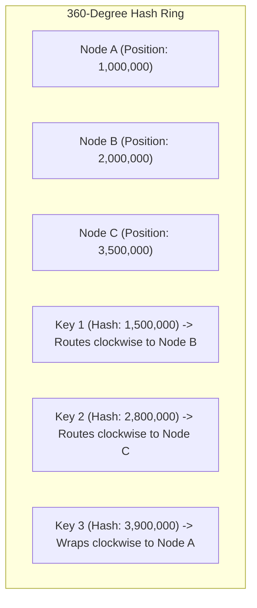
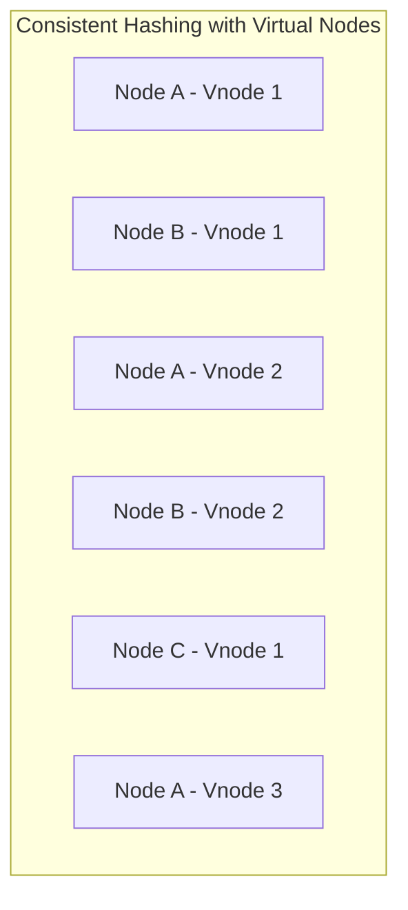

# Consistent Hashing and Virtual Nodes

## Overview
In distributed caching and sharded storage systems, mapping keys to nodes using naive modulo hashing:
$$\text{Node} = \text{Hash}(\text{Key}) \pmod N$$
suffers from a fatal flaw: when a node is added or removed ($N$ changes to $N+1$ or $N-1$), **almost 100% of all keys remap to new locations**, causing catastrophic cache invalidation and database stampedes.

**Consistent Hashing** is an algorithmic distribution technique where changing the number of nodes requires remapping only **$K/N$ keys on average** (where $K$ is total keys and $N$ is total nodes).

## Why It Matters
In massive distributed systems like Amazon DynamoDB, Apache Cassandra, and Akamai CDNs, servers join and leave clusters continuously due to autoscaling, hardware crashes, and rolling deployments. Consistent hashing guarantees that server churn causes minimal data movement and zero downtime.

## Core Concepts & Step-by-Step Mechanics
1. **The Circular Hash Ring**:
   - The output range of a standard hash function (e.g., 32-bit integer range: $0$ to $2^{32}-1$) is conceptualized as a continuous circular ring.
2. **Mapping Nodes to the Ring**:
   - Each physical server node is hashed based on its IP address or hostname and placed onto the ring.
3. **Mapping Keys to the Ring**:
   - When a data key arrives, it is hashed to a position on the ring.
4. **Clockwise Routing**:
   - The key traverses the ring **clockwise** until it encounters the first server node. That node owns the key.
5. **Handling Node Failures**:
   - If Node B crashes, only the keys mapped between Node A and Node B are affected. They naturally fall onto the next clockwise node (Node C). Nodes A and D remain completely unaffected!

### The Non-Uniformity Problem & Virtual Nodes (Vnodes)
- **The Problem**: With a small number of physical nodes (e.g., 3 nodes), random placement can cluster nodes together, causing one server to own 80% of the ring while others hold 10%. Furthermore, when a node dies, its entire load collapses onto its immediate successor.
- **The Solution (Virtual Nodes)**:
  - Instead of assigning a physical node to 1 point on the ring, assign it **100 to 256 virtual nodes (vnodes)** distributed randomly across the ring (e.g., `NodeA#1`, `NodeA#2`, ..., `NodeA#200`).
  - *Result*: Guarantees mathematically uniform distribution of keys and distributes a dead node's workload evenly across **all** surviving nodes in the cluster.

## Trade-offs
| Attribute | Modulo Hashing (`hash % N`) | Consistent Hashing with Vnodes |
| :--- | :--- | :--- |
| **Keys Remapped on Node Churn**| $\approx 100\%$ (Catastrophic cache loss) | **$1/N$ fraction only (Minimal data movement)** |
| **Lookup Time Complexity** | $O(1)$ | $O(\log(\text{Total Vnodes}))$ via Binary Search |
| **Memory Overhead** | Zero | Small in-memory routing table of vnode positions |
| **Load Distribution Uniformity**| High | **Near-perfect with 200+ vnodes per physical node** |

## When to Use / When NOT to Use
### When Consistent Hashing is Mandatory
- Distributed caches (Memcached clusters), P2P networks (BitTorrent DHT), distributed databases (Cassandra, DynamoDB, Riak), stateful connection routers.

### When NOT Needed
- Small static clusters with zero node churn where modulo hashing or standard round-robin suffices.

## Real-World Examples
- **Amazon Dynamo Paper (2007)**: Popularized consistent hashing with virtual nodes to distribute shopping cart data across thousands of commodity storage nodes with zero downtime.
- **Discord Gateway Routing**: Uses consistent hashing rings to assign millions of connected Discord guilds (servers) to specific gateway routing pods.

## Common Pitfalls
- **Too Few Virtual Nodes**: Using fewer than 50 vnodes per physical server, leading to noticeable load skew (variance > 25% between nodes).
- **Ignoring Cascading Failures without Vnodes**: Without vnodes, Server B's crash doubles the load on Server C, crashing Server C, which triples the load on Server D, cascading into total cluster collapse.

## Key Takeaways
- Consistent hashing remaps only $1/N$ keys when a node joins or leaves.
- **Virtual nodes (vnodes)** are mandatory to ensure uniform load distribution and prevent cascading failures.
- Binary search (`bisect` in Python or `std::lower_bound` in C++) resolves key lookups in $O(\log M)$ time on the client.

## Common Interview Questions
1. Why does naive modulo hashing fail when scaling distributed caches up and down?
2. How do virtual nodes solve both load imbalance and cascading failovers in consistent hashing?
3. Walk through the exact algorithm to find the owning node for a key on a consistent hash ring.

## Further Reading
- [Karger et al.: Consistent Hashing and Random Trees (ACM STOC 1997)](https://dl.acm.org/doi/10.1145/258533.258660)
- [Amazon Dynamo: Highly Available Key-value Store (SOSP 2007)](https://www.allthingsdistributed.com/files/amazon-dynamo-sosp2007.pdf)
