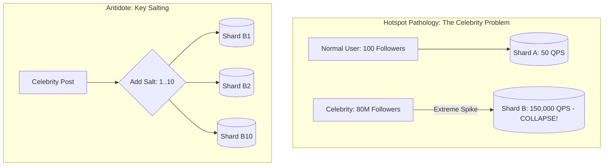

# Hotspots, Resharding, and Partition Rebalancing

## Overview
Even with mathematical partitioning algorithms, production distributed systems frequently suffer from **hotspots**: severe imbalances where a tiny fraction of partition keys receives a disproportionate share of read or write traffic (the "Celebrity Problem").

Resolving hotspots requires proactive mitigation strategies, dynamic range splitting, and zero-downtime **partition rebalancing (resharding)**.

## Why It Matters
A single viral tweet, flash sale item, or high-profile user account can generate 100,000 requests per second. If that entity's data maps to a single database shard, that individual shard's CPU and disk saturate, causing cascading connection timeouts across the entire platform while neighboring shards sit 95% idle.

## Core Concepts & Mitigation Mechanics

### 1. The Celebrity Problem & Key Salting
- **The Problem**: Key `user_id:999` belongs to a celebrity with 80 million followers. Every update or read strikes a single shard.
- **The Mitigation (Key Salting)**:
  - When writing data for the celebrity, append a random integer suffix (salt): `user_id:999_1`, `user_id:999_2`, ..., `user_id:999_10`.
  - The writes distribute uniformly across 10 distinct shards.
  - *Read Path*: Reads execute a parallel scatter-gather query across all 10 salted keys and merge the results.

### 2. Zero-Downtime Dynamic Resharding
When a shard reaches maximum capacity, expanding from $N$ to $2N$ shards must execute without stopping live customer traffic:
1. **Dual-Writing (Shadow Replication)**: Application writes to both old and new shard topologies concurrently.
2. **Backfill Snapshot**: Background batch process copies historical records from old shards to new shards.
3. **Catch-Up & Verification**: Read the replication change stream (CDC) to reconcile any missing delta records.
4. **Read Cutover**: Shift 1% -> 10% -> 100% of read traffic to the new shards via dynamic feature flags.
5. **Decommission**: Stop writes to old shards and safely delete old data.

## Trade-offs
| Mitigation Pattern | Benefit | Trade-off / Cost |
| :--- | :--- | :--- |
| **Key Salting** | Neutralizes write hotspots instantly | Reads must scatter-gather across all salt variants |
| **In-Memory Read Shielding**| Caches hot key reads in Redis/CDN | Does not solve write hotspots |
| **Dynamic Shard Splitting** | Long-term linear capacity growth | Complex orchestration and background disk I/O |

## When to Use / When NOT to Use
### When to Use Key Salting
- High-profile entities with asymmetric write/read spikes (e.g., trending hashtags, celebrity social profiles, viral product drops).

### When to Use Dynamic Range Splitting
- Storage engines (Google Spanner, CockroachDB, HBase) that automatically split a table partition into two halves when its size exceeds 64MB or when CPU load crosses 80%.

## Real-World Examples
- **Twitter/X**: When Taylor Swift or Elon Musk posts a tweet, Twitter does not push the tweet into 100 million follower timeline shards (which would take minutes); instead, follower feeds dynamically merge celebrity tweets at read time.
- **Amazon DynamoDB Adaptive Capacity**: Automatically detects unbalanced read/write request spikes on individual partitions and dynamically shifts unused throughput capacity from quiet partitions to the hot partition within minutes.

## Common Pitfalls
- **Over-Salting Uniform Keys**: Appending random salts to ordinary users with 100 followers, forcing unnecessary scatter-gather queries and multiplying read latency by 10x for zero benefit.
- **Resharding During Peak Hours**: Triggering heavy data migration and rebalancing scripts during peak traffic hours, saturating network interfaces and disk I/O when the system is already stressed.

## Key Takeaways
- Use **Key Salting** to distribute super-hot entity writes across multiple physical shards.
- Always implement zero-downtime resharding via **Dual-Writing -> Backfilling -> Verification -> Cutover**.
- Treat hot-key mitigation as an application-layer design requirement, not just a database property.

## Common Interview Questions
1. How does Key Salting resolve write hotspots in a distributed key-value store?
2. Walk through the step-by-step process of splitting a live database shard with zero downtime.
3. How does DynamoDB's adaptive capacity dynamically balance partitions?

## Further Reading
- [Amazon DynamoDB: How Partitioning Works and Adaptive Capacity](https://docs.aws.amazon.com/amazondynamodb/latest/developerguide/HowItWorks.Partitions.html)
- [Google Cloud Spanner: Schema Design and Avoiding Hotspots](https://cloud.google.com/spanner/docs/schema-design#hotspots)
