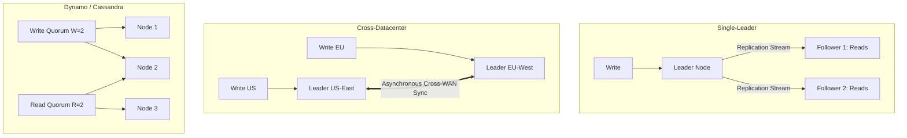

# Replication Models: Single-Leader, Multi-Leader, and Leaderless

## Overview
**Replication** is the process of keeping a copy of the same data across multiple distinct physical machines connected via a network. Replication provides two indispensable benefits: **fault tolerance (high availability)** and **increased read throughput**.

Distributed data systems organize replication around three primary models:
1. **Single-Leader (Primary-Replica)**: One designated leader node accepts all writes; followers asynchronously or synchronously replicate changes to serve read traffic.
2. **Multi-Leader (Active-Active)**: Multiple nodes accept writes concurrently and replicate state changes to each other across datacenters.
3. **Leaderless (Dynamo-Style)**: Every replica accepts writes and reads directly from clients; consistency is managed via quorum consensus ($R + W > N$).

## Why It Matters
Your replication topology dictates whether writes can survive a datacenter blackout, how long clients wait for write acknowledgments, and whether your database can experience concurrent write conflict anomalies.

## Core Concepts & Architectural Comparison
| Replication Model | Write Destinations | Read Destinations | Conflict Handling | Fault Tolerance |
| :--- | :--- | :--- | :--- | :--- |
| **Single-Leader** | Single Leader only | Leader + All Followers | **Zero write conflicts (Leader serializes writes)**| Leader is SPOF until failover completes |
| **Multi-Leader** | Any regional Leader | Any regional Leader | **Complex (Requires conflict resolution)** | High (Writes continue if 1 region dies)|
| **Leaderless** | Any $W$ nodes (Quorum)| Any $R$ nodes (Quorum) | **Handled at read time (Vector clocks / LWW)**| **Extreme (No single master to crash)** |

## Detailed Mechanics

### 1. Single-Leader Replication (MySQL, PostgreSQL, Redis)
- All mutations (`INSERT`, `UPDATE`, `DELETE`) route strictly to the Leader.
- Leader writes changes to its Write-Ahead Log (WAL) and streams them to Followers.
- *Strength*: Simple semantics; ACID transactions are easily enforced.
- *Limitation*: Write throughput is strictly bounded by the single leader's capacity.

### 2. Multi-Leader Replication (Multi-Datacenter Deployments)
- A leader exists in each geographic datacenter (e.g., US-East, Europe-West).
- Local writes complete in sub-millisecond local LAN time without crossing the ocean.
- **The Core Challenge (Write Conflicts)**: User A updates an order in the US to "Cancelled"; User B simultaneously updates the same order in Europe to "Shipped".
- *Resolution Strategies*:
  - *Last Write Wins (LWW)*: Wall-clock timestamp wins (risks silent data loss due to clock skew).
  - *Conflict-Free Replicated Data Types (CRDTs)*: Mathematical data structures that resolve concurrently without coordination.

### 3. Leaderless Replication (Apache Cassandra, Amazon Dynamo, Riak)
- Clients (or coordinator nodes) write directly to $N$ replicas.
- Success is returned as soon as $W$ replicas acknowledge.
- Reads query $R$ replicas in parallel, returning the version with the newest timestamp and triggering **Read Repair** on stale nodes.

## Trade-offs
| Model | Write Latency | Operational Simplicity | Conflict Risk |
| :--- | :--- | :--- | :--- |
| **Single-Leader** | Moderate | **High (Industry default)** | **Zero** |
| **Multi-Leader** | **Low (Local DC write)** | Very Hard | High (Requires domain merge logic) |
| **Leaderless** | Tunable ($W$) | Moderate | Handled via versioning & quorums |

## When to Use / When NOT to Use
### When to Choose Single-Leader
- 90% of business applications: PostgreSQL, MySQL, Redis. Financial ledgers, ERPs, user auth.

### When to Choose Multi-Leader
- Multi-datacenter architectures where local write latency is non-negotiable or offline collaboration tools (e.g., Git, CouchDB).

### When to Choose Leaderless
- High-velocity globally distributed systems with massive write volumes and high uptime requirements (Cassandra/DynamoDB).

## Real-World Examples
- **Git Version Control**: The ultimate distributed **Multi-Leader** system. Developers commit and merge branches locally (acting as independent leaders) and resolve merge conflicts explicitly during pull requests.
- **Netflix Cassandra Fleet**: Runs massive multi-region Cassandra clusters across AWS regions to survive entire AWS regional blackouts without losing active user streaming sessions.

## Common Pitfalls
- **Relying on Last-Write-Wins (LWW) Blindly**: In multi-leader or leaderless systems, LWW silently drops valid updates due to unaligned physical quartz clocks (clock skew).
- **Split-Brain during Single-Leader Failover**: Promoting a follower to leader while the old leader is still alive and accepting writes, partitioning the database into two divergent histories.

## Key Takeaways
- Single-leader is the simplest model; writes are serialized without conflict.
- Multi-leader reduces cross-region write latency but introduces complex write conflict resolution.
- Leaderless architectures rely on quorum mathematics ($R + W > N$) and anti-entropy to guarantee consistency.

## Common Interview Questions
1. How does a Multi-Leader database resolve concurrent write conflicts on the same record?
2. What are Conflict-Free Replicated Data Types (CRDTs), and where are they used?
3. How does Leaderless replication achieve high write availability during partial network partitions?

## Further Reading
- [Martin Kleppmann: Replication (DDIA Chapter 5)](https://dataintensive.net/)
- [Werner Vogels et al.: Dynamo: Amazon’s Highly Available Key-value Store](https://www.allthingsdistributed.com/files/amazon-dynamo-sosp2007.pdf)
