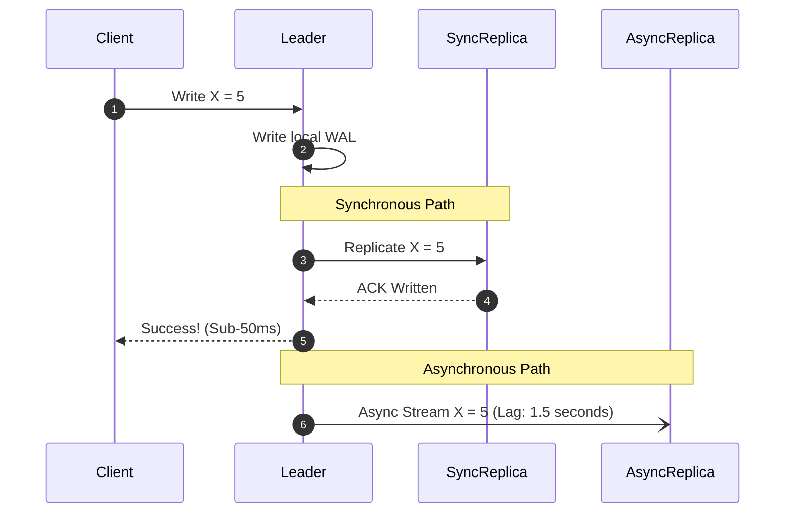

# Synchronous vs Asynchronous Replication and Replication Lag

## Overview
When replicating data from a primary leader to replica followers, a distributed system must choose its synchronization boundary:
- **Synchronous Replication**: The leader waits for the replica to write the change to disk before returning success to the client.
- **Asynchronous Replication**: The leader writes to local disk, returns success to the client immediately, and pushes the change to replicas in the background.
- **Semi-Synchronous Replication**: The leader waits for at least **one** replica to acknowledge, while remaining replicas replicate asynchronously.

## Why It Matters
Asynchronous replication makes writes blindingly fast (sub-2ms), but introduces **Replication Lag**: the time delay between a write committing on the leader and appearing on the replica. If an application routes reads to lagging replicas, users experience jarring consistency bugs where newly submitted comments vanish upon page reload.

## Core Concepts & Replication Lag Anomalies
1. **Reading Your Own Writes (Read-After-Write Consistency)**:
   - *The Bug*: User updates their profile photo -> Page reloads -> Read routes to a lagging replica -> User sees their old photo -> User assumes upload failed and submits 5 more times.
   - *Antidote*: Route reads for User X's profile directly to the **Leader** for 5 seconds following any write by User X. All other users continue reading from replicas.
2. **Monotonic Reads**:
   - *The Bug*: User refreshes the page repeatedly. Request 1 hits a fast replica (sees comment); Request 2 hits a lagging replica (comment disappears); Request 3 hits the fast replica (comment reappears).
   - *Antidote*: Pin user read sessions to a consistent replica using hash routing (e.g., `hash(user_id) % NumReplicas`).
3. **Consistent Prefix Reads (Causality Violation)**:
   - *The Bug*: Question arrives after Answer because questions and answers replicate across different shards with variable network delays.
   - *Antidote*: Keep causally related records on the same partition.

## Trade-offs
| Replication Mode | Write Latency | Durability on Leader Crash | Availability Impact |
| :--- | :--- | :--- | :--- |
| **Fully Synchronous** | High (bound by slowest replica) | **100% Guaranteed (Zero data loss)** | If 1 replica hangs, all writes freeze |
| **Fully Asynchronous**| **Ultra-Low (< 2ms local write)** | Risk of uncommitted write loss | Unaffected by replica outages |
| **Semi-Synchronous** | Moderate (waits for fastest replica)| **Excellent (At least 1 backup copy)** | High resilience |

## When to Use / When NOT to Use
### When to Use Synchronous / Semi-Synchronous
- Financial transactions, billing ledgers, authentication credential changes where losing the last 10 seconds of writes during a leader crash is unacceptable.

### When to Use Asynchronous
- High-throughput social networks, analytics pipelines, content platforms where sub-millisecond write latency outweighs brief replication lag.

## Real-World Examples
- **MySQL Semi-Synchronous Replication**: Widely deployed in production enterprise clusters. The leader waits until at least one replica has written the event to its **Relay Log** before returning success, guaranteeing that a sudden primary crash loses zero committed transactions.
- **PostgreSQL Synchronous Standby**: Allows engineers to specify `synchronous_commit = on` and `synchronous_standby_names = 'FIRST 1 (replica1, replica2)'`.

## Common Pitfalls
- **Global Read Routing to Replicas**: Routing 100% of read queries to read replicas without tracking user mutation timestamps, breaking Read-After-Write consistency across the entire application.
- **Unmonitored Replication Lag**: Failing to alert on replication lag metrics (e.g., `pg_stat_replication.replay_lag` in Postgres), allowing a replica to fall 4 hours behind without engineering awareness.

## Key Takeaways
- Fully synchronous replication halts write availability if any single replica hangs.
- **Semi-synchronous replication** provides the optimal balance of durability and write latency.
- Protect user experience against replication lag using **Read-After-Write** routing patterns.

## Common Interview Questions
1. What is replication lag, and what specific architectural strategies guarantee Read-After-Write consistency?
2. What are Monotonic Reads, and how do you prevent users from seeing data move backward in time?
3. How does Semi-Synchronous replication differ from fully synchronous and fully asynchronous replication?

## Further Reading
- [Martin Kleppmann: Problems with Replication Lag (DDIA Chapter 5)](https://dataintensive.net/)
- [MySQL Documentation: Semi-Synchronous Replication](https://dev.mysql.com/doc/refman/8.0/en/replication-semisync.html)
