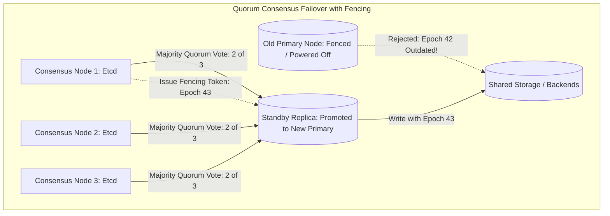

# Read Replicas, Automatic Failover, and Split-Brain Prevention

## Overview
As read traffic scales into tens of thousands of queries per second, a single primary database becomes saturated. Systems scale read throughput by attaching **read replicas** (follower nodes) to the primary leader.

When the primary leader fails, an **automatic failover** system must detect the outage, elect the most up-to-date replica, promote it to primary, and redirect client traffic—all while rigorously preventing the catastrophic condition known as **Split-Brain**.

## Why It Matters
A split-brain disaster occurs when a network glitch severs communication between datacenters. Both the primary and the promoted replica believe they are the legitimate leader, simultaneously accepting conflicting writes from split clients. Reconciling two divergent databases after split-brain is mathematically impossible without permanent data loss.

## Core Concepts & Failover Mechanics
1. **Heartbeat Monitoring & Detection**:
   - Health agents ping the primary leader every 500ms.
   - To prevent false alarms from transient network hiccups, failover triggers only after $K$ consecutive missed heartbeats (e.g., 5 seconds).
2. **Leader Election via Majority Quorum**:
   - An odd number of consensus arbiters (3 or 5 nodes running Raft/etcd/ZooKeeper) vote on failover.
   - A node can only promote itself if it secures a **strict majority ($> 50\%$) of votes**. A partitioned datacenter holding only 1 out of 3 arbiters can never promote a master.
3. **Fencing Tokens (Generation Clocks)**:
   - Every time a new leader is promoted, the consensus cluster increments a monotonically increasing epoch number (e.g., Epoch 42 -> 43).
   - The new leader includes its fencing token with every write.
   - Shared storage tiers and downstreams **reject any write bearing an older token**, instantly neutralizing zombie former primaries.
4. **STONITH (Shoot The Other Node In The Head)**:
   - Hardware-level fencing. The cluster triggers an automated power switch (IPMI / smart PDU) to physically cut power to the old primary machine before promoting the secondary.

## Trade-offs
| Failover Strategy | Detection Speed | False-Positive Risk | Split-Brain Defense |
| :--- | :--- | :--- | :--- |
| **Aggressive Automated Failover (< 2s)**| Near-zero downtime (RTO < 5s) | **High (Network blips trigger needless failovers)**| Requires strict fencing |
| **Conservative Failover (30s - 60s)** | Higher downtime during true crash | Very Low | High stability |
| **Manual Human-in-the-Loop** | Slowest (RTO: 15-30 mins) | Zero false automated triggers | Safest against split-brain |

## When to Use / When NOT to Use
### When to Deploy Automated Consensus Failover
- Mission-critical databases requiring 99.99% availability (e.g., using Patroni for PostgreSQL or Orchestrator for MySQL).

### When Manual Failover is Acceptable
- Systems with low SLA requirements where human verification eliminates any risk of uncoordinated failover errors.

## Real-World Examples
- **GitHub Incident (2018)**: An internal fiber cut severed communications between datacenters. An automated failover script promoted a replica in the secondary datacenter that had 43 seconds of replication lag. Both datacenters accepted writes simultaneously, resulting in a 24-hour outage to manually resolve data conflicts.
- **Patroni (PostgreSQL)**: The industry-standard HA template for PostgreSQL. Uses **etcd** consensus to guarantee that exactly one node holds the leader key lease at any second; if the leader loses its etcd lease, it immediately demotes itself to read-only mode.

## Common Pitfalls
- **Two-Node Clusters**: Deploying exactly 2 database nodes without an external third arbiter. If the network link cuts, both nodes see 1 node alive and 1 dead, making majority voting mathematically impossible. (Always deploy an odd number: 3 or 5 consensus nodes!).
- **Unfenced Zombie Masters**: Failing to cut write access to the old primary; upon recovering from a temporary kernel freeze, the old master continues writing data until clients discover divergent states.

## Key Takeaways
- Always deploy an **odd number of consensus arbiters (3 or 5)** to guarantee majority voting.
- **Fencing tokens** (monotonically increasing epoch numbers) are mandatory to reject zombie primary writes.
- Never promote a read replica without verifying its replication log sequence number (LSN).

## Common Interview Questions
1. What is Split-Brain, and why is it considered the most catastrophic failure in distributed databases?
2. How do Fencing Tokens prevent a zombie primary from corrupting storage after a network partition heals?
3. Why can a two-node database cluster never safely implement automated leader election?

## Further Reading
- [Martin Kleppmann: How to do distributed locking (Fencing Tokens)](https://martin.kleppmann.com/2016/02/08/how-to-do-distributed-locking.html)
- [Zalando: Patroni PostgreSQL High Availability Documentation](https://patroni.readthedocs.io/en/latest/)
