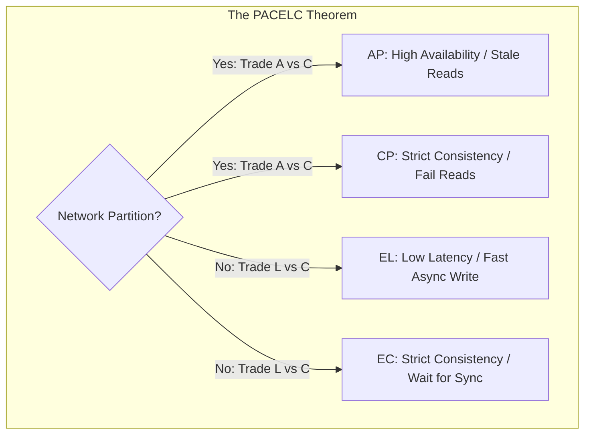

# CAP Theorem and the PACELC Extension

## Overview
The **CAP Theorem** (formulated by Eric Brewer and proved by Gilbert and Lynch) states that any distributed data store can simultaneously provide at most two of the following three guarantees:
- **Consistency ($C$)**: Every read receives the most recent write or an error (linearizability).
- **Availability ($A$)**: Every non-failing node returns a non-error response for every request (without guarantee of containing the latest write).
- **Partition Tolerance ($P$)**: The system continues to operate despite an arbitrary number of messages being dropped or delayed by the network between nodes.

Because physical networks *always* experience partitions (fiber cuts, hardware switches crashing, packet loss), **Partition Tolerance ($P$) is non-negotiable**. Thus, the real choice is: **In the presence of a network partition, do you choose Consistency (CP) or Availability (AP)?**

## Why It Matters
The CAP theorem is frequently misunderstood. Engineers often ask: *"Can I build a CA system?"* The answer in distributed networks is **NO**; a "CA system" can only exist if network failure is physically impossible (i.e., a single machine). Furthermore, CAP only describes behavior during rare network partitions. **The PACELC Theorem** extends CAP to explain how systems behave during normal healthy operation (99.9% of the time).

## Core Concepts & PACELC Breakdown
**PACELC** states:
> **If there is a Partition ($P$)**: Trade Availability ($A$) versus Consistency ($C$);
> **Else ($E$)**: Trade Latency ($L$) versus Consistency ($C$).

### The 4 PACELC Classifications
1. **PC/EC (e.g., Google Spanner, CockroachDB)**:
   - During partition ($P$): Choose Consistency ($C$).
   - Normal operation ($E$): Choose Consistency ($C$), paying higher Latency ($L$) for synchronous replication.
2. **PA/EL (e.g., Amazon DynamoDB, Apache Cassandra)**:
   - During partition ($P$): Choose Availability ($A$).
   - Normal operation ($E$): Choose Latency ($L$), writing asynchronously and accepting eventual consistency.
3. **PC/EL (e.g., MongoDB, PostgreSQL with async replicas)**:
   - During partition: Rejects writes to isolated primary (Consistency).
   - Normal operation: Writes to primary immediately and replicates asynchronously for low latency ($L$).
4. **PA/EC**: Rare; favors availability under partitions, but pays latency costs during normal times.

## Trade-offs
| System Type | Partition Behavior (P) | Normal Operation (E) | Real-World System |
| :--- | :--- | :--- | :--- |
| **CP / EC** | Returns errors to preserve exact state | High latency (waits for multi-node consensus)| Google Spanner, etcd |
| **AP / EL** | Serves reads/writes on any available replica| Ultra-low latency (sub-1ms RAM writes) | Cassandra, DynamoDB |

## When to Use / When NOT to Use
### When to Choose CP (Consistency over Availability)
- Banking ledgers, credit card auth, ticket/seat booking, distributed lock coordination (etcd/ZooKeeper).

### When to Choose AP (Availability over Consistency)
- Social media timelines, video streaming session tracking, shopping cart additions, DNS routing.

## Real-World Examples
- **ATM Cash Withdrawals**: Often designed as **AP/EL**. If the network link between the local ATM and the central bank mainframe drops, the ATM does not fail the transaction; it dispenses cash up to a local $200 emergency offline limit, reconciling the balance later when the network heals.
- **ZooKeeper & etcd**: Classic **CP/EC** systems. If a network partition isolates a follower from the quorum majority, it strictly refuses to service reads or writes to prevent split-brain.

## Common Pitfalls
- **Claiming "CA" in Distributed Systems**: Stating that a multi-node cluster is "CA". If a network partition occurs, a system cannot remain both available and consistent.
- **Ignoring the "Else" in PACELC**: Forgetting that even when the network is 100% healthy, enforcing strong consistency introduces measurable latency penalties.

## Key Takeaways
- Partition Tolerance is mandatory in distributed networks; you must choose between **CP** and **AP** during failures.
- **PACELC** models the everyday trade-off: Latency vs Consistency during normal healthy times.
- Strong consistency requires synchronous network round trips that directly increase P99 latency.

## Common Interview Questions
1. Why is it impossible to build a "CA" distributed database across multiple physical servers?
2. How does the PACELC theorem describe the operational characteristics of Apache Cassandra?
3. How does an ATM network demonstrate an AP system in practice?

## Further Reading
- [Seth Gilbert and Nancy Lynch: Brewer's Conjecture and the Feasibility of Consistent, Available, Partition-Tolerant Web Services (ACM SIGACT, 2002)](https://groups.csail.mit.edu/tds/papers/Lynch/MIT-LCS-TR-850.pdf)
- [Daniel Abadi: Consistency Tradeoffs in Modern Distributed Database System Design (PACELC)](https://cs-www.cs.yale.edu/homes/dna/papers/abadi-pacelc.pdf)
