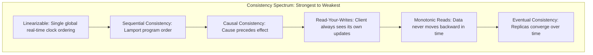

# Distributed Consistency Models: From Linearizable to Eventual

## Overview
In a distributed system, a **consistency model** is an architectural contract between the data store and the application defining the valid ordering and freshness guarantees of read operations relative to preceding writes across multiple nodes.

Consistency exists on a continuous mathematical spectrum ranging from **Linearizable (Strongest)** to **Eventual (Weakest)**.

## Why It Matters
Assuming a database is "strongly consistent" when it only provides eventual consistency leads to subtle race conditions, lost inventory, and corrupt business states. Conversely, enforcing linearizability across all tables adds immense latency and reduces availability.

## Core Concepts & Detailed Spectrum Breakdown

### 1. Linearizability (Strong Consistency / External Consistency)
- The gold standard. The system behaves as if there is only a **single copy of the data** in the entire world, and all operations execute instantaneously at a point in global time.
- If Client A writes $X = 5$ and receives success at $t_1$, any client reading $X$ at $t_2 > t_1$ is **physically guaranteed** to see $5$.
- *Cost*: Requires consensus protocols (Raft/Paxos) and clock synchronization.

### 2. Sequential Consistency (Leslie Lamport)
- Operations take effect in some sequential order that is visible identically to all processes, and operations performed by each individual process appear in the order specified by its program.
- No global real-time clock constraint; operations can be delayed as long as all nodes agree on the sequence.

### 3. Causal Consistency
- Operations that are **causally related** must be seen by every node in the identical order. Concurrent operations that are independent may be observed in different orders.
- *Example*: A question and its reply must never appear reversed, but two independent people posting in different channels can appear in any order.

### 4. Client-Centric Consistency Models
- **Read-Your-Writes**: A process that updates a value will always observe its own update on subsequent reads.
- **Monotonic Reads**: If a process reads value $V_1$, it will never subsequently observe an older value $V_0$.
- **Monotonic Writes**: A system guarantees that writes from a single process are processed in the order they were submitted.

### 5. Eventual Consistency
- The weakest guarantee. If no new updates are made to a key, all replicas will eventually converge to hold identical values.
- *Reality*: Provides zero guarantees about *when* data becomes visible (could be 5 milliseconds or 5 hours during network partitions).

## Trade-offs
| Consistency Model | Latency Added | Availability under Partition | Complexity |
| :--- | :--- | :--- | :--- |
| **Linearizable** | **High (waits for consensus)** | Zero (halts writes during partition) | Extreme |
| **Causal** | Low | High | Moderate (requires vector clocks) |
| **Eventual** | **Minimal (sub-1ms local write)**| **Maximum (writes succeed everywhere)** | Application must handle conflicts |

## When to Use / When NOT to Use
### When Linearizability is Mandatory
- Leader election in cluster managers (etcd/ZooKeeper), unique username reservation, bank account transfers, distributed locking.

### When Eventual Consistency is Optimal
- Social network "likes" counters, comment threads, product review postings, collaborative cursor positioning.

## Real-World Examples
- **Google Spanner**: Implements **Linearizability (External Consistency)** globally across worldwide datacenters using hardware atomic clocks (TrueTime API) to bound uncertainty to $\le 7$ms.
- **Amazon S3**: Originally launched with Eventual Consistency for overwrite PUTs and DELETEs (causing deleted objects to intermittently reappear). In December 2020, AWS re-architected S3 to support **Strong Read-After-Write Consistency (Linearizability)** for all objects with zero performance penalty.

## Common Pitfalls
- **Confusing ACID Consistency ($C$) with CAP Consistency ($C$)**:
  - *ACID "C"*: Application invariants and database schema constraints (e.g., account balance $\ge 0$).
  - *CAP "C"*: Linearizability (every read sees the latest write across all network nodes).
- **Relying on Local Wall Clocks**: Using `System.currentTimeMillis()` to establish causality across servers; clock drift guarantees causality inversion bugs.

## Key Takeaways
- Linearizability means operations take effect instantaneously on a single virtual timeline.
- Causal consistency preserves cause-and-effect ordering without paying the latency penalty of full linearizability.
- S3 is now strongly consistent; Cassandra and DynamoDB remain tunable from eventual to strong.

## Common Interview Questions
1. What is the precise definition of Linearizability, and how does it differ from Serializability?
2. How does Causal Consistency prevent conversation replies from appearing before the initial message?
3. How did Amazon S3 transition from eventual consistency to strong consistency without degrading latency?

## Further Reading
- [Leslie Lamport: Time, Clocks, and the Ordering of Events in a Distributed System (1978)](https://lamport.azurewebsites.net/pubs/time-clocks.pdf)
- [Martin Kleppmann: Consistency and Consensus (DDIA Chapter 9)](https://dataintensive.net/)
