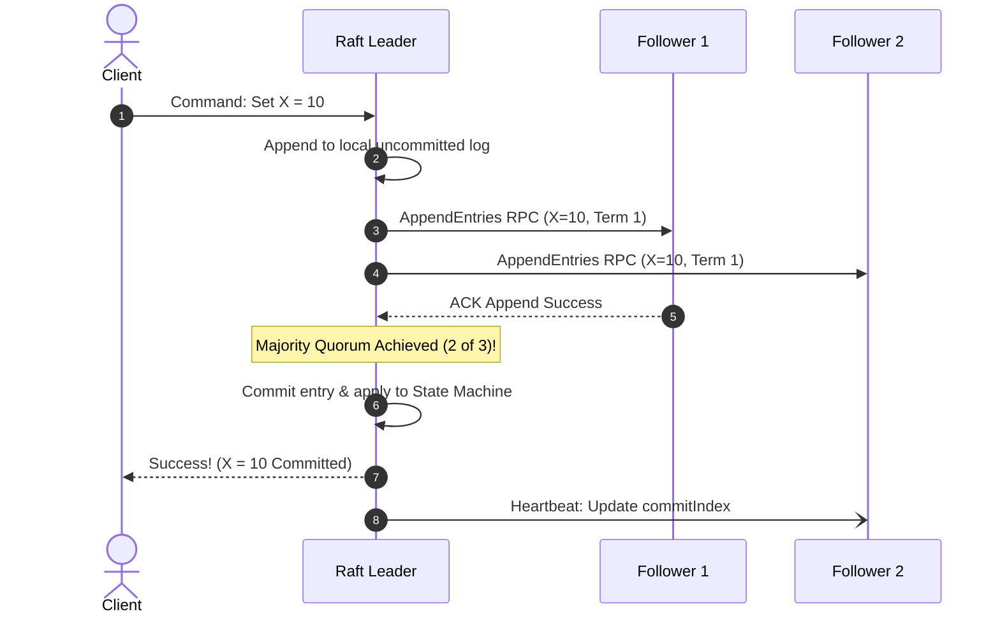

# Distributed Consensus: Paxos and Raft

## Overview
The **consensus problem** is the foundational challenge of distributed computing: how can a collection of independent, unreliable machines agree on a single data value or sequence of state updates over an asynchronous network subject to packet delays, reordering, and node crashes?

Two canonical protocols solve this challenge:
- **Paxos**: The mathematically proven, generalized family of consensus protocols introduced by Leslie Lamport.
- **Raft**: An understandable, decomposed consensus protocol designed by Ongaro and Ousterhout that divides consensus into distinct, verifiable subproblems: **Leader Election**, **Log Replication**, and **Safety**.

## Why It Matters
Without consensus algorithms, building reliable distributed coordination engines (etcd, Consul, ZooKeeper) is impossible. Consensus is the bedrock of leader election, distributed locking, service discovery, and distributed SQL transactions (CockroachDB, Spanner, TiKV).

## Core Concepts & Raft Protocol Mechanics
Raft achieves consensus by decomposing the problem into three independent state machines:

### 1. Leader Election
- Nodes exist in one of three states: **Leader**, **Follower**, or **Candidate**.
- Time is divided into arbitrary numerical **Terms** acting as logical clocks.
- If a Follower receives no heartbeats within its randomized **Election Timeout** (150ms - 300ms), it transitions to Candidate, increments the Term, votes for itself, and broadcasts `RequestVote` RPCs.
- If it wins a **majority vote ($> N/2$)**, it becomes the cluster Leader and immediately broadcasts empty heartbeat `AppendEntries` RPCs.

### 2. Log Replication
- Clients send commands strictly to the Leader.
- Leader appends the command to its local log and broadcasts `AppendEntries` to all Followers.
- When the entry is written to a **majority of followers**, the Leader marks the entry as **Committed**, applies it to its local finite state machine, and returns success to the client.

### 3. Safety Invariants
- **Election Safety**: At most one leader can be elected in a given term.
- **Leader Completeness**: If a log entry is committed in a given term, that entry will be present in the logs of the leaders for all higher-numbered terms. A candidate can only win an election if its log is *at least as up-to-date* as any voting follower.

## Trade-offs
| Consensus Algorithm | Understandability | Formal Proofs | Industry Adoption |
| :--- | :--- | :--- | :--- |
| **Raft** | **Exceptional (Designed for human comprehension)**| Solid | **Dominant (Kubernetes etcd, CockroachDB, TiKV)**|
| **Multi-Paxos** | Cryptic and notoriously difficult to implement | Rigorous & Elegant | Google Chubby, Spanner |

## When to Use / When NOT to Use
### When to Deploy Consensus (Raft/Paxos)
- Small clusters (3 or 5 nodes) managing mission-critical shared state: metadata registries, leader election, cluster configuration, distributed locks.

### When NOT to Use Consensus Everywhere
- High-throughput user data streams! Consensus requires multiple network round trips and disk `fsync` operations per write. Running 100,000 writes/sec through a single Raft group will instantly saturate network and disk controllers. (Instead, partition data into multiple independent Raft groups: **Multi-Raft**).

## Real-World Examples
- **Kubernetes etcd**: Runs **Raft** to store the cluster's entire state. Every Pod creation, deployment scaling, and ingress routing rule is committed via Raft consensus across 3 or 5 etcd nodes.
- **CockroachDB Multi-Raft**: Instead of running a single global Raft cluster, CockroachDB divides table data into 64MB Ranges. Each individual range forms its own independent 3-node **Raft group**, allowing hundreds of thousands of concurrent writes to execute in parallel across separate consensus groups.

## Common Pitfalls
- **Even-Numbered Clusters**: Provisioning 4 or 6 consensus nodes. An even number increases hardware cost without improving fault tolerance: a 4-node cluster requires 3 nodes for a majority (tolerating only 1 failure), exactly the same as a 3-node cluster! (Always deploy **3, 5, or 7** nodes).
- **Split Votes from Uniform Timeouts**: Setting identical election timeouts on all nodes, causing all nodes to become candidates simultaneously and splitting votes indefinitely (mitigated by **randomized election timeouts**).

## Key Takeaways
- Consensus allows a cluster of unreliable nodes to agree on a sequence of state updates.
- **Raft** solves consensus through Leader Election, Log Replication, and randomized timeouts.
- Consensus requires an **odd number of nodes (3 or 5)** and a strict majority ($> 50\%$) quorum.

## Common Interview Questions
1. How does Raft handle split votes during leader election?
2. What is Multi-Raft, and why is it necessary for scaling distributed transactional databases?
3. What is the difference between Paxos and Raft?

## Further Reading
- [Diego Ongaro and John Ousterhout: In Search of an Understandable Consensus Algorithm (USENIX ATC 2014)](https://raft.github.io/raft.pdf)
- [The Secret Lives of Data: Raft Visualization](http://thesecretlivesofdata.com/raft/)
