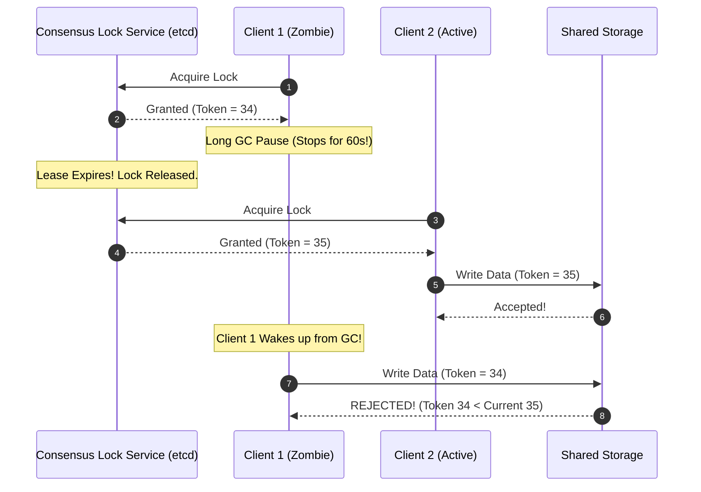

# Leader Election, Distributed Locks, and Fencing Tokens

## Overview
In distributed systems, coordinate processes often require that exactly one node acts as a leader or that only one worker accesses a shared resource at any given moment:
- **Leader Election**: The process by which a cluster of nodes elects a single primary coordinator to manage workloads.
- **Distributed Lock**: A mutual exclusion primitive ensuring that concurrent processes across distinct physical servers do not concurrently mutate shared state.
- **Fencing Token**: A monotonically increasing number issued by a lock service to prevent expired or delayed processes ("zombie clients") from corrupting shared storage.

## Why It Matters
Naive distributed locks (e.g., using basic Redis `SETNX` without fencing) are fundamentally unsafe. A process can acquire a lock, experience a 30-second garbage collection (GC) pause or network delay, and have its lock lease expire. A new worker acquires the lock, and both workers mutate shared storage concurrently, silently corrupting data.

## Core Concepts & The Failure of Naive Locks
1. **The Distributed Lock Hazard**:
   - Client 1 acquires lock with a 10-second TTL.
   - Client 1 enters an operating system thread descheduling, paging swap, or JVM Full Garbage Collection pause lasting 15 seconds.
   - Lock lease expires in the lock service.
   - Client 2 acquires the newly released lock and begins updating the database.
   - Client 1 wakes up, unaware that time has passed, believes it still holds the lock, and writes to the database.
   - *Result*: **Corrupted state and race conditions**.
2. **The Fencing Token Solution (Martin Kleppmann)**:
   - The lock server maintains a monotonically increasing counter.
   - Every lock grant returns a token: Token 34, Token 35, Token 36.
   - The resource storage engine records the highest token it has processed.
   - When Client 1 attempts to write with Token 34, storage inspects its ledger, sees that Token 35 was already accepted, and **rejects Client 1's write**.

## How It Works: Robust Implementations
1. **Consensus-Backed Locks (etcd / ZooKeeper)**:
   - Client creates an ephemeral key with a heartbeat lease (`/locks/resource`).
   - If the client crashes, the heartbeat stops, the lease expires, and etcd automatically drops the ephemeral key, triggering notification watchers.
2. **Redis Redlock Controversy**:
   - Proposed multi-instance Redis lock algorithm.
   - Criticized by distributed systems researchers because it relies on physical wall-clock time bounds across unsynchronized servers, making it vulnerable to clock drift and GC pauses unless strict fencing tokens are enforced.

## Trade-offs
| Lock Mechanism | Latency | Fault Tolerance | Safety Guarantee |
| :--- | :--- | :--- | :--- |
| **Consensus Store (etcd/ZooKeeper)**| 2ms - 10ms | **High (Raft consensus)** | **Strongest (Safe with Fencing Tokens)**|
| **Redis Single Instance** | **Sub-millisecond** | None (Single node crash = lock loss)| Weak (Not safe for critical money state)|
| **Database Row Locking (`SELECT FOR UPDATE`)**| Moderate | Tied to DB | Strong within local DB boundaries |

## When to Use / When NOT to Use
### When to Use Distributed Locks with Fencing
- Non-idempotent batch processing, assigning leader roles in worker clusters, coordinating single-threaded legacy migration jobs.

### When to Avoid Distributed Locks
- High-concurrency transaction workflows! Distributed locks serialize execution, capping throughput. Instead, design systems with **atomic conditional database updates** (`UPDATE balance SET bal = bal - 10 WHERE bal >= 10`) or **Optimistic Concurrency Control (OCC)** using version numbers.

## Real-World Examples
- **Apache Kafka (KRaft)**: Replaced external ZooKeeper with an internal Raft consensus quorum to elect the active cluster metadata controller, achieving faster failover and supporting millions of partitions.
- **Kubernetes Controller Manager**: Uses etcd leader election leases to ensure only one active replica of the controller manager reconciles cluster state at any second.

## Common Pitfalls
- **Omitting Fencing Tokens**: Believing that setting a generous TTL (e.g., 60 seconds) guarantees safety; unexpected VM hypervisor freezes and network delays routinely exceed 60 seconds.
- **Using Distributed Locks for Distributed Transactions**: Wrapping microservice calls in distributed locks instead of implementing the **Saga Pattern**.

## Key Takeaways
- Distributed locks without **fencing tokens** are unsafe for data mutations.
- Prefer atomic conditional SQL statements and optimistic concurrency control over distributed locks.
- Build locks on consensus stores (etcd/Consul) rather than uncoordinated memory caches.

## Common Interview Questions
1. Why does a garbage collection pause break distributed lock safety if fencing tokens are not used?
2. How does an ephemeral node in ZooKeeper implement automated lock release upon worker failure?
3. What is Martin Kleppmann's critique of the Redis Redlock algorithm?

## Further Reading
- [Martin Kleppmann: How to do Distributed Locking (2016)](https://martin.kleppmann.com/2016/02/08/how-to-do-distributed-locking.html)
- [etcd Documentation: Distributed Concurrency and Locks](https://etcd.io/docs/latest/learning/api_guarantees/)
